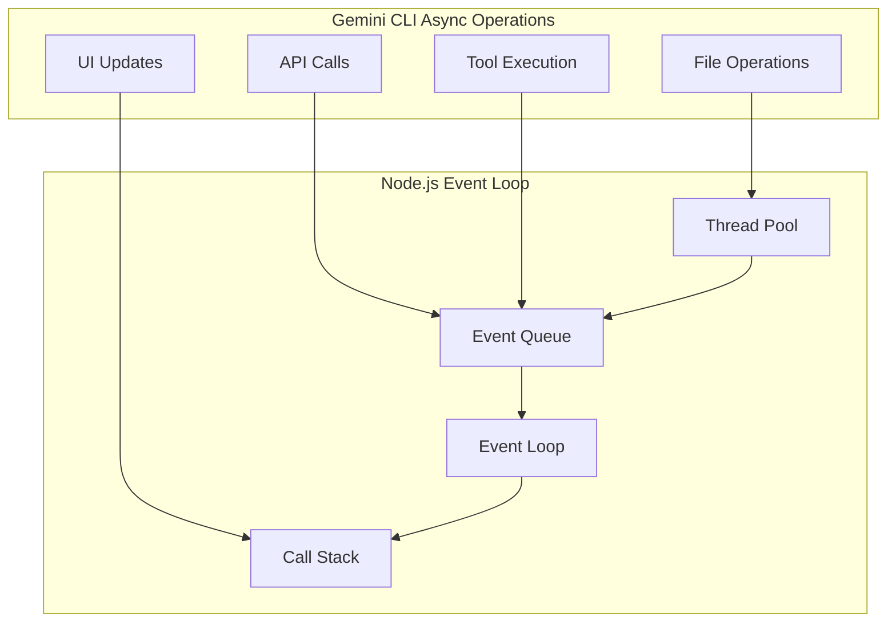

# Asynchronous Processing Architecture

## Overview

Gemini CLI leverages Node.js's event-driven architecture to handle concurrent operations efficiently. The system implements sophisticated asynchronous patterns for API communication, tool execution, file operations, and UI updates, ensuring responsive user experience while managing complex workflows.

## Core Async Patterns

### Event Loop Architecture



### Asynchronous Patterns Implementation

#### 1. Promise-Based API Communication

```typescript
class GeminiAPIClient {
  async sendRequest(request: APIRequest): Promise<APIResponse> {
    try {
      // Concurrent request handling
      const [authToken, rateLimitCheck] = await Promise.all([
        this.getAuthToken(),
        this.checkRateLimit()
      ])
      
      if (!rateLimitCheck.allowed) {
        await this.waitForRateLimit(rateLimitCheck.resetTime)
      }
      
      // Streaming response handling
      const response = await this.makeStreamingRequest(request, authToken)
      return await this.processStreamingResponse(response)
      
    } catch (error) {
      return this.handleAPIError(error)
    }
  }
  
  private async makeStreamingRequest(
    request: APIRequest,
    token: string
  ): Promise<ReadableStream> {
    const response = await fetch(this.apiUrl, {
      method: 'POST',
      headers: {
        'Authorization': `Bearer ${token}`,
        'Content-Type': 'application/json'
      },
      body: JSON.stringify(request)
    })
    
    return response.body!
  }
  
  private async processStreamingResponse(
    stream: ReadableStream
  ): Promise<APIResponse> {
    const reader = stream.getReader()
    const decoder = new TextDecoder()
    let fullResponse = ''
    
    while (true) {
      const { done, value } = await reader.read()
      if (done) break
      
      const chunk = decoder.decode(value)
      fullResponse += chunk
      
      // Emit progress events for real-time UI updates
      this.emit('chunk', chunk)
    }
    
    return JSON.parse(fullResponse)
  }
}
```

#### 2. Concurrent Tool Execution

```typescript
class ToolExecutor {
  private executionQueue: AsyncQueue<ToolExecution> = new AsyncQueue()
  private maxConcurrency: number = 3
  
  async executeTools(tools: ToolCall[]): Promise<ToolResult[]> {
    // Analyze dependencies between tools
    const dependencyGraph = this.buildDependencyGraph(tools)
    const executionPlan = this.createExecutionPlan(dependencyGraph)
    
    const results: ToolResult[] = []
    
    for (const batch of executionPlan) {
      // Execute independent tools concurrently
      const batchResults = await this.executeBatch(batch)
      results.push(...batchResults)
    }
    
    return results
  }
  
  private async executeBatch(tools: ToolCall[]): Promise<ToolResult[]> {
    // Limit concurrency to prevent resource exhaustion
    const semaphore = new Semaphore(this.maxConcurrency)
    
    return Promise.all(
      tools.map(async (tool) => {
        await semaphore.acquire()
        try {
          return await this.executeSingleTool(tool)
        } finally {
          semaphore.release()
        }
      })
    )
  }
  
  private async executeSingleTool(tool: ToolCall): Promise<ToolResult> {
    // Wrap execution in timeout
    const timeout = tool.timeout || 30000
    
    return Promise.race([
      this.performToolExecution(tool),
      this.createTimeout(timeout, `Tool ${tool.name} timed out`)
    ])
  }
}
```

### Semaphore Implementation

```typescript
class Semaphore {
  private permits: number
  private waiting: Array<() => void> = []
  
  constructor(permits: number) {
    this.permits = permits
  }
  
  async acquire(): Promise<void> {
    if (this.permits > 0) {
      this.permits--
      return
    }
    
    return new Promise(resolve => {
      this.waiting.push(resolve)
    })
  }
  
  release(): void {
    if (this.waiting.length > 0) {
      const next = this.waiting.shift()!
      next()
    } else {
      this.permits++
    }
  }
}
```

## File System Operations

### Asynchronous File Handling

```typescript
class FileSystemManager {
  private fileCache: Map<string, FileContent> = new Map()
  private readLocks: Map<string, Promise<any>> = new Map()
  
  async readMultipleFiles(paths: string[]): Promise<FileContent[]> {
    // Deduplicate and batch file reads
    const uniquePaths = [...new Set(paths)]
    const chunks = this.chunkPaths(uniquePaths, 10) // Read 10 files at a time
    
    const results: FileContent[] = []
    
    for (const chunk of chunks) {
      const chunkResults = await Promise.allSettled(
        chunk.map(path => this.readFileWithCaching(path))
      )
      
      results.push(...this.processSettledResults(chunkResults))
    }
    
    return results
  }
  
  private async readFileWithCaching(path: string): Promise<FileContent> {
    // Check cache first
    if (this.fileCache.has(path)) {
      return this.fileCache.get(path)!
    }
    
    // Prevent duplicate reads with locks
    if (this.readLocks.has(path)) {
      return this.readLocks.get(path)!
    }
    
    const readPromise = this.performFileRead(path)
    this.readLocks.set(path, readPromise)
    
    try {
      const content = await readPromise
      this.fileCache.set(path, content)
      return content
    } finally {
      this.readLocks.delete(path)
    }
  }
  
  private async performFileRead(path: string): Promise<FileContent> {
    const stats = await fs.stat(path)
    
    if (stats.size > this.maxFileSize) {
      throw new Error(`File too large: ${path}`)
    }
    
    const content = await fs.readFile(path, 'utf-8')
    
    return {
      path,
      content,
      size: stats.size,
      modifiedTime: stats.mtime,
      encoding: 'utf-8'
    }
  }
}
```

### Directory Watching

```typescript
class DirectoryWatcher {
  private watchers: Map<string, FSWatcher> = new Map()
  private eventEmitter: EventEmitter = new EventEmitter()
  
  async watchDirectory(path: string): Promise<void> {
    if (this.watchers.has(path)) {
      return // Already watching
    }
    
    const watcher = fs.watch(path, { recursive: true }, 
      (eventType, filename) => {
        this.handleFileEvent(path, eventType, filename)
      }
    )
    
    this.watchers.set(path, watcher)
  }
  
  private handleFileEvent(
    directory: string,
    eventType: string,
    filename: string
  ): void {
    // Debounce events to prevent spam
    const key = `${directory}:${filename}`
    
    if (this.eventDebouncer.has(key)) {
      clearTimeout(this.eventDebouncer.get(key))
    }
    
    this.eventDebouncer.set(key, setTimeout(() => {
      this.processFileEvent(directory, eventType, filename)
      this.eventDebouncer.delete(key)
    }, 100))
  }
  
  private async processFileEvent(
    directory: string,
    eventType: string,
    filename: string
  ): Promise<void> {
    const fullPath = path.join(directory, filename)
    
    try {
      switch (eventType) {
        case 'rename':
          await this.handleFileRename(fullPath)
          break
        case 'change':
          await this.handleFileChange(fullPath)
          break
      }
    } catch (error) {
      console.error('Error processing file event:', error)
    }
  }
}
```

## UI Updates and Rendering

### React/Ink Async Updates

```typescript
class UIUpdateManager {
  private updateQueue: UpdateQueue<UIUpdate> = new UpdateQueue()
  private renderScheduled: boolean = false
  
  scheduleUpdate(update: UIUpdate): void {
    this.updateQueue.enqueue(update)
    
    if (!this.renderScheduled) {
      this.renderScheduled = true
      setImmediate(() => this.processUpdates())
    }
  }
  
  private async processUpdates(): Promise<void> {
    this.renderScheduled = false
    const updates = this.updateQueue.drainAll()
    
    // Batch updates for performance
    const batches = this.batchUpdates(updates)
    
    for (const batch of batches) {
      await this.processBatch(batch)
      
      // Yield to event loop between batches
      await new Promise(resolve => setImmediate(resolve))
    }
  }
  
  private async processBatch(updates: UIUpdate[]): Promise<void> {
    // Apply updates atomically
    const state = this.getCurrentState()
    const newState = updates.reduce((acc, update) => {
      return this.applyUpdate(acc, update)
    }, state)
    
    this.setState(newState)
  }
}
```

### Streaming UI Updates

```typescript
class StreamingRenderer {
  private contentBuffer: string = ''
  private lastRenderTime: number = 0
  private renderThrottleMs: number = 50
  
  handleStreamingContent(chunk: string): void {
    this.contentBuffer += chunk
    
    // Throttle renders for performance
    const now = Date.now()
    if (now - this.lastRenderTime > this.renderThrottleMs) {
      this.renderContent()
      this.lastRenderTime = now
    }
  }
  
  private renderContent(): void {
    // Use requestAnimationFrame equivalent for CLI
    process.nextTick(() => {
      this.updateDisplay(this.contentBuffer)
    })
  }
  
  flushContent(): void {
    if (this.contentBuffer) {
      this.renderContent()
      this.contentBuffer = ''
    }
  }
}
```

## MCP Server Communication

### Async MCP Protocol

```typescript
class MCPServerConnection {
  private messageQueue: AsyncQueue<MCPMessage> = new AsyncQueue()
  private pendingRequests: Map<string, PendingRequest> = new Map()
  private connectionState: ConnectionState = 'disconnected'
  
  async sendRequest(message: MCPMessage): Promise<MCPResponse> {
    if (this.connectionState !== 'connected') {
      await this.ensureConnected()
    }
    
    const requestId = this.generateRequestId()
    message.id = requestId
    
    const responsePromise = this.createPendingRequest(requestId)
    
    await this.sendMessage(message)
    
    // Set timeout for request
    const timeout = setTimeout(() => {
      this.rejectPendingRequest(requestId, new Error('Request timeout'))
    }, 30000)
    
    try {
      const response = await responsePromise
      clearTimeout(timeout)
      return response
    } catch (error) {
      clearTimeout(timeout)
      throw error
    }
  }
  
  private createPendingRequest(id: string): Promise<MCPResponse> {
    return new Promise((resolve, reject) => {
      this.pendingRequests.set(id, { resolve, reject })
    })
  }
  
  private handleIncomingMessage(message: MCPMessage): void {
    if (message.id && this.pendingRequests.has(message.id.toString())) {
      const pending = this.pendingRequests.get(message.id.toString())!
      this.pendingRequests.delete(message.id.toString())
      
      if (message.error) {
        pending.reject(new Error(message.error.message))
      } else {
        pending.resolve(message)
      }
    } else {
      // Handle server-initiated messages
      this.handleServerMessage(message)
    }
  }
}
```

### Connection Pooling

```typescript
class MCPConnectionPool {
  private pools: Map<string, ConnectionPool> = new Map()
  private defaultPoolSize: number = 3
  
  async getConnection(serverName: string): Promise<MCPConnection> {
    let pool = this.pools.get(serverName)
    
    if (!pool) {
      pool = new ConnectionPool(this.defaultPoolSize)
      this.pools.set(serverName, pool)
    }
    
    return pool.acquire()
  }
  
  releaseConnection(serverName: string, connection: MCPConnection): void {
    const pool = this.pools.get(serverName)
    if (pool) {
      pool.release(connection)
    }
  }
}

class ConnectionPool {
  private available: MCPConnection[] = []
  private inUse: Set<MCPConnection> = new Set()
  private waiting: Array<(conn: MCPConnection) => void> = []
  
  async acquire(): Promise<MCPConnection> {
    if (this.available.length > 0) {
      const conn = this.available.pop()!
      this.inUse.add(conn)
      return conn
    }
    
    if (this.inUse.size < this.maxSize) {
      const conn = await this.createConnection()
      this.inUse.add(conn)
      return conn
    }
    
    // Wait for available connection
    return new Promise(resolve => {
      this.waiting.push(resolve)
    })
  }
  
  release(connection: MCPConnection): void {
    this.inUse.delete(connection)
    
    if (this.waiting.length > 0) {
      const waiter = this.waiting.shift()!
      this.inUse.add(connection)
      waiter(connection)
    } else {
      this.available.push(connection)
    }
  }
}
```

## Error Handling in Async Operations

### Promise Error Handling

```typescript
class AsyncErrorHandler {
  async withRetry<T>(
    operation: () => Promise<T>,
    maxRetries: number = 3,
    backoffMs: number = 1000
  ): Promise<T> {
    let lastError: Error
    
    for (let attempt = 0; attempt <= maxRetries; attempt++) {
      try {
        return await operation()
      } catch (error) {
        lastError = error as Error
        
        if (attempt === maxRetries) {
          break
        }
        
        if (this.shouldRetry(error)) {
          await this.delay(backoffMs * Math.pow(2, attempt))
          continue
        }
        
        throw error
      }
    }
    
    throw lastError!
  }
  
  private shouldRetry(error: Error): boolean {
    // Retry on network errors, timeouts, rate limits
    return error.message.includes('ECONNRESET') ||
           error.message.includes('ETIMEDOUT') ||
           error.message.includes('429')
  }
  
  private delay(ms: number): Promise<void> {
    return new Promise(resolve => setTimeout(resolve, ms))
  }
}
```

### Circuit Breaker Pattern

```typescript
class CircuitBreaker {
  private failures: number = 0
  private lastFailureTime: number = 0
  private state: 'closed' | 'open' | 'half-open' = 'closed'
  
  async execute<T>(operation: () => Promise<T>): Promise<T> {
    if (this.state === 'open') {
      if (Date.now() - this.lastFailureTime > this.resetTimeoutMs) {
        this.state = 'half-open'
      } else {
        throw new Error('Circuit breaker is open')
      }
    }
    
    try {
      const result = await operation()
      this.onSuccess()
      return result
    } catch (error) {
      this.onFailure()
      throw error
    }
  }
  
  private onSuccess(): void {
    this.failures = 0
    this.state = 'closed'
  }
  
  private onFailure(): void {
    this.failures++
    this.lastFailureTime = Date.now()
    
    if (this.failures >= this.failureThreshold) {
      this.state = 'open'
    }
  }
}
```

## Performance Optimization

### Async Queue Management

```typescript
class AsyncQueue<T> {
  private queue: T[] = []
  private processing: boolean = false
  private processors: number = 0
  private maxConcurrency: number
  
  constructor(maxConcurrency: number = 5) {
    this.maxConcurrency = maxConcurrency
  }
  
  async enqueue(item: T, processor: (item: T) => Promise<void>): Promise<void> {
    this.queue.push(item)
    
    if (this.processors < this.maxConcurrency) {
      this.startProcessor(processor)
    }
  }
  
  private async startProcessor(processor: (item: T) => Promise<void>): Promise<void> {
    this.processors++
    
    while (this.queue.length > 0) {
      const item = this.queue.shift()!
      
      try {
        await processor(item)
      } catch (error) {
        console.error('Queue processor error:', error)
      }
    }
    
    this.processors--
  }
}
```

### Memory Management

```typescript
class AsyncMemoryManager {
  private memoryUsage: NodeJS.MemoryUsage
  private gcThresholdMB: number = 100
  private monitoringInterval: NodeJS.Timer
  
  startMonitoring(): void {
    this.monitoringInterval = setInterval(() => {
      this.checkMemoryUsage()
    }, 5000)
  }
  
  private checkMemoryUsage(): void {
    const usage = process.memoryUsage()
    const heapUsedMB = usage.heapUsed / 1024 / 1024
    
    if (heapUsedMB > this.gcThresholdMB) {
      // Force garbage collection if available
      if (global.gc) {
        global.gc()
      }
      
      // Clear caches
      this.clearCaches()
    }
  }
  
  private clearCaches(): void {
    // Clear file cache
    if (this.fileCache.size > 100) {
      const entries = Array.from(this.fileCache.entries())
      const toDelete = entries.slice(0, entries.length / 2)
      toDelete.forEach(([key]) => this.fileCache.delete(key))
    }
  }
}
```

## Best Practices

### Async/Await Best Practices

```typescript
// ✅ Good: Concurrent operations
async function processFiles(files: string[]): Promise<ProcessedFile[]> {
  return Promise.all(files.map(file => processFile(file)))
}

// ✅ Good: Sequential when needed
async function processFilesSequentially(files: string[]): Promise<ProcessedFile[]> {
  const results: ProcessedFile[] = []
  
  for (const file of files) {
    const result = await processFile(file)
    results.push(result)
  }
  
  return results
}

// ✅ Good: Error handling
async function robustOperation(): Promise<Result> {
  try {
    const result = await riskyOperation()
    return { success: true, data: result }
  } catch (error) {
    console.error('Operation failed:', error)
    return { success: false, error: error.message }
  }
}
```

### Resource Cleanup

```typescript
class ResourceManager {
  private resources: Set<Disposable> = new Set()
  
  async withResource<T extends Disposable, R>(
    createResource: () => Promise<T>,
    useResource: (resource: T) => Promise<R>
  ): Promise<R> {
    const resource = await createResource()
    this.resources.add(resource)
    
    try {
      return await useResource(resource)
    } finally {
      this.resources.delete(resource)
      await resource.dispose()
    }
  }
  
  async dispose(): Promise<void> {
    const disposePromises = Array.from(this.resources).map(r => r.dispose())
    await Promise.all(disposePromises)
    this.resources.clear()
  }
}
```

## Monitoring and Debugging

### Async Operation Tracking

```typescript
class AsyncTracker {
  private operations: Map<string, AsyncOperation> = new Map()
  
  trackOperation<T>(name: string, operation: () => Promise<T>): Promise<T> {
    const id = this.generateId()
    const startTime = Date.now()
    
    this.operations.set(id, {
      name,
      startTime,
      status: 'running'
    })
    
    return operation()
      .then(result => {
        this.completeOperation(id, 'success')
        return result
      })
      .catch(error => {
        this.completeOperation(id, 'error', error)
        throw error
      })
  }
  
  private completeOperation(id: string, status: string, error?: Error): void {
    const op = this.operations.get(id)
    if (op) {
      op.status = status
      op.duration = Date.now() - op.startTime
      op.error = error
      
      // Log slow operations
      if (op.duration > 5000) {
        console.warn(`Slow operation: ${op.name} took ${op.duration}ms`)
      }
    }
  }
}
```

## Future Enhancements

### Planned Improvements
- **Worker Thread Integration**: CPU-intensive operations in worker threads
- **Stream Processing**: Enhanced streaming capabilities
- **Advanced Caching**: More sophisticated caching strategies
- **Performance Monitoring**: Real-time performance metrics
- **Async Debugging**: Better debugging tools for async operations

### Research Areas
- WebAssembly integration for compute-heavy tasks
- Advanced scheduling algorithms
- Predictive prefetching
- Adaptive concurrency control
- Cross-platform optimization techniques