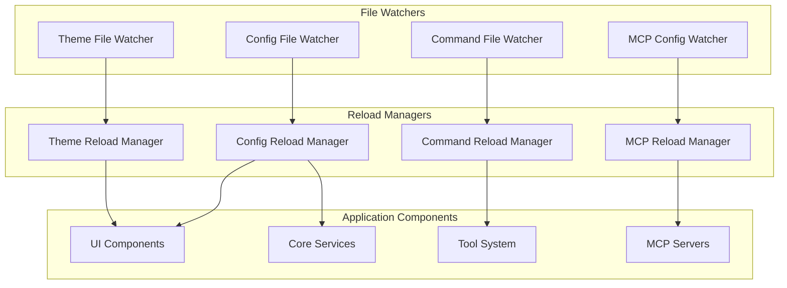
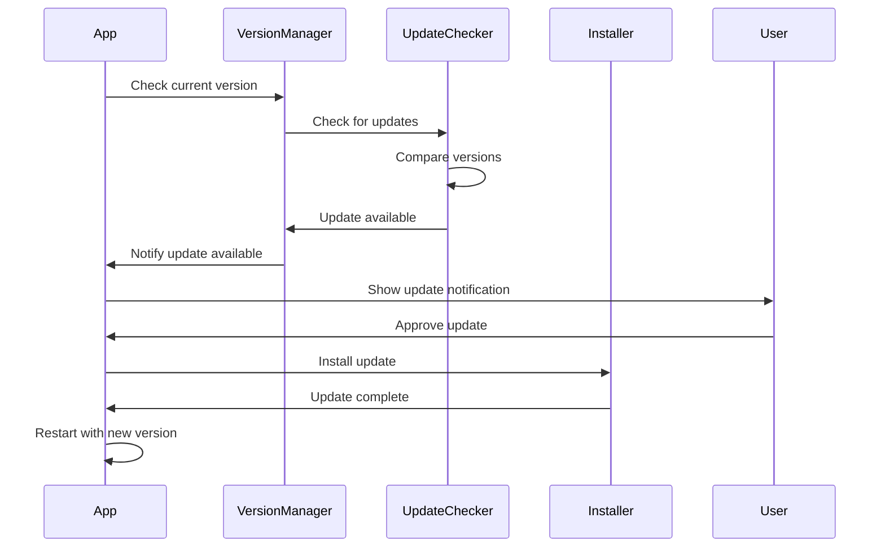

# Code Update Mechanisms

## Overview

Gemini CLI implements sophisticated code update mechanisms that enable dynamic configuration changes, hot reloading of components, version management, and seamless updates without service interruption. These mechanisms ensure the system remains responsive and maintainable while supporting continuous improvement.

## Hot Reload Architecture

### Configuration Hot Reloading



### File System Monitoring

```typescript
class HotReloadManager {
  private watchers: Map<string, FileWatcher> = new Map()
  private reloadHandlers: Map<string, ReloadHandler> = new Map()
  private debounceTime: number = 200
  
  watchFile(path: string, handler: ReloadHandler): void {
    const watcher = new FileWatcher(path, {
      debounce: this.debounceTime,
      onChange: async (filePath) => {
        await this.handleFileChange(filePath, handler)
      }
    })
    
    this.watchers.set(path, watcher)
    this.reloadHandlers.set(path, handler)
  }
  
  private async handleFileChange(path: string, handler: ReloadHandler): Promise<void> {
    try {
      console.log(`File changed: ${path}`)
      
      // Validate file before reloading
      const validation = await this.validateFile(path)
      if (!validation.valid) {
        console.error(`Invalid file: ${validation.error}`)
        return
      }
      
      // Execute reload handler
      await handler.reload(path)
      console.log(`Successfully reloaded: ${path}`)
      
    } catch (error) {
      console.error(`Failed to reload ${path}:`, error)
      // Emit error event for UI notification
      this.emit('reload-error', { path, error })
    }
  }
  
  private async validateFile(path: string): Promise<ValidationResult> {
    const ext = path.extname(path)
    
    switch (ext) {
      case '.json':
        return this.validateJSON(path)
      case '.toml':
        return this.validateTOML(path)
      case '.js':
      case '.ts':
        return this.validateJavaScript(path)
      default:
        return { valid: true }
    }
  }
}
```

### Configuration Reload Implementation

```typescript
class ConfigurationReloader implements ReloadHandler {
  private config: Configuration
  private subscribers: Set<ConfigSubscriber> = new Set()
  
  async reload(configPath: string): Promise<void> {
    // Load new configuration
    const newConfig = await this.loadConfiguration(configPath)
    
    // Compare with current configuration
    const changes = this.detectChanges(this.config, newConfig)
    
    if (changes.length === 0) {
      return // No changes detected
    }
    
    // Validate new configuration
    const validation = await this.validateConfiguration(newConfig)
    if (!validation.valid) {
      throw new Error(`Invalid configuration: ${validation.errors.join(', ')}`)
    }
    
    // Apply changes incrementally
    await this.applyConfigurationChanges(changes, newConfig)
    
    // Update current configuration
    this.config = newConfig
    
    // Notify subscribers
    await this.notifySubscribers(changes)
  }
  
  private detectChanges(oldConfig: Configuration, newConfig: Configuration): ConfigChange[] {
    const changes: ConfigChange[] = []
    
    // Deep comparison of configuration objects
    const oldFlat = this.flattenObject(oldConfig)
    const newFlat = this.flattenObject(newConfig)
    
    // Find changed/added keys
    for (const [key, newValue] of Object.entries(newFlat)) {
      if (oldFlat[key] !== newValue) {
        changes.push({
          type: oldFlat.hasOwnProperty(key) ? 'modified' : 'added',
          key,
          oldValue: oldFlat[key],
          newValue
        })
      }
    }
    
    // Find removed keys
    for (const key of Object.keys(oldFlat)) {
      if (!newFlat.hasOwnProperty(key)) {
        changes.push({
          type: 'removed',
          key,
          oldValue: oldFlat[key],
          newValue: undefined
        })
      }
    }
    
    return changes
  }
  
  private async applyConfigurationChanges(
    changes: ConfigChange[],
    newConfig: Configuration
  ): Promise<void> {
    // Group changes by component
    const componentChanges = this.groupChangesByComponent(changes)
    
    for (const [component, componentChanges] of componentChanges) {
      const handler = this.getComponentHandler(component)
      if (handler) {
        await handler.applyChanges(componentChanges, newConfig)
      }
    }
  }
}
```

## Theme Hot Reloading

### Dynamic Theme Updates

```typescript
class ThemeReloader implements ReloadHandler {
  private themeManager: ThemeManager
  private activeTheme: Theme
  
  async reload(themePath: string): Promise<void> {
    try {
      // Load and parse theme file
      const themeDefinition = await this.loadThemeDefinition(themePath)
      
      // Validate theme structure
      this.validateThemeDefinition(themeDefinition)
      
      // Compile theme styles
      const compiledTheme = await this.compileTheme(themeDefinition)
      
      // Apply theme smoothly with animation
      await this.applyThemeWithTransition(compiledTheme)
      
      this.activeTheme = compiledTheme
      
    } catch (error) {
      console.error('Theme reload failed:', error)
      // Revert to previous theme on error
      await this.revertToPreviousTheme()
      throw error
    }
  }
  
  private async applyThemeWithTransition(theme: Theme): Promise<void> {
    // Create smooth transition between themes
    const transitionDuration = 300 // ms
    
    // Apply new theme gradually
    return new Promise((resolve) => {
      let progress = 0
      const step = 100 / transitionDuration
      
      const transition = setInterval(() => {
        progress += step
        
        if (progress >= 100) {
          clearInterval(transition)
          this.themeManager.setTheme(theme)
          resolve()
        } else {
          // Interpolate between old and new theme
          const interpolated = this.interpolateThemes(
            this.activeTheme,
            theme,
            progress / 100
          )
          this.themeManager.setTheme(interpolated)
        }
      }, 10)
    })
  }
  
  private interpolateThemes(oldTheme: Theme, newTheme: Theme, progress: number): Theme {
    return {
      ...newTheme,
      colors: Object.fromEntries(
        Object.entries(newTheme.colors).map(([key, newColor]) => {
          const oldColor = oldTheme.colors[key]
          return [key, this.interpolateColor(oldColor, newColor, progress)]
        })
      )
    }
  }
}
```

## Command Hot Reloading

### Dynamic Command Registration

```typescript
class CommandReloader implements ReloadHandler {
  private commandRegistry: CommandRegistry
  private watchedDirectories: Set<string> = new Set()
  
  async reload(commandPath: string): Promise<void> {
    const isDirectory = await this.isDirectory(commandPath)
    
    if (isDirectory) {
      await this.reloadCommandDirectory(commandPath)
    } else {
      await this.reloadSingleCommand(commandPath)
    }
  }
  
  private async reloadCommandDirectory(directoryPath: string): Promise<void> {
    // Find all command files
    const commandFiles = await this.findCommandFiles(directoryPath)
    
    // Remove old commands from this directory
    const existingCommands = this.commandRegistry.getCommandsByPath(directoryPath)
    for (const command of existingCommands) {
      this.commandRegistry.unregister(command.name)
    }
    
    // Load new/updated commands
    const commands = await Promise.all(
      commandFiles.map(file => this.loadCommandFile(file))
    )
    
    // Register new commands
    for (const command of commands) {
      this.commandRegistry.register(command)
    }
    
    console.log(`Reloaded ${commands.length} commands from ${directoryPath}`)
  }
  
  private async loadCommandFile(filePath: string): Promise<Command> {
    const content = await fs.readFile(filePath, 'utf-8')
    const definition = toml.parse(content)
    
    // Generate command name from file path
    const commandName = this.getCommandNameFromPath(filePath)
    
    return {
      name: commandName,
      description: definition.description || `Command from ${filePath}`,
      prompt: definition.prompt,
      permissions: definition.permissions || {},
      confirmation: definition.confirmation || 'smart',
      filePath
    }
  }
  
  private getCommandNameFromPath(filePath: string): string {
    const relative = path.relative(this.getCommandsDirectory(), filePath)
    const withoutExt = relative.replace(/\.toml$/, '')
    return withoutExt.replace(/[/\\]/g, ':')
  }
}
```

## MCP Server Hot Reloading

### Dynamic Server Management

```typescript
class MCPServerReloader implements ReloadHandler {
  private mcpManager: MCPManager
  private serverConnections: Map<string, MCPServer> = new Map()
  
  async reload(configPath: string): Promise<void> {
    const newConfig = await this.loadMCPConfig(configPath)
    const currentServers = new Set(this.serverConnections.keys())
    const newServers = new Set(Object.keys(newConfig.mcpServers))
    
    // Find servers to remove
    const serversToRemove = this.setDifference(currentServers, newServers)
    
    // Find servers to add
    const serversToAdd = this.setDifference(newServers, currentServers)
    
    // Find servers to update
    const serversToUpdate = this.findServersToUpdate(newConfig)
    
    // Execute changes
    await this.executeServerChanges({
      remove: serversToRemove,
      add: serversToAdd,
      update: serversToUpdate,
      config: newConfig
    })
  }
  
  private async executeServerChanges(changes: ServerChanges): Promise<void> {
    // Remove disconnected servers
    for (const serverName of changes.remove) {
      await this.disconnectServer(serverName)
    }
    
    // Update existing servers
    for (const serverName of changes.update) {
      await this.updateServer(serverName, changes.config.mcpServers[serverName])
    }
    
    // Add new servers
    for (const serverName of changes.add) {
      await this.connectServer(serverName, changes.config.mcpServers[serverName])
    }
  }
  
  private async updateServer(serverName: string, config: MCPServerConfig): Promise<void> {
    const existingServer = this.serverConnections.get(serverName)
    if (!existingServer) return
    
    // Check if reconnection is needed
    if (this.requiresReconnection(existingServer.config, config)) {
      await this.disconnectServer(serverName)
      await this.connectServer(serverName, config)
    } else {
      // Update configuration in-place
      await existingServer.updateConfig(config)
    }
  }
  
  private requiresReconnection(oldConfig: MCPServerConfig, newConfig: MCPServerConfig): boolean {
    // Reconnection needed if transport or connection details changed
    return oldConfig.transport !== newConfig.transport ||
           oldConfig.command !== newConfig.command ||
           oldConfig.url !== newConfig.url ||
           JSON.stringify(oldConfig.args) !== JSON.stringify(newConfig.args)
  }
}
```

## Version Management

### Application Version Tracking



### Version Manager Implementation

```typescript
class VersionManager {
  private currentVersion: string
  private updateChannel: 'stable' | 'preview' | 'nightly'
  
  constructor() {
    this.currentVersion = this.getCurrentVersion()
    this.updateChannel = this.getUpdateChannel()
  }
  
  async checkForUpdates(): Promise<UpdateInfo | null> {
    try {
      const response = await fetch(this.getUpdateEndpoint())
      const updateInfo = await response.json()
      
      if (this.isNewerVersion(updateInfo.version, this.currentVersion)) {
        return {
          version: updateInfo.version,
          releaseNotes: updateInfo.releaseNotes,
          downloadUrl: updateInfo.downloadUrl,
          size: updateInfo.size,
          checksums: updateInfo.checksums
        }
      }
      
      return null
    } catch (error) {
      console.error('Failed to check for updates:', error)
      return null
    }
  }
  
  async installUpdate(updateInfo: UpdateInfo): Promise<void> {
    // Download update
    const updatePath = await this.downloadUpdate(updateInfo)
    
    // Verify checksum
    await this.verifyChecksum(updatePath, updateInfo.checksums)
    
    // Backup current installation
    const backupPath = await this.createBackup()
    
    try {
      // Install update
      await this.installUpdateFile(updatePath)
      
      // Cleanup
      await fs.unlink(updatePath)
      await this.removeBackup(backupPath)
      
    } catch (error) {
      // Restore from backup on failure
      await this.restoreFromBackup(backupPath)
      throw error
    }
  }
  
  private isNewerVersion(remoteVersion: string, localVersion: string): boolean {
    const remote = semver.parse(remoteVersion)
    const local = semver.parse(localVersion)
    
    if (!remote || !local) {
      return false
    }
    
    return semver.gt(remote, local)
  }
}
```

### Dependency Injection and Module Updates

```typescript
class DependencyInjector {
  private container: Map<string, any> = new Map()
  private dependencies: Map<string, DependencyDefinition> = new Map()
  
  register<T>(name: string, factory: () => T, options: DependencyOptions = {}): void {
    this.dependencies.set(name, {
      name,
      factory,
      singleton: options.singleton ?? true,
      hotReloadable: options.hotReloadable ?? false
    })
    
    if (options.hotReloadable) {
      this.setupHotReloading(name)
    }
  }
  
  private setupHotReloading(name: string): void {
    const dependency = this.dependencies.get(name)!
    
    // Watch for changes in dependency source
    const sourcePath = this.getDependencySourcePath(name)
    if (sourcePath) {
      this.hotReloadManager.watchFile(sourcePath, {
        async reload(path: string): Promise<void> {
          await this.reloadDependency(name)
        }
      })
    }
  }
  
  private async reloadDependency(name: string): Promise<void> {
    const dependency = this.dependencies.get(name)!
    
    // Remove old instance
    this.container.delete(name)
    
    // Clear module cache if it's a Node.js module
    const modulePath = this.getDependencyModulePath(name)
    if (modulePath && require.cache[modulePath]) {
      delete require.cache[modulePath]
    }
    
    // Create new instance
    const newInstance = dependency.factory()
    this.container.set(name, newInstance)
    
    // Notify dependents
    await this.notifyDependents(name, newInstance)
  }
  
  private async notifyDependents(dependencyName: string, newInstance: any): Promise<void> {
    for (const [name, dependency] of this.dependencies) {
      if (dependency.dependsOn?.includes(dependencyName)) {
        await this.reloadDependency(name)
      }
    }
  }
}
```

## Build System Integration

### Incremental Building

```typescript
class IncrementalBuilder {
  private buildCache: Map<string, BuildCacheEntry> = new Map()
  private dependencyGraph: DependencyGraph
  
  async build(changedFiles: string[]): Promise<BuildResult> {
    // Analyze what needs to be rebuilt
    const affectedModules = this.dependencyGraph.getAffectedModules(changedFiles)
    
    // Topological sort for build order
    const buildOrder = this.dependencyGraph.topologicalSort(affectedModules)
    
    const results: BuildModuleResult[] = []
    
    for (const module of buildOrder) {
      const result = await this.buildModule(module)
      results.push(result)
      
      if (!result.success) {
        return { success: false, results, error: result.error }
      }
    }
    
    return { success: true, results }
  }
  
  private async buildModule(module: string): Promise<BuildModuleResult> {
    const cacheEntry = this.buildCache.get(module)
    const sourceFiles = this.dependencyGraph.getSourceFiles(module)
    const currentHashes = await this.calculateFileHashes(sourceFiles)
    
    // Check if rebuild is needed
    if (cacheEntry && this.hashesMatch(cacheEntry.sourceHashes, currentHashes)) {
      return { success: true, module, cached: true }
    }
    
    try {
      // Execute build for this module
      const buildResult = await this.executeBuild(module)
      
      // Update cache
      this.buildCache.set(module, {
        module,
        sourceHashes: currentHashes,
        buildTime: Date.now(),
        outputs: buildResult.outputs
      })
      
      return { success: true, module, outputs: buildResult.outputs }
      
    } catch (error) {
      return { success: false, module, error }
    }
  }
}
```

### Asset Hot Replacement

```typescript
class AssetHotReplacement {
  private assetManifest: Map<string, AssetInfo> = new Map()
  private liveConnections: Set<WebSocket> = new Set()
  
  watchAssets(assetDirectory: string): void {
    const watcher = fs.watch(assetDirectory, { recursive: true }, 
      (eventType, filename) => {
        this.handleAssetChange(assetDirectory, eventType, filename)
      }
    )
  }
  
  private async handleAssetChange(
    directory: string,
    eventType: string,
    filename: string
  ): Promise<void> {
    const fullPath = path.join(directory, filename)
    const assetKey = this.getAssetKey(fullPath)
    
    switch (eventType) {
      case 'change':
        await this.handleAssetUpdate(assetKey, fullPath)
        break
      case 'rename':
        await this.handleAssetRename(assetKey, fullPath)
        break
    }
  }
  
  private async handleAssetUpdate(assetKey: string, path: string): Promise<void> {
    // Read updated asset
    const content = await fs.readFile(path)
    const hash = this.calculateHash(content)
    
    // Update manifest
    this.assetManifest.set(assetKey, {
      path,
      hash,
      lastModified: Date.now()
    })
    
    // Notify live connections
    const message = {
      type: 'asset-updated',
      assetKey,
      hash,
      content: content.toString('base64')
    }
    
    this.broadcast(message)
  }
  
  private broadcast(message: any): void {
    const messageStr = JSON.stringify(message)
    
    for (const connection of this.liveConnections) {
      if (connection.readyState === WebSocket.OPEN) {
        connection.send(messageStr)
      }
    }
  }
}
```

## Error Handling and Rollback

### Safe Update Mechanism

```typescript
class SafeUpdateManager {
  private rollbackStack: RollbackAction[] = []
  private updateInProgress: boolean = false
  
  async performSafeUpdate(updateAction: UpdateAction): Promise<void> {
    if (this.updateInProgress) {
      throw new Error('Update already in progress')
    }
    
    this.updateInProgress = true
    this.rollbackStack = []
    
    try {
      await this.executeUpdate(updateAction)
      this.clearRollbackStack()
    } catch (error) {
      console.error('Update failed, performing rollback:', error)
      await this.performRollback()
      throw error
    } finally {
      this.updateInProgress = false
    }
  }
  
  private async executeUpdate(action: UpdateAction): Promise<void> {
    // Create rollback action before making changes
    const rollbackAction = await this.createRollbackAction(action)
    this.rollbackStack.push(rollbackAction)
    
    // Execute the update
    await action.execute()
    
    // Verify the update was successful
    const verification = await this.verifyUpdate(action)
    if (!verification.success) {
      throw new Error(`Update verification failed: ${verification.error}`)
    }
  }
  
  private async performRollback(): Promise<void> {
    // Execute rollback actions in reverse order
    for (let i = this.rollbackStack.length - 1; i >= 0; i--) {
      const rollbackAction = this.rollbackStack[i]
      try {
        await rollbackAction.execute()
      } catch (error) {
        console.error('Rollback action failed:', error)
        // Continue with other rollback actions
      }
    }
  }
}
```

## Performance Optimization

### Lazy Loading and Code Splitting

```typescript
class ModuleLoader {
  private loadedModules: Map<string, any> = new Map()
  private loadingPromises: Map<string, Promise<any>> = new Map()
  
  async loadModule(moduleName: string): Promise<any> {
    // Return cached module if already loaded
    if (this.loadedModules.has(moduleName)) {
      return this.loadedModules.get(moduleName)
    }
    
    // Return existing loading promise if already loading
    if (this.loadingPromises.has(moduleName)) {
      return this.loadingPromises.get(moduleName)
    }
    
    // Start loading module
    const loadingPromise = this.performModuleLoad(moduleName)
    this.loadingPromises.set(moduleName, loadingPromise)
    
    try {
      const module = await loadingPromise
      this.loadedModules.set(moduleName, module)
      return module
    } finally {
      this.loadingPromises.delete(moduleName)
    }
  }
  
  private async performModuleLoad(moduleName: string): Promise<any> {
    const modulePath = this.resolveModulePath(moduleName)
    
    // Use dynamic import for ES modules
    if (this.isESModule(modulePath)) {
      return await import(modulePath)
    }
    
    // Use require for CommonJS modules
    return require(modulePath)
  }
  
  unloadModule(moduleName: string): void {
    // Remove from cache
    this.loadedModules.delete(moduleName)
    
    // Clear from Node.js require cache
    const modulePath = this.resolveModulePath(moduleName)
    if (require.cache[modulePath]) {
      delete require.cache[modulePath]
    }
  }
}
```

## Best Practices

### Hot Reload Best Practices

1. **Graceful Degradation**: System continues to work even if hot reload fails
2. **Validation**: Always validate configuration before applying changes
3. **Atomic Updates**: Apply changes atomically to prevent inconsistent state
4. **Rollback Capability**: Maintain ability to rollback on failure
5. **Performance**: Minimize impact on running system

### Error Recovery

```typescript
class ErrorRecoveryManager {
  private errorThreshold: number = 5
  private errorCount: number = 0
  private lastErrorTime: number = 0
  private recoveryStrategies: Map<string, RecoveryStrategy> = new Map()
  
  async handleError(error: Error, context: ErrorContext): Promise<void> {
    this.errorCount++
    this.lastErrorTime = Date.now()
    
    // If too many errors, disable hot reloading temporarily
    if (this.errorCount > this.errorThreshold) {
      this.disableHotReloading()
      return
    }
    
    const strategy = this.recoveryStrategies.get(error.constructor.name)
    if (strategy) {
      await strategy.recover(error, context)
    }
  }
  
  private disableHotReloading(): void {
    console.warn('Too many hot reload errors, disabling temporarily')
    
    // Re-enable after 5 minutes
    setTimeout(() => {
      this.errorCount = 0
      this.enableHotReloading()
    }, 5 * 60 * 1000)
  }
}
```

## Future Enhancements

### Planned Improvements
- **Distributed Hot Reloading**: Hot reload across multiple instances
- **Smart Dependency Tracking**: Better dependency analysis
- **Zero-Downtime Updates**: Seamless updates without interruption
- **Configuration Validation**: Advanced validation with custom rules
- **Update Rollback UI**: User interface for managing rollbacks

### Research Areas
- Incremental compilation techniques
- Advanced caching strategies
- Predictive preloading
- Cross-platform compatibility
- Memory-efficient hot reloading