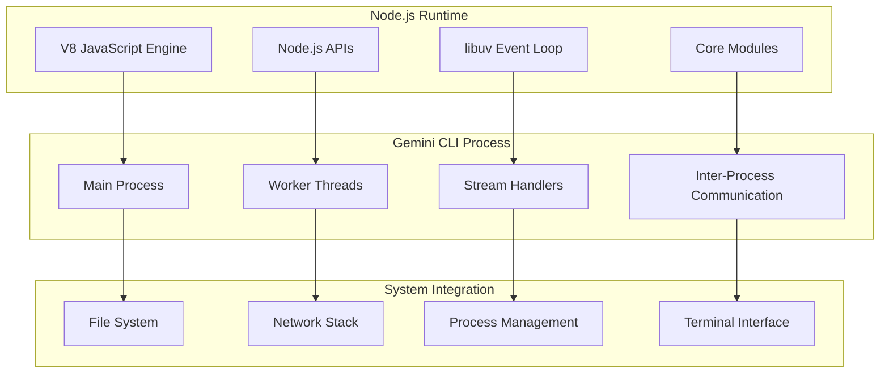

# Core Technologies

## Overview

Gemini CLI is built on a foundation of modern technologies that enable high-performance, cross-platform operation with rich terminal interfaces. This document analyzes the core technical stack, runtime environment, performance optimizations, and security implementations that power the system.

## Runtime Environment

### Node.js Architecture



### JavaScript Engine Optimization

```typescript
// V8 Engine Configuration
class RuntimeOptimizer {
  private memoryThresholds = {
    warning: 512 * 1024 * 1024,  // 512MB
    critical: 1024 * 1024 * 1024  // 1GB
  }
  
  optimizeRuntime(): void {
    // Enable V8 optimizations
    if (process.env.NODE_ENV === 'production') {
      // Optimize for performance
      process.env.NODE_OPTIONS = [
        '--optimize-for-size',
        '--max-old-space-size=2048',
        '--max-semi-space-size=128'
      ].join(' ')
    }
    
    // Monitor memory usage
    this.startMemoryMonitoring()
    
    // Configure garbage collection
    this.configureGarbageCollection()
  }
  
  private configureGarbageCollection(): void {
    // Force GC when memory usage is high
    const memoryCheck = () => {
      const usage = process.memoryUsage()
      const heapUsed = usage.heapUsed
      
      if (heapUsed > this.memoryThresholds.critical) {
        if (global.gc) {
          global.gc()
        }
      }
    }
    
    setInterval(memoryCheck, 30000) // Check every 30 seconds
  }
}
```

## TypeScript Integration

### Advanced Type System Usage

```typescript
// Sophisticated type definitions
interface APIClient<T extends APIProvider> {
  provider: T
  send<R extends APIRequest>(request: R): Promise<APIResponse<R>>
  stream<S extends StreamRequest>(request: S): AsyncIterator<StreamChunk<S>>
}

// Conditional types for tool parameters
type ToolParameters<T extends ToolName> = 
  T extends 'read_file' ? { path: string } :
  T extends 'write_file' ? { path: string; content: string } :
  T extends 'bash_command' ? { command: string } :
  never

// Template literal types for command parsing
type CommandName = `/${string}` | `@${string}` | `!${string}`
type ParseCommand<T extends string> = 
  T extends `/${infer Command}` ? { type: 'slash'; command: Command } :
  T extends `@${infer Path}` ? { type: 'file'; path: Path } :
  T extends `!${infer Shell}` ? { type: 'shell'; command: Shell } :
  never

// Utility types for configuration
type DeepPartial<T> = {
  [P in keyof T]?: T[P] extends object ? DeepPartial<T[P]> : T[P]
}

type RequireAtLeastOne<T, Keys extends keyof T = keyof T> = 
  Pick<T, Exclude<keyof T, Keys>> & {
    [K in Keys]-?: Required<Pick<T, K>> & Partial<Pick<T, Exclude<Keys, K>>>
  }[Keys]
```

### Build System and Compilation

```typescript
// ESBuild configuration for optimal bundling
interface BuildConfig {
  entryPoints: string[]
  outdir: string
  bundle: boolean
  platform: 'node'
  target: 'node20'
  format: 'esm' | 'cjs'
  minify: boolean
  sourcemap: boolean
  external: string[]
}

class BuildOptimizer {
  createOptimizedBuild(): BuildConfig {
    return {
      entryPoints: ['src/index.ts'],
      outdir: 'dist',
      bundle: true,
      platform: 'node',
      target: 'node20',
      format: 'esm',
      minify: process.env.NODE_ENV === 'production',
      sourcemap: true,
      external: [
        // Keep Node.js built-ins external
        'fs', 'path', 'os', 'crypto', 'stream',
        // Keep optional dependencies external
        'node-pty', '@lydell/node-pty'
      ],
      plugins: [
        this.createProgressPlugin(),
        this.createOptimizationPlugin()
      ]
    }
  }
  
  private createOptimizationPlugin(): Plugin {
    return {
      name: 'optimization',
      setup(build) {
        // Tree shaking optimization
        build.onResolve({ filter: /.*/ }, (args) => {
          if (args.kind === 'dynamic-import') {
            // Convert dynamic imports to static for better bundling
            return this.staticizeImport(args)
          }
        })
        
        // Dead code elimination
        build.onLoad({ filter: /\.ts$/ }, async (args) => {
          const source = await fs.readFile(args.path, 'utf8')
          return {
            contents: this.eliminateDeadCode(source),
            loader: 'ts'
          }
        })
      }
    }
  }
}
```

## Terminal UI Technologies

### React and Ink Integration

```typescript
// Advanced React patterns for CLI
interface InkComponent {
  render(): React.ReactElement
  useEffect(): void
  useState(): [any, (value: any) => void]
}

class TerminalRenderer {
  private app: Instance
  private components: Map<string, React.ComponentType> = new Map()
  
  async render(component: React.ComponentType, props?: any): Promise<void> {
    // Create Ink app instance
    this.app = render(React.createElement(component, props))
    
    // Handle graceful shutdown
    process.on('SIGINT', () => {
      this.app.unmount()
      process.exit(0)
    })
    
    // Wait for completion
    await this.app.waitUntilExit()
  }
  
  // Custom hooks for CLI-specific functionality
  useTerminalSize(): { width: number; height: number } {
    const [size, setSize] = React.useState({
      width: process.stdout.columns || 80,
      height: process.stdout.rows || 24
    })
    
    React.useEffect(() => {
      const updateSize = () => {
        setSize({
          width: process.stdout.columns || 80,
          height: process.stdout.rows || 24
        })
      }
      
      process.stdout.on('resize', updateSize)
      return () => process.stdout.off('resize', updateSize)
    }, [])
    
    return size
  }
}
```

### ANSI and Terminal Control

```typescript
class TerminalController {
  // ANSI escape sequences
  private readonly ANSI = {
    RESET: '\x1b[0m',
    BOLD: '\x1b[1m',
    DIM: '\x1b[2m',
    UNDERLINE: '\x1b[4m',
    BLINK: '\x1b[5m',
    REVERSE: '\x1b[7m',
    HIDDEN: '\x1b[8m',
    
    // Cursor control
    CURSOR_UP: (n: number) => `\x1b[${n}A`,
    CURSOR_DOWN: (n: number) => `\x1b[${n}B`,
    CURSOR_FORWARD: (n: number) => `\x1b[${n}C`,
    CURSOR_BACK: (n: number) => `\x1b[${n}D`,
    
    // Screen control
    CLEAR_SCREEN: '\x1b[2J',
    CLEAR_LINE: '\x1b[K',
    SAVE_CURSOR: '\x1b[s',
    RESTORE_CURSOR: '\x1b[u'
  }
  
  setupAlternateScreen(): void {
    // Switch to alternate screen buffer
    process.stdout.write('\x1b[?1049h')
    
    // Cleanup on exit
    process.on('exit', () => {
      process.stdout.write('\x1b[?1049l')
    })
  }
  
  enableRawMode(): void {
    if (process.stdin.isTTY) {
      process.stdin.setRawMode(true)
      process.stdin.resume()
    }
  }
  
  createProgressBar(total: number): ProgressBar {
    return new ProgressBar({
      format: '{bar} {percentage}% | {value}/{total}',
      width: 40,
      total
    })
  }
}
```

## Security Implementation

### Sandboxing Technologies

```typescript
class SandboxManager {
  private sandboxType: SandboxType
  private containerRuntime: ContainerRuntime
  
  async createSandbox(config: SandboxConfig): Promise<Sandbox> {
    switch (this.sandboxType) {
      case 'docker':
        return this.createDockerSandbox(config)
      case 'podman':
        return this.createPodmanSandbox(config)
      case 'seatbelt':
        return this.createSeatbeltSandbox(config)
      default:
        throw new Error(`Unsupported sandbox type: ${this.sandboxType}`)
    }
  }
  
  private async createDockerSandbox(config: SandboxConfig): Promise<DockerSandbox> {
    const containerConfig = {
      Image: config.image || 'gemini-cli-sandbox:latest',
      Cmd: config.command,
      Env: Object.entries(config.env || {}).map(([k, v]) => `${k}=${v}`),
      WorkingDir: config.workingDir || '/workspace',
      HostConfig: {
        Memory: config.memoryLimit || 512 * 1024 * 1024, // 512MB
        CpuQuota: config.cpuQuota || 50000, // 50% CPU
        NetworkMode: config.networkMode || 'none',
        ReadonlyRootfs: config.readOnly || false,
        Binds: config.mounts?.map(m => `${m.host}:${m.container}:${m.mode}`) || []
      }
    }
    
    const container = await this.containerRuntime.createContainer(containerConfig)
    return new DockerSandbox(container)
  }
  
  private createSeatbeltProfile(restrictions: SecurityRestrictions): string {
    return `
      (version 1)
      (deny default)
      
      ; Allow basic system operations
      (allow file-read* file-write*
        (regex #"^/dev/null$")
        (regex #"^/dev/zero$")
        (regex #"^/dev/random$")
        (regex #"^/dev/urandom$"))
      
      ; Allow network access if specified
      ${restrictions.network ? '(allow network*)' : '(deny network*)'}
      
      ; File system restrictions
      ${restrictions.fileSystem.readPaths.map(path => 
        `(allow file-read* (regex #"^${path}.*"))`
      ).join('\n')}
      
      ${restrictions.fileSystem.writePaths.map(path => 
        `(allow file-write* (regex #"^${path}.*"))`
      ).join('\n')}
    `
  }
}
```

### Credential Management

```typescript
class SecureCredentialStore {
  private keychain: KeychainAccess
  private fallbackStore: EncryptedFileStore
  
  async store(service: string, account: string, password: string): Promise<void> {
    try {
      // Try system keychain first
      if (this.keychain.isAvailable()) {
        await this.keychain.setPassword(service, account, password)
        return
      }
    } catch (error) {
      console.warn('Keychain storage failed, using fallback')
    }
    
    // Fallback to encrypted file storage
    await this.fallbackStore.store(service, account, password)
  }
  
  async retrieve(service: string, account: string): Promise<string | null> {
    try {
      if (this.keychain.isAvailable()) {
        return await this.keychain.getPassword(service, account)
      }
    } catch (error) {
      // Fall through to fallback
    }
    
    return this.fallbackStore.retrieve(service, account)
  }
}

class EncryptedFileStore {
  private encryptionKey: Buffer
  
  constructor() {
    this.encryptionKey = this.deriveKey()
  }
  
  private deriveKey(): Buffer {
    const salt = os.hostname() + os.userInfo().username
    return crypto.pbkdf2Sync('gemini-cli', salt, 100000, 32, 'sha256')
  }
  
  async store(service: string, account: string, password: string): Promise<void> {
    const data = { service, account, password, timestamp: Date.now() }
    const encrypted = this.encrypt(JSON.stringify(data))
    const storePath = this.getStorePath(service, account)
    
    await fs.mkdir(path.dirname(storePath), { recursive: true })
    await fs.writeFile(storePath, encrypted)
  }
  
  private encrypt(data: string): string {
    const iv = crypto.randomBytes(16)
    const cipher = crypto.createCipher('aes-256-gcm', this.encryptionKey, iv)
    
    let encrypted = cipher.update(data, 'utf8', 'hex')
    encrypted += cipher.final('hex')
    
    const authTag = cipher.getAuthTag()
    return iv.toString('hex') + ':' + authTag.toString('hex') + ':' + encrypted
  }
}
```

## Performance Optimization

### Memory Management

```typescript
class MemoryManager {
  private pools: Map<string, ObjectPool> = new Map()
  private monitors: Set<MemoryMonitor> = new Set()
  
  createObjectPool<T>(name: string, factory: () => T, maxSize: number = 100): ObjectPool<T> {
    const pool = new ObjectPool(factory, maxSize)
    this.pools.set(name, pool)
    return pool
  }
  
  startMemoryMonitoring(): void {
    const monitor = setInterval(() => {
      const usage = process.memoryUsage()
      const heapUsedMB = usage.heapUsed / 1024 / 1024
      
      // Trigger cleanup if memory usage is high
      if (heapUsedMB > 500) { // 500MB threshold
        this.performMemoryCleanup()
      }
      
      // Log memory statistics
      this.logMemoryStats(usage)
    }, 10000) // Check every 10 seconds
    
    this.monitors.add(monitor)
  }
  
  private performMemoryCleanup(): void {
    // Clear object pools
    for (const pool of this.pools.values()) {
      pool.clear()
    }
    
    // Force garbage collection if available
    if (global.gc) {
      global.gc()
    }
  }
}

class ObjectPool<T> {
  private pool: T[] = []
  private factory: () => T
  private maxSize: number
  
  constructor(factory: () => T, maxSize: number) {
    this.factory = factory
    this.maxSize = maxSize
  }
  
  acquire(): T {
    return this.pool.pop() || this.factory()
  }
  
  release(obj: T): void {
    if (this.pool.length < this.maxSize) {
      // Reset object state if it has a reset method
      if (typeof (obj as any).reset === 'function') {
        (obj as any).reset()
      }
      
      this.pool.push(obj)
    }
  }
  
  clear(): void {
    this.pool = []
  }
}
```

### I/O Optimization

```typescript
class IOOptimizer {
  private readCache: LRUCache<string, Buffer>
  private writeQueue: AsyncQueue<WriteOperation>
  
  constructor() {
    this.readCache = new LRUCache({ max: 1000, ttl: 60000 }) // 1 minute TTL
    this.writeQueue = new AsyncQueue(10) // Max 10 concurrent writes
  }
  
  async optimizedRead(path: string): Promise<Buffer> {
    // Check cache first
    const cached = this.readCache.get(path)
    if (cached) {
      return cached
    }
    
    // Read with optimal buffer size
    const stats = await fs.stat(path)
    const bufferSize = this.getOptimalBufferSize(stats.size)
    
    const fd = await fs.open(path, 'r')
    try {
      const buffer = Buffer.allocUnsafe(stats.size)
      let position = 0
      
      while (position < stats.size) {
        const bytesToRead = Math.min(bufferSize, stats.size - position)
        const { bytesRead } = await fd.read(buffer, position, bytesToRead, position)
        position += bytesRead
      }
      
      // Cache the result
      this.readCache.set(path, buffer)
      return buffer
      
    } finally {
      await fd.close()
    }
  }
  
  async optimizedWrite(path: string, data: Buffer): Promise<void> {
    return this.writeQueue.add(async () => {
      const fd = await fs.open(path, 'w')
      try {
        let position = 0
        const bufferSize = this.getOptimalBufferSize(data.length)
        
        while (position < data.length) {
          const bytesToWrite = Math.min(bufferSize, data.length - position)
          await fd.write(data, position, bytesToWrite, position)
          position += bytesToWrite
        }
        
        await fd.sync() // Force write to disk
      } finally {
        await fd.close()
      }
    })
  }
  
  private getOptimalBufferSize(fileSize: number): number {
    // Optimal buffer size based on file size
    if (fileSize < 64 * 1024) return 8 * 1024      // 8KB for small files
    if (fileSize < 1024 * 1024) return 64 * 1024   // 64KB for medium files
    return 256 * 1024                               // 256KB for large files
  }
}
```

### CPU Optimization

```typescript
class CPUOptimizer {
  private workerPool: WorkerPool
  private cpuCount: number
  
  constructor() {
    this.cpuCount = os.cpus().length
    this.workerPool = new WorkerPool(Math.max(1, this.cpuCount - 1))
  }
  
  async optimizeCPUIntensiveTask<T>(
    task: CPUIntensiveTask<T>,
    data: any[]
  ): Promise<T[]> {
    // Determine if task should be parallelized
    if (data.length < 100 || !this.shouldParallelize(task)) {
      return this.executeSequentially(task, data)
    }
    
    // Parallel execution using worker threads
    return this.executeInParallel(task, data)
  }
  
  private async executeInParallel<T>(
    task: CPUIntensiveTask<T>,
    data: any[]
  ): Promise<T[]> {
    const chunkSize = Math.ceil(data.length / this.cpuCount)
    const chunks = this.chunkArray(data, chunkSize)
    
    const results = await Promise.all(
      chunks.map(chunk => 
        this.workerPool.execute(task.workerScript, { chunk })
      )
    )
    
    return results.flat()
  }
  
  private shouldParallelize(task: CPUIntensiveTask<any>): boolean {
    // Decision based on task complexity and data size
    return task.complexity === 'high' || 
           task.estimatedTime > 1000 // > 1 second
  }
}

class WorkerPool {
  private workers: Worker[] = []
  private available: Worker[] = []
  private queue: TaskExecution[] = []
  
  constructor(poolSize: number) {
    for (let i = 0; i < poolSize; i++) {
      this.createWorker()
    }
  }
  
  private createWorker(): void {
    const worker = new Worker('./worker.js')
    
    worker.on('message', (result) => {
      this.handleWorkerMessage(worker, result)
    })
    
    worker.on('error', (error) => {
      this.handleWorkerError(worker, error)
    })
    
    this.workers.push(worker)
    this.available.push(worker)
  }
  
  async execute(script: string, data: any): Promise<any> {
    return new Promise((resolve, reject) => {
      const execution = { script, data, resolve, reject }
      
      const worker = this.available.pop()
      if (worker) {
        this.executeTask(worker, execution)
      } else {
        this.queue.push(execution)
      }
    })
  }
  
  private executeTask(worker: Worker, execution: TaskExecution): void {
    worker.postMessage({
      script: execution.script,
      data: execution.data
    })
    
    // Store execution context for result handling
    (worker as any)._currentExecution = execution
  }
}
```

## Cross-Platform Compatibility

### Platform Abstraction

```typescript
class PlatformAdapter {
  private platform: NodeJS.Platform
  
  constructor() {
    this.platform = process.platform
  }
  
  getConfigDirectory(): string {
    switch (this.platform) {
      case 'win32':
        return path.join(os.homedir(), 'AppData', 'Roaming', 'gemini-cli')
      case 'darwin':
        return path.join(os.homedir(), 'Library', 'Application Support', 'gemini-cli')
      default:
        return path.join(os.homedir(), '.config', 'gemini-cli')
    }
  }
  
  getShellCommand(): string {
    switch (this.platform) {
      case 'win32':
        return process.env.COMSPEC || 'cmd.exe'
      default:
        return process.env.SHELL || '/bin/bash'
    }
  }
  
  async executeShell(command: string): Promise<ExecutionResult> {
    const shell = this.getShellCommand()
    const isWindows = this.platform === 'win32'
    
    const childProcess = spawn(shell, 
      isWindows ? ['/c', command] : ['-c', command],
      {
        stdio: 'pipe',
        env: { ...process.env, GEMINI_CLI: '1' }
      }
    )
    
    return this.handleChildProcess(childProcess)
  }
}
```

### Terminal Compatibility

```typescript
class TerminalCompatibility {
  private capabilities: TerminalCapabilities
  
  constructor() {
    this.capabilities = this.detectCapabilities()
  }
  
  private detectCapabilities(): TerminalCapabilities {
    return {
      colors: this.detectColorSupport(),
      unicode: this.detectUnicodeSupport(),
      ansi: this.detectANSISupport(),
      mouse: this.detectMouseSupport(),
      clipboard: this.detectClipboardSupport()
    }
  }
  
  private detectColorSupport(): ColorSupport {
    if (process.env.NO_COLOR) return 'none'
    if (process.env.FORCE_COLOR) return 'full'
    
    const colorTerm = process.env.COLORTERM
    if (colorTerm === 'truecolor' || colorTerm === '24bit') {
      return 'full'
    }
    
    const term = process.env.TERM
    if (term?.includes('256')) return '256'
    if (term?.includes('color')) return 'basic'
    
    return process.stdout.isTTY ? 'basic' : 'none'
  }
  
  adaptToTerminal(content: string): string {
    if (this.capabilities.colors === 'none') {
      return this.stripColors(content)
    }
    
    if (this.capabilities.colors === 'basic') {
      return this.convertToBasicColors(content)
    }
    
    return content
  }
}
```

## Best Practices and Patterns

### Error Handling Patterns

```typescript
class RobustErrorHandler {
  private errorTypes: Map<string, ErrorHandlerStrategy> = new Map()
  
  constructor() {
    this.registerDefaultHandlers()
  }
  
  private registerDefaultHandlers(): void {
    this.errorTypes.set('ENOENT', new FileNotFoundHandler())
    this.errorTypes.set('EACCES', new PermissionHandler())
    this.errorTypes.set('ENOTDIR', new NotDirectoryHandler())
    this.errorTypes.set('EISDIR', new IsDirectoryHandler())
    this.errorTypes.set('EMFILE', new TooManyFilesHandler())
  }
  
  async handle(error: NodeJS.ErrnoException): Promise<ErrorResult> {
    const handler = this.errorTypes.get(error.code || 'UNKNOWN')
    
    if (handler) {
      return handler.handle(error)
    }
    
    return this.handleUnknownError(error)
  }
}

interface ErrorHandlerStrategy {
  handle(error: NodeJS.ErrnoException): Promise<ErrorResult>
}

class FileNotFoundHandler implements ErrorHandlerStrategy {
  async handle(error: NodeJS.ErrnoException): Promise<ErrorResult> {
    const suggestions = await this.generateSuggestions(error.path)
    
    return {
      recoverable: false,
      message: `File not found: ${error.path}`,
      suggestions,
      retry: false
    }
  }
  
  private async generateSuggestions(path?: string): Promise<string[]> {
    if (!path) return []
    
    const dir = dirname(path)
    const filename = basename(path)
    
    try {
      const files = await fs.readdir(dir)
      return files
        .filter(f => this.calculateSimilarity(f, filename) > 0.6)
        .slice(0, 3)
        .map(f => join(dir, f))
    } catch {
      return []
    }
  }
}
```

### Resource Management

```typescript
class ResourceManager {
  private resources: Set<ManagedResource> = new Set()
  private cleanupHandlers: Set<() => Promise<void>> = new Set()
  
  constructor() {
    this.setupGracefulShutdown()
  }
  
  private setupGracefulShutdown(): void {
    const shutdown = async (signal: string) => {
      console.log(`Received ${signal}, shutting down gracefully...`)
      
      try {
        await this.cleanup()
        process.exit(0)
      } catch (error) {
        console.error('Error during cleanup:', error)
        process.exit(1)
      }
    }
    
    process.on('SIGINT', () => shutdown('SIGINT'))
    process.on('SIGTERM', () => shutdown('SIGTERM'))
    process.on('SIGHUP', () => shutdown('SIGHUP'))
  }
  
  async manage<T extends ManagedResource>(resource: T): Promise<T> {
    this.resources.add(resource)
    return resource
  }
  
  private async cleanup(): Promise<void> {
    const cleanupPromises = [
      ...Array.from(this.resources).map(r => r.cleanup()),
      ...Array.from(this.cleanupHandlers).map(h => h())
    ]
    
    await Promise.allSettled(cleanupPromises)
  }
}
```

## Future Technology Considerations

### Emerging Technologies

1. **WebAssembly Integration**
   - High-performance modules for CPU-intensive tasks
   - Cross-language interoperability
   - Sandboxed execution environment

2. **Worker Threads Enhancement**
   - Better parallel processing
   - Shared memory between threads
   - Advanced synchronization primitives

3. **Native Modules**
   - Platform-specific optimizations
   - Direct system integration
   - Hardware acceleration capabilities

4. **Modern JavaScript Features**
   - Top-level await
   - Pattern matching
   - Records and tuples
   - Temporal API for better date/time handling

### Performance Improvements

1. **V8 Optimizations**
   - Better garbage collection strategies
   - Improved JIT compilation
   - Advanced profiling capabilities

2. **I/O Performance**
   - io_uring on Linux
   - IOCP on Windows
   - Better async file operations

3. **Memory Management**
   - Weak references and finalizers
   - Better memory debugging tools
   - Optimized object allocation

This comprehensive core technologies analysis provides the foundation for understanding how Gemini CLI achieves its performance, security, and cross-platform compatibility goals.