# Component Relationships Diagrams

This document contains comprehensive diagrams showing the relationships between different components in the Gemini CLI architecture.

## System-Level Component Architecture

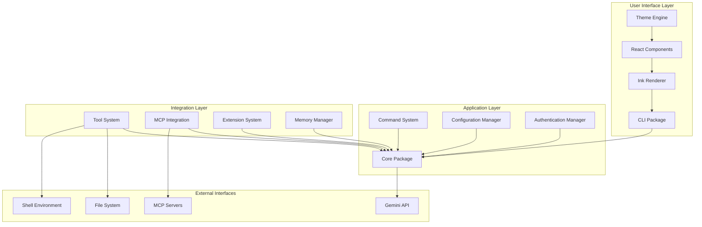

## Package Dependency Graph

```mermaid
graph LR
    subgraph "Packages"
        CLI[packages/cli]
        Core[packages/core]
        TestUtils[packages/test-utils]
        VSCode[packages/vscode-ide-companion]
    end
    
    subgraph "External Dependencies"
        React[react]
        Ink[ink]
        GeminiAPI[@google/genai]
        MCPsdk[@modelcontextprotocol/sdk]
        NodePTY[node-pty]
    end
    
    CLI --> Core
    CLI --> React
    CLI --> Ink
    CLI --> NodePTY
    
    Core --> GeminiAPI
    Core --> MCPsdk
    
    TestUtils --> CLI
    TestUtils --> Core
    
    VSCode --> Core
```

## Tool System Component Relationships

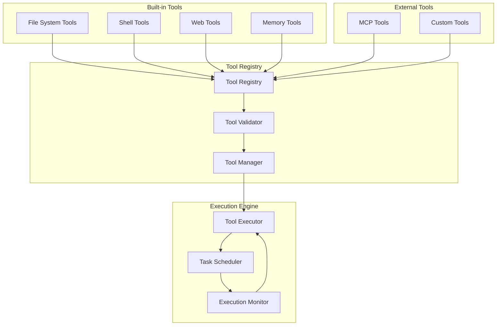

## MCP Server Integration Components

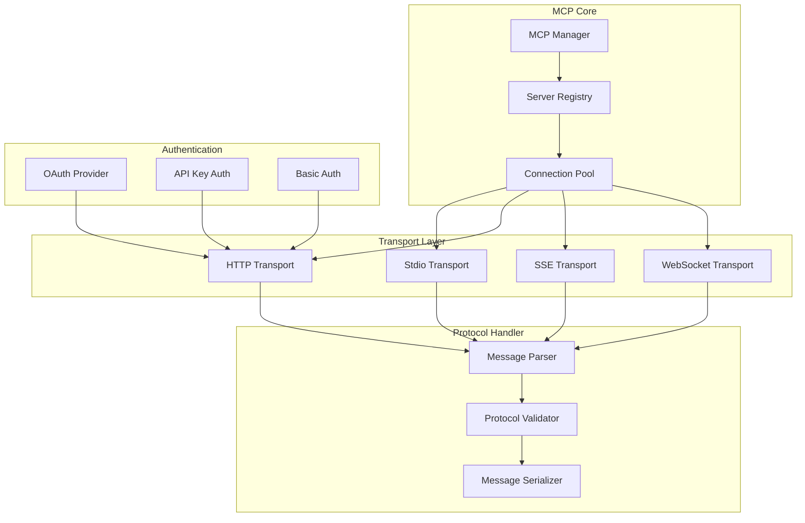

## Authentication Flow Components

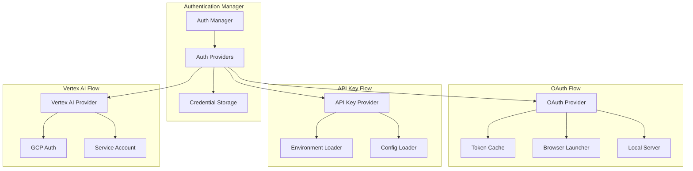

## Configuration System Components

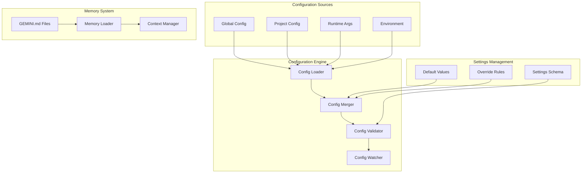

## Command Processing Components

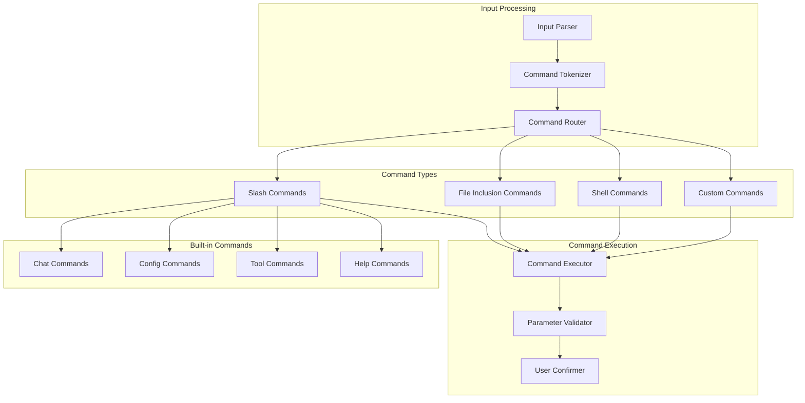

## UI Component Hierarchy

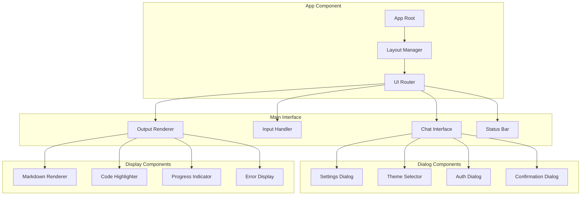

## Memory and Context Components

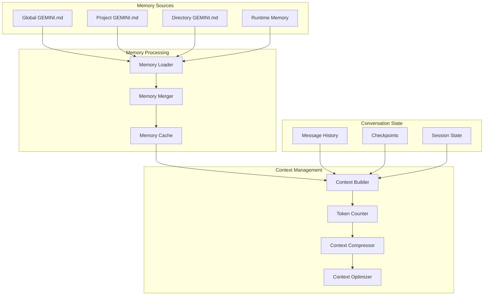

## Error Handling Component Network

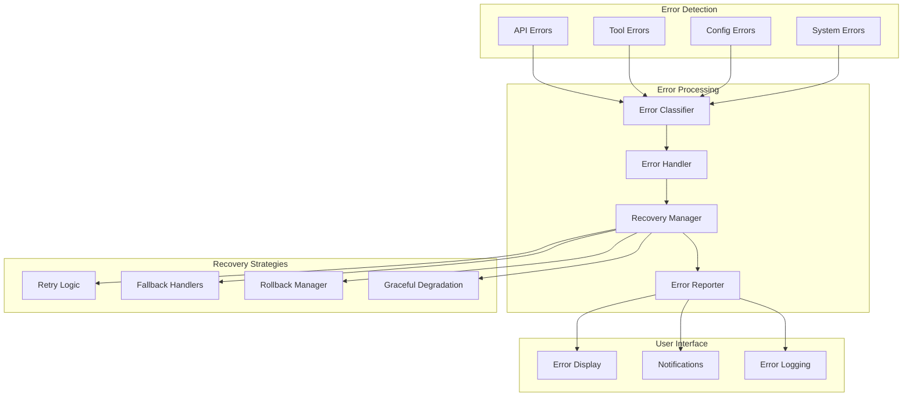

## Data Flow Between Components

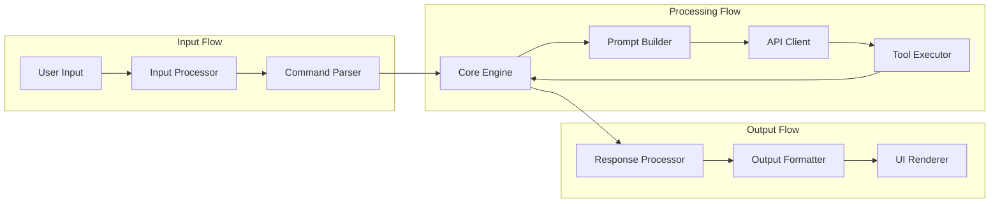

## Testing Component Relationships

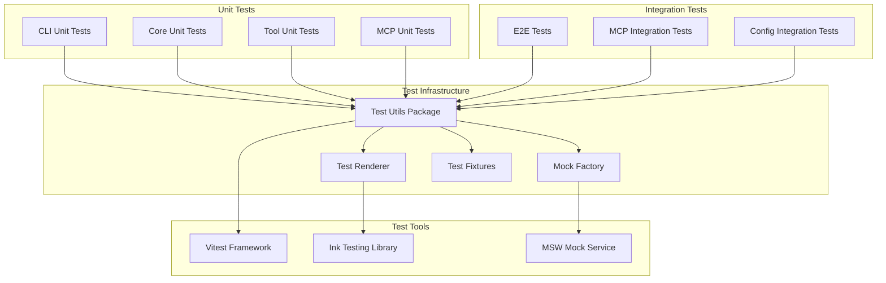

## Security Component Relationships

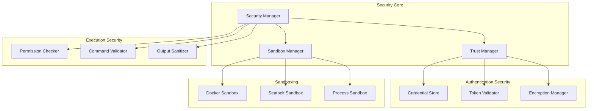

These component relationship diagrams provide a comprehensive view of how different parts of the Gemini CLI system interact with each other, showing dependencies, data flow, and architectural boundaries.