# Data Flow Diagrams

This document contains comprehensive data flow diagrams showing how information moves through the Gemini CLI system.

## Overall System Data Flow

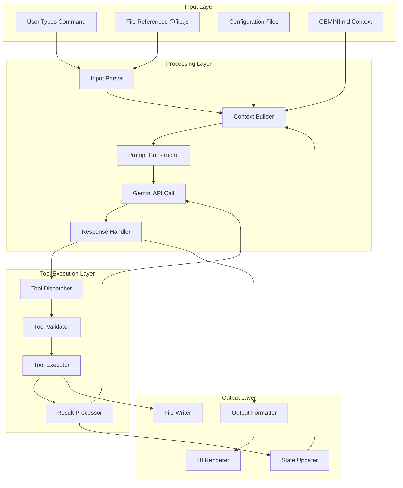

## Request-Response Cycle Data Flow

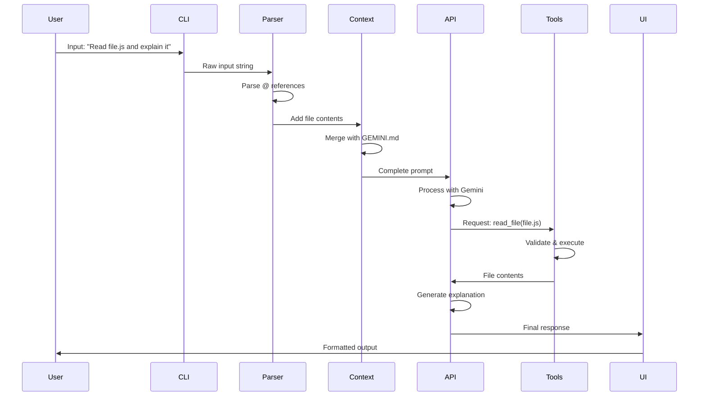

## File Operation Data Flow

```mermaid
flowchart LR
    subgraph "File Discovery"
        UserPath[User Path Input]
        PathResolver[Path Resolver]
        GitIgnoreFilter[Git Ignore Filter]
        FileList[Filtered File List]
    end
    
    subgraph "File Reading"
        FileReader[File Reader]
        ContentCache[Content Cache]
        SizeChecker[Size Checker]
        EncodingDetector[Encoding Detector]
    end
    
    subgraph "Content Processing"
        ContentParser[Content Parser]
        MetadataExtractor[Metadata Extractor]
        TokenCounter[Token Counter]
        ContentOptimizer[Content Optimizer]
    end
    
    UserPath --> PathResolver
    PathResolver --> GitIgnoreFilter
    GitIgnoreFilter --> FileList
    
    FileList --> FileReader
    FileReader --> ContentCache
    FileReader --> SizeChecker
    SizeChecker --> EncodingDetector
    
    EncodingDetector --> ContentParser
    ContentParser --> MetadataExtractor
    MetadataExtractor --> TokenCounter
    TokenCounter --> ContentOptimizer
    
    ContentOptimizer --> PromptBuilder[Prompt Builder]
```

## Configuration Data Flow

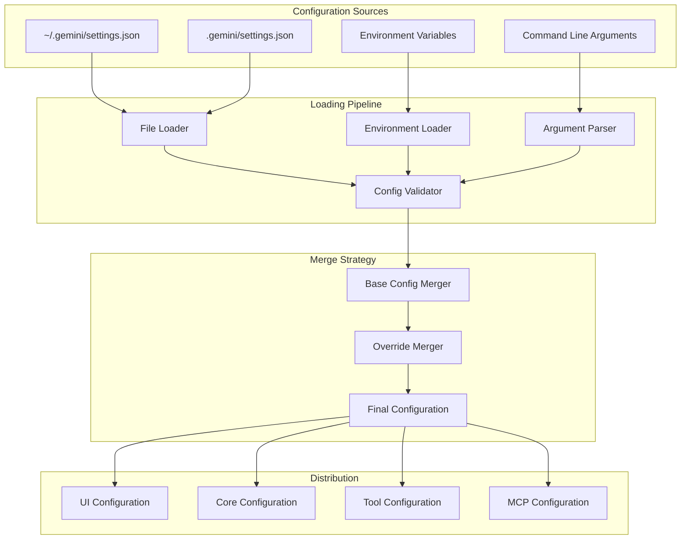

## Authentication Data Flow

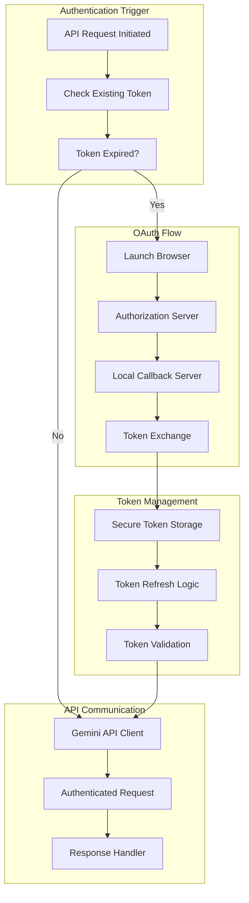

## Tool Execution Data Flow

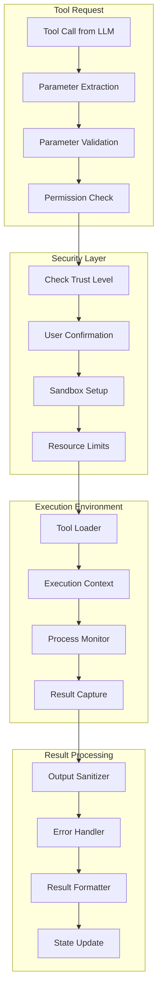

## MCP Server Communication Flow

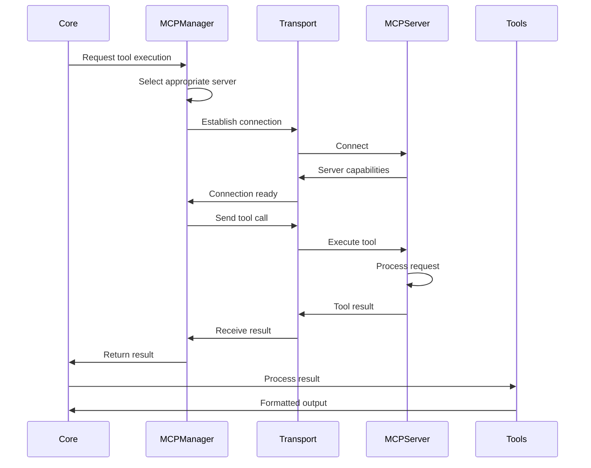

## Memory and Context Flow

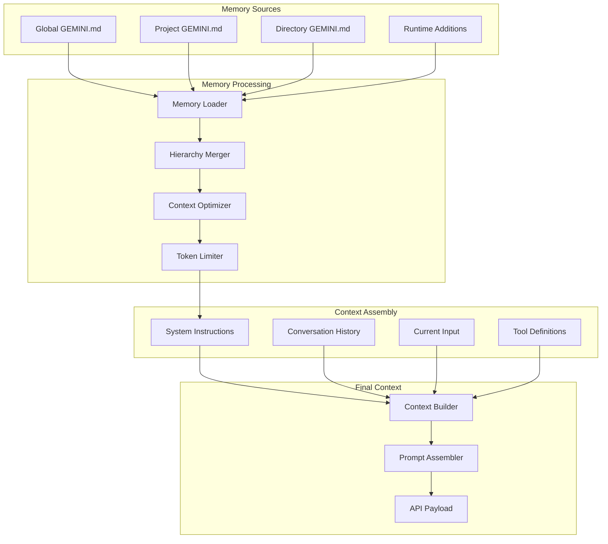

## Streaming Response Data Flow

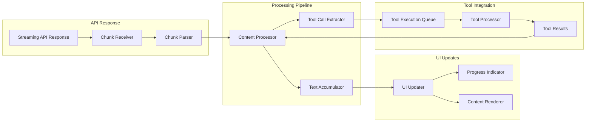

## Error Propagation Flow

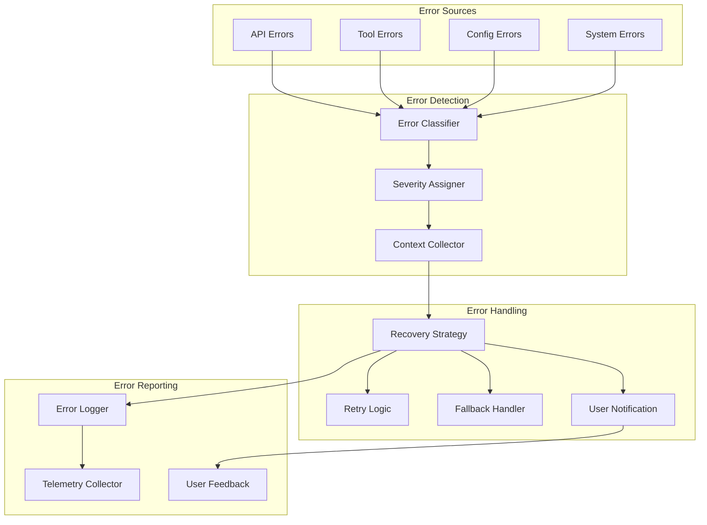

## Checkpoint and State Management Flow

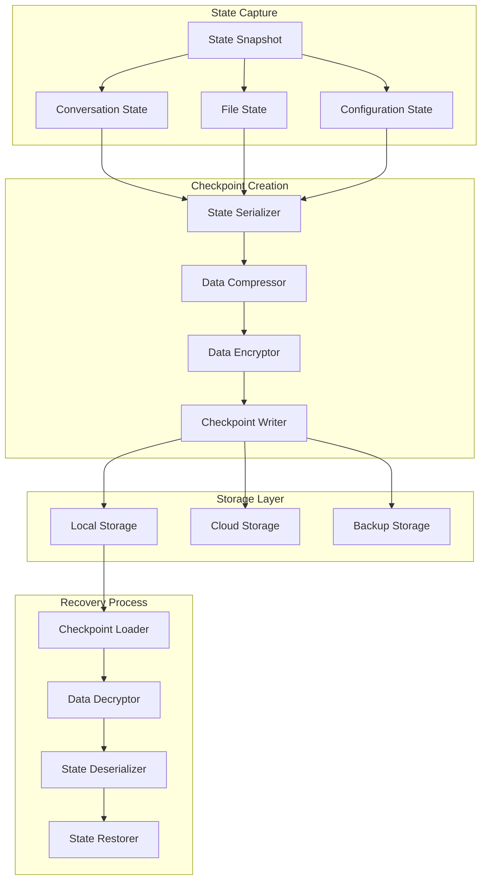

## Performance Monitoring Data Flow

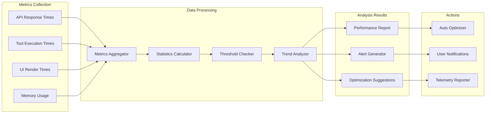

These data flow diagrams provide a comprehensive view of how information moves through the Gemini CLI system, from user input to final output, including all the processing steps, transformations, and state changes that occur along the way.