# Sequence Diagrams

This document contains detailed sequence diagrams showing the temporal flow of operations in Gemini CLI.

## Application Startup Sequence

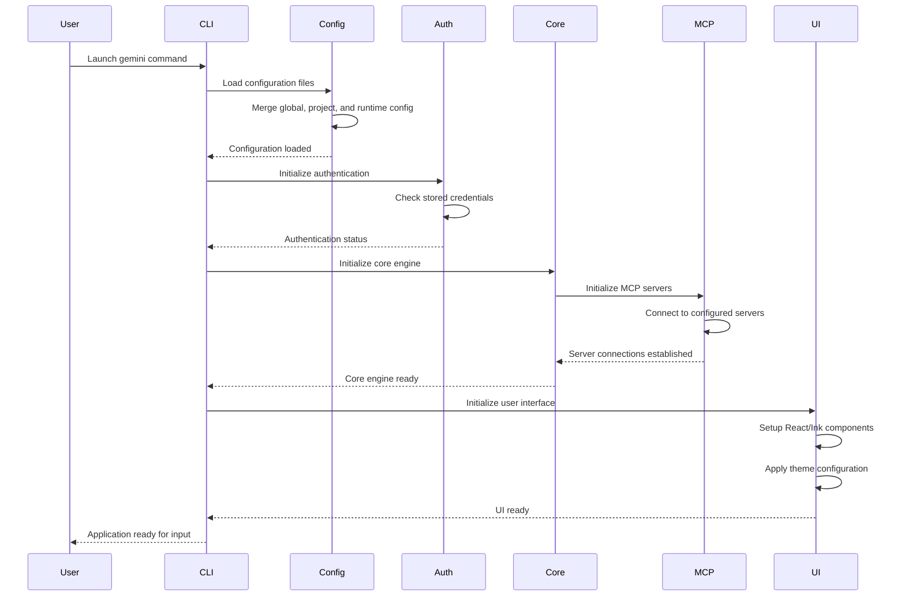

## User Input Processing Sequence

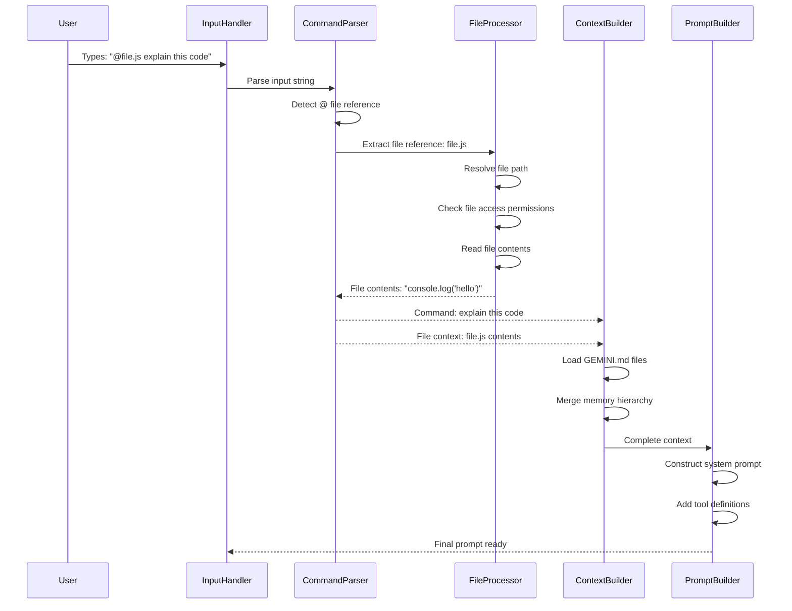

## Authentication Flow Sequence

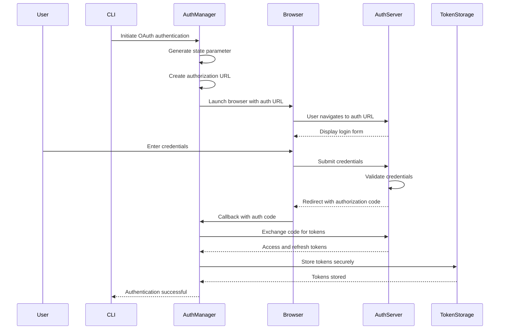

## Tool Execution Sequence

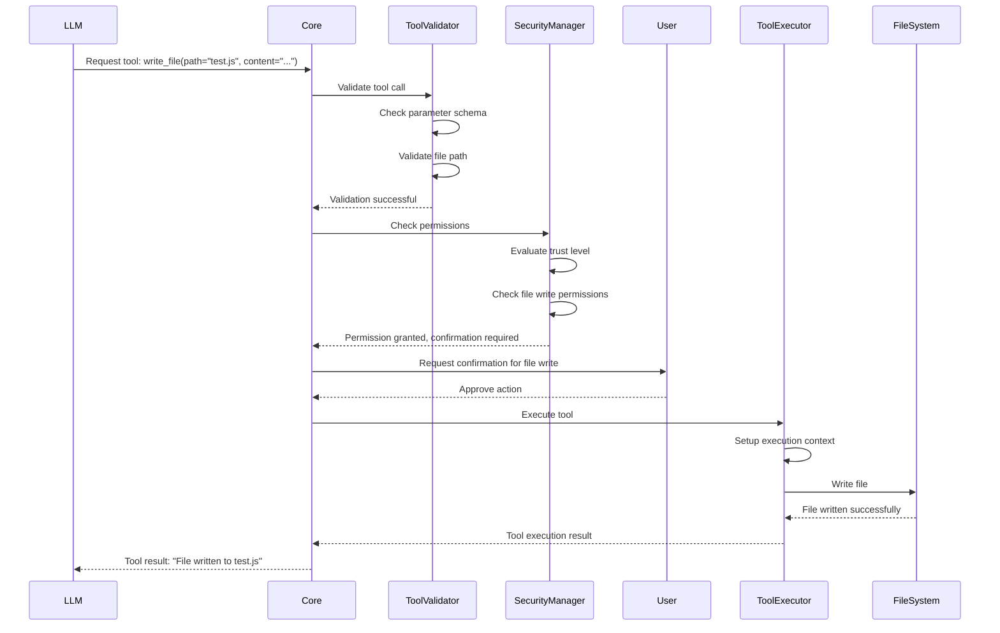

## MCP Server Connection Sequence

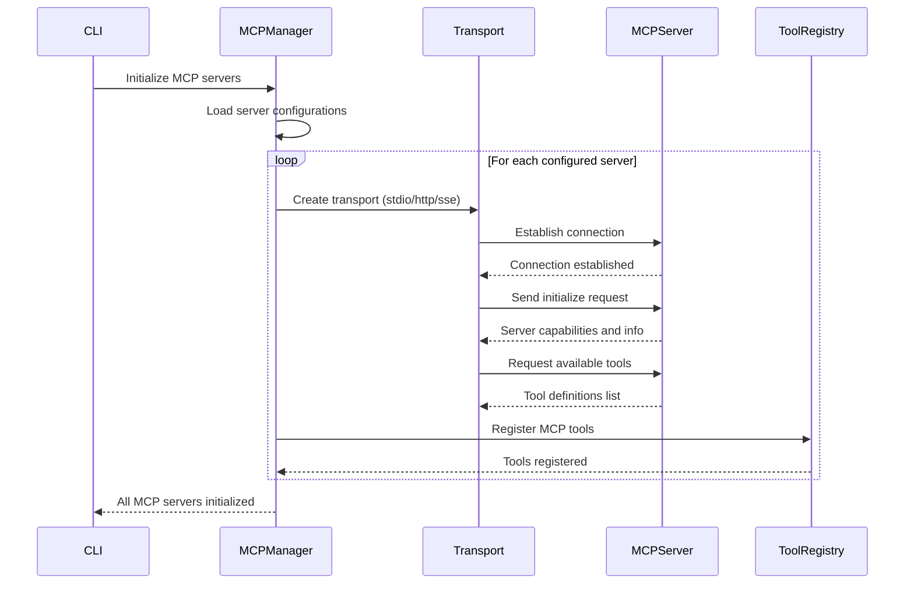

## Streaming Response Handling Sequence

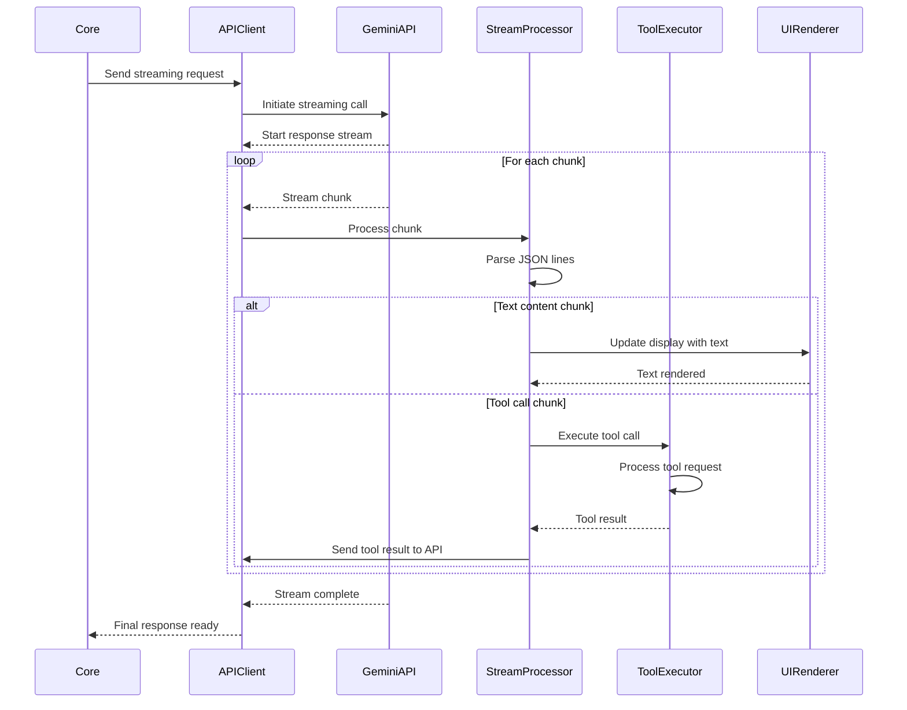

## Error Handling and Recovery Sequence

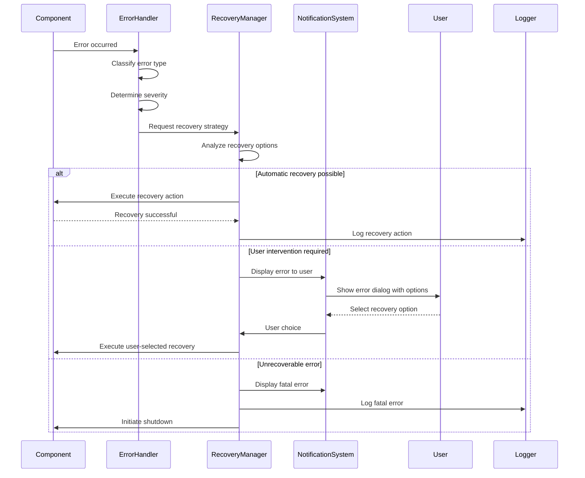

## Configuration Hot Reload Sequence

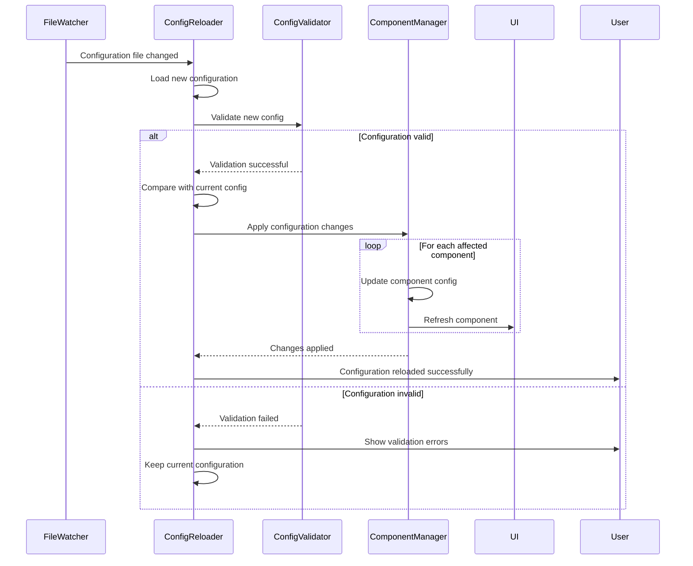

## Conversation Checkpoint Sequence

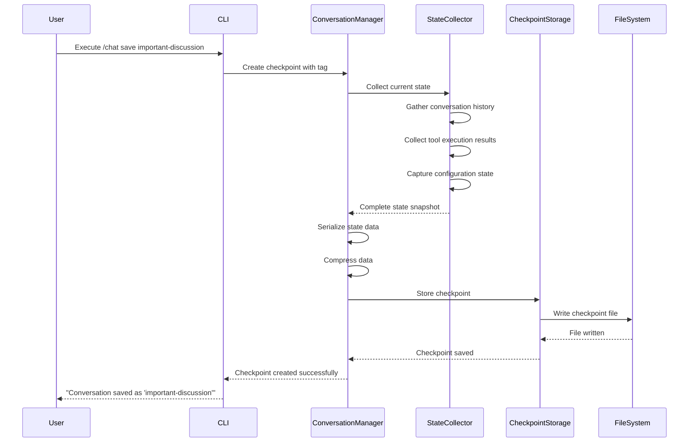

## Memory Loading and Merging Sequence

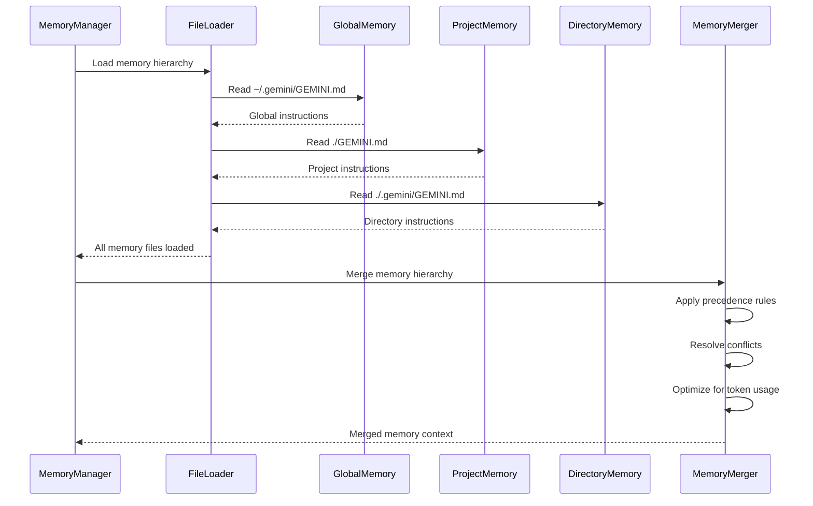

## Theme Application Sequence

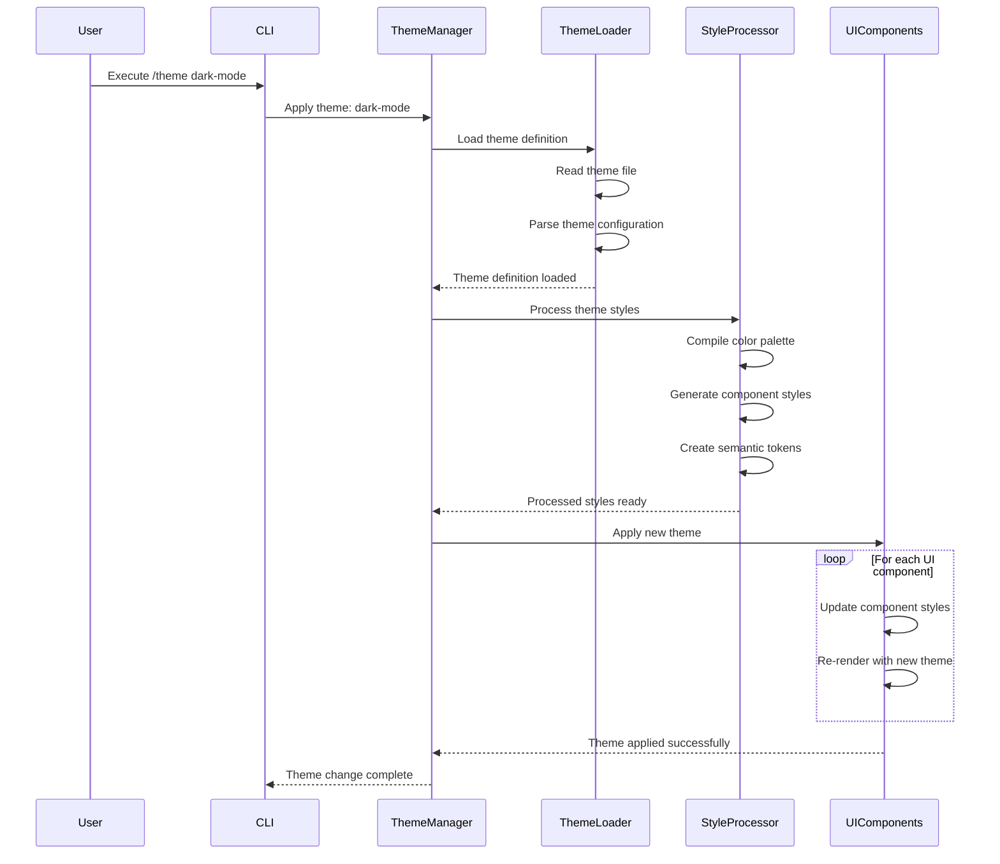

## Custom Command Execution Sequence

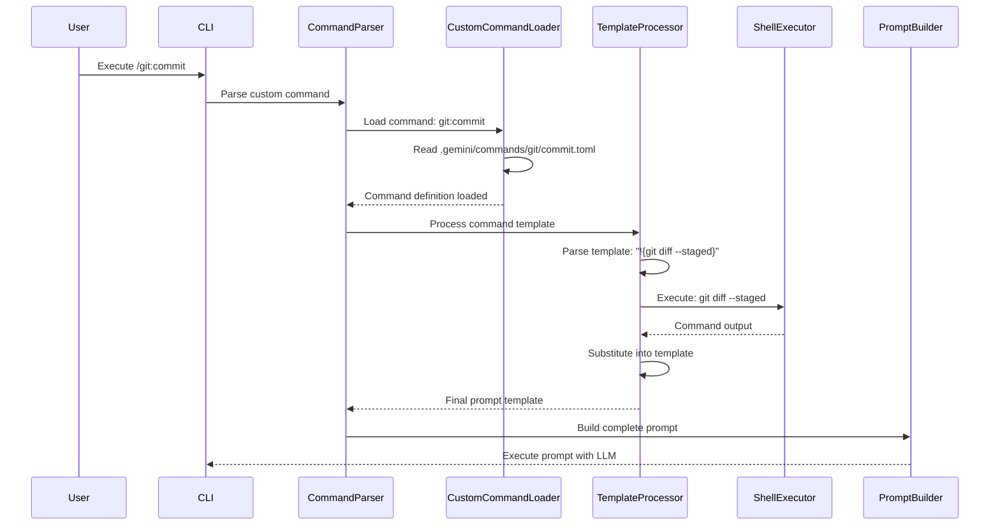

## Session Cleanup Sequence

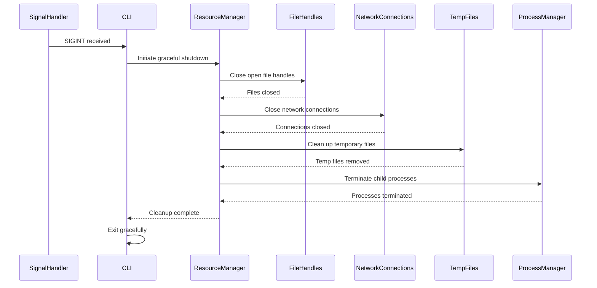

These sequence diagrams provide detailed views of the temporal interactions between components in Gemini CLI, showing how operations unfold over time and how different parts of the system coordinate to accomplish complex tasks.