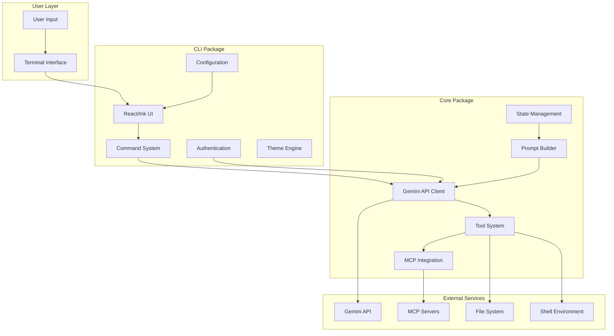
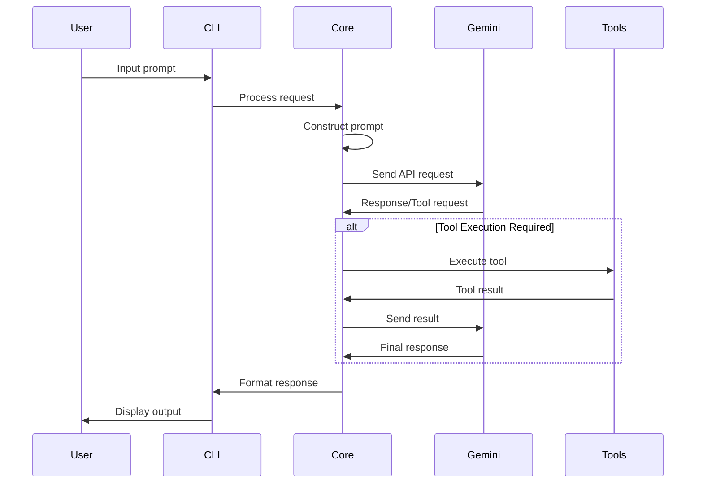
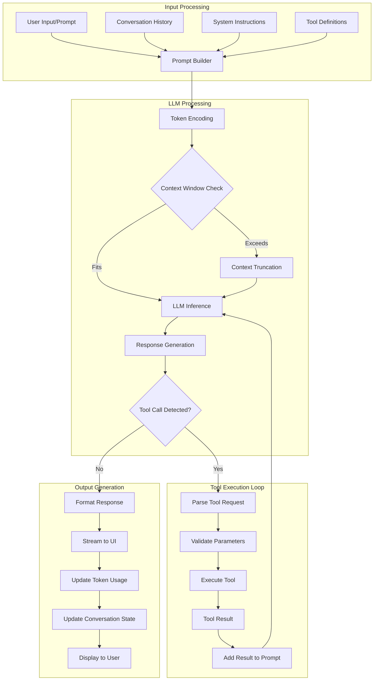
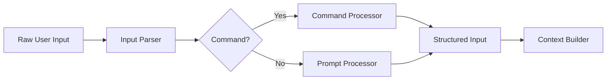
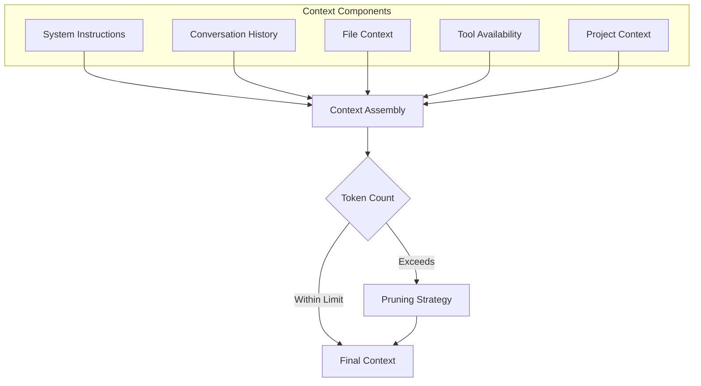
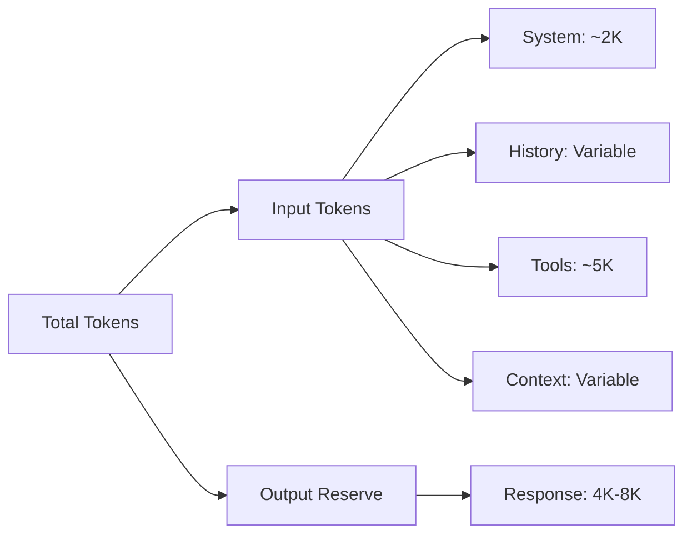
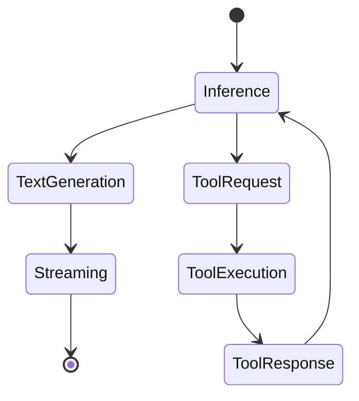
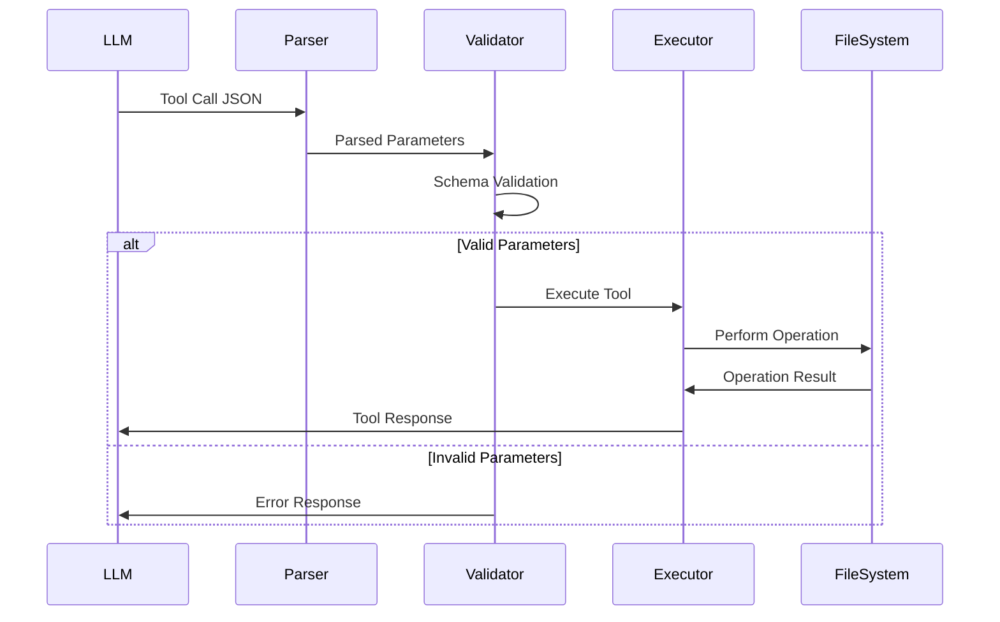
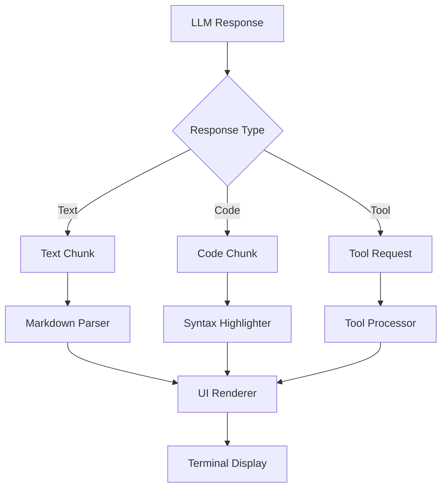
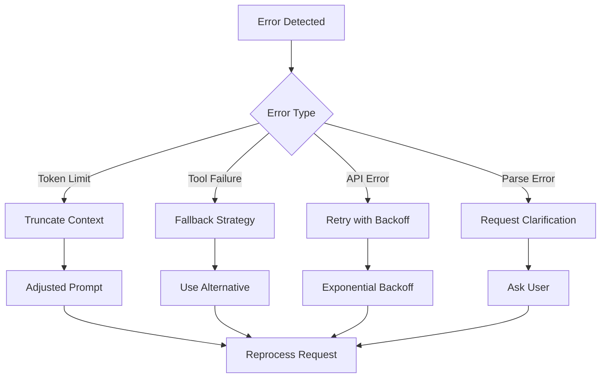

# Gemini CLI Architecture Overview

## Executive Summary

Gemini CLI is a sophisticated command-line interface that brings Google's Gemini AI model directly to the terminal. Built on a modular monorepo architecture, it provides a rich interactive experience through React-based terminal UI, extensible tool system, and comprehensive integration capabilities.

## System Architecture



## Package Structure

The project follows a monorepo structure managed by npm workspaces:

```
gemini-cli/
├── packages/
│   ├── cli/          # User-facing CLI application
│   ├── core/         # Backend logic and API integration
│   ├── test-utils/   # Shared testing utilities
│   └── vscode-ide-companion/  # VS Code integration
├── docs/             # Comprehensive documentation
├── integration-tests/# End-to-end testing
└── scripts/          # Build and development scripts
```

## Core Components

### 1. CLI Package (`packages/cli`)
**Purpose**: Handles all user-facing interactions and UI rendering

**Key Responsibilities**:
- Terminal UI rendering using React and Ink
- Command processing and routing
- Theme management and customization
- Authentication flow management
- Configuration handling
- User input processing and validation

### 2. Core Package (`packages/core`)
**Purpose**: Backend engine managing Gemini API and tool orchestration

**Key Responsibilities**:
- Gemini API communication
- Tool registration and execution
- MCP server integration
- Prompt construction and management
- State management for conversations
- Security and sandboxing

### 3. Tool System
**Purpose**: Extensible framework for extending Gemini's capabilities

**Built-in Tools**:
- File system operations (read, write, edit)
- Shell command execution
- Web fetching and searching
- Memory management
- Multi-file operations

### 4. MCP Integration
**Purpose**: Model Context Protocol support for custom tool servers

**Features**:
- Multiple transport support (Stdio, SSE, HTTP)
- OAuth authentication
- Dynamic tool discovery
- Rich content handling

## Data Flow Patterns

### Request-Response Cycle



## LLM Processing Workflow

### Overview
The LLM (Large Language Model) processing workflow describes how Gemini processes user input, manages context, executes tools, and generates responses. This multi-stage pipeline ensures intelligent, context-aware interactions with tool execution capabilities.

### Detailed LLM Input-Output Workflow



### Input Components

#### 1. User Input Processing


**Input Types**:
- **Direct Prompts**: Natural language queries and instructions
- **Commands**: Slash commands (e.g., `/edit`, `/search`)
- **File References**: `@filename` syntax for file inclusion
- **Shell Injections**: `!{command}` for command output inclusion

#### 2. Context Management


**Context Priorities**:
1. **System Instructions**: Core behavior definitions
2. **Recent Messages**: Latest conversation turns
3. **Tool Definitions**: Available tool schemas
4. **File Context**: Referenced file contents
5. **Historical Context**: Older conversation (prunable)

### LLM Processing Pipeline

#### 1. Prompt Construction
```typescript
interface PromptStructure {
  system: string           // System instructions and behavior
  messages: Message[]       // Conversation history
  tools: ToolDefinition[]   // Available tool schemas
  context: {
    files: FileContext[]    // Referenced files
    project: ProjectInfo    // Project metadata
    memory: MemoryContext   // Persistent memory
  }
}
```

#### 2. Token Management


**Token Allocation Strategy**:
- **Model Limit**: 128K tokens (Gemini 1.5)
- **Input Budget**: ~120K tokens
- **Output Reserve**: ~8K tokens
- **Dynamic Pruning**: Oldest context first

#### 3. Response Generation


### Tool Execution Workflow

#### Tool Detection and Parsing


#### Tool Types and Execution
```yaml
built_in_tools:
  - read_file:
      input: file_path, range
      output: file_contents
      execution: sync filesystem read
  
  - write_file:
      input: file_path, content
      output: success/error
      execution: async filesystem write
  
  - run_shell:
      input: command, timeout
      output: stdout, stderr, exit_code
      execution: subprocess spawn
  
  - search:
      input: query, path, pattern
      output: matched_files, snippets
      execution: ripgrep integration

mcp_tools:
  - dynamic_registration: true
  - execution: via MCP protocol
  - response: structured JSON
```

### Output Processing

#### Response Streaming


#### State Management
```typescript
interface ConversationState {
  messages: Message[]
  tokenUsage: {
    input: number
    output: number
    total: number
  }
  toolExecutions: ToolExecution[]
  checkpoints: Checkpoint[]
  memory: PersistentMemory
}
```

### Error Handling and Recovery



### Performance Optimizations

#### Caching Strategy
```yaml
cache_layers:
  token_cache:
    - system_prompt: persistent
    - tool_definitions: session
    - common_responses: LRU cache
  
  file_cache:
    - read_files: TTL 5 minutes
    - project_structure: TTL 10 minutes
  
  api_cache:
    - model_config: persistent
    - rate_limits: dynamic
```

#### Streaming Optimizations
- **Progressive Rendering**: Display as chunks arrive
- **Parallel Processing**: Tool execution while streaming
- **Buffer Management**: Efficient memory usage
- **Chunk Aggregation**: Reduce UI updates

## Key Design Principles

### 1. Modularity
- Clear separation between UI (CLI) and business logic (Core)
- Extensible tool system with plugin architecture
- Independent package development and testing

### 2. Extensibility
- Tool Builder pattern for custom tools
- MCP server integration for external capabilities
- Command system supporting custom commands
- Theme customization support

### 3. User Experience
- Rich terminal UI with React components
- Real-time syntax highlighting
- Interactive command completion
- Vim mode support
- Conversation checkpointing

### 4. Security
- Sandboxing support (Docker, Podman, macOS Seatbelt)
- Tool execution confirmation
- Trust level management
- Secure credential storage

## Technology Stack

### Core Technologies
- **Runtime**: Node.js (>=20.0.0)
- **Language**: TypeScript
- **UI Framework**: React with Ink for terminal rendering
- **Testing**: Vitest for unit and integration tests
- **Build System**: ESBuild for bundling

### Key Libraries
- **@google/genai**: Gemini API client
- **@modelcontextprotocol/sdk**: MCP integration
- **ink**: React renderer for CLI
- **yargs**: Command-line argument parsing
- **node-pty**: Terminal emulation

## Extension Points

### 1. Custom Tools
Tools can be added through the ToolBuilder interface:
```typescript
interface ToolBuilder {
  name: string
  description: string
  parameters: JSONSchema
  execute: (params) => Promise<ToolResponse>
}
```

### 2. MCP Servers
External tool servers can be integrated via:
- Stdio transport for local processes
- HTTP/SSE for remote servers
- OAuth for authenticated services

### 3. Custom Commands
TOML-based command definitions in:
- `~/.gemini/commands/` (global)
- `.gemini/commands/` (project-specific)

### 4. Themes
Customizable UI themes supporting:
- Semantic color tokens
- Component styling
- Markdown rendering

## Performance Considerations

### Optimization Strategies
- Token caching for reduced API costs
- Lazy loading of tools and commands
- Efficient file filtering with .gemini-ignore
- Streaming responses for real-time feedback

### Resource Management
- Configurable context windows
- Memory usage monitoring
- Checkpoint management for large conversations
- Efficient multi-file operations

## Security Architecture

### Trust Levels
1. **None**: No file system access
2. **Restricted**: Read-only operations
3. **Standard**: Read/write with confirmations
4. **Full**: Unrestricted access

### Sandboxing Options
- Container-based (Docker/Podman)
- macOS Seatbelt profiles
- Custom proxy servers for network restrictions

## Integration Capabilities

### IDE Integration
- VS Code companion extension
- Terminal integration
- Custom protocol handlers

### CI/CD Integration
- GitHub Actions support
- Non-interactive mode for automation
- Scriptable interface

### Version Control
- Git-aware file filtering
- Checkpoint management
- Configuration versioning

## Future Architecture Considerations

### Scalability
- Horizontal scaling for MCP servers
- Distributed tool execution
- Cloud-based checkpoint storage

### Extensibility
- Plugin marketplace
- Community tool repositories
- Enhanced MCP capabilities

### Performance
- Improved caching strategies
- Parallel tool execution
- Optimized token usage

## Conclusion

The Gemini CLI architecture demonstrates excellent engineering practices with its modular design, extensible framework, and comprehensive feature set. The clear separation of concerns, robust tool system, and thoughtful abstraction layers create a powerful yet maintainable system that can evolve to meet future requirements while maintaining backward compatibility.