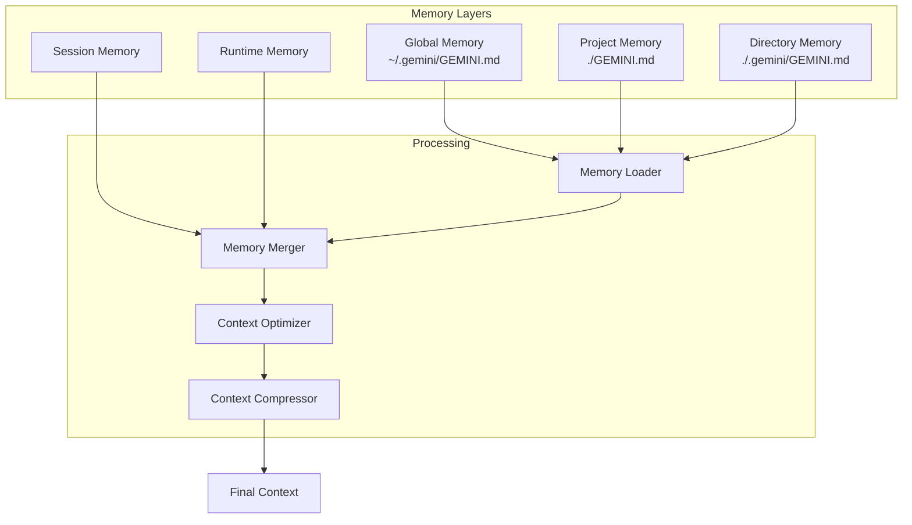
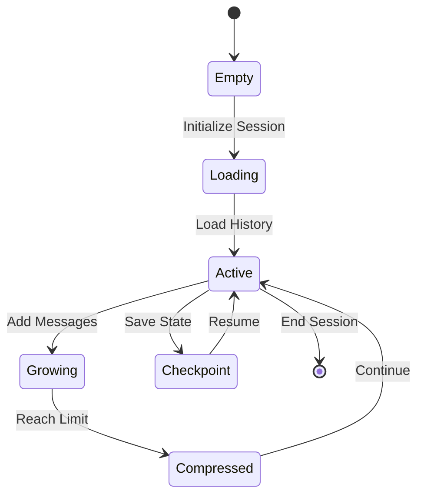
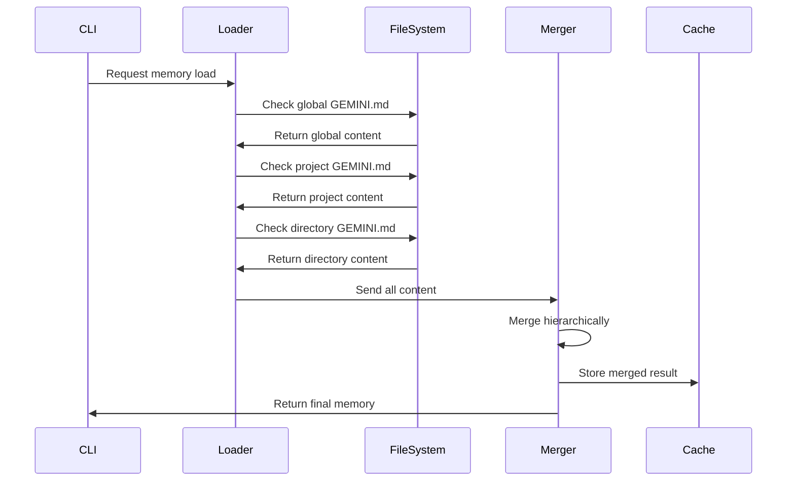
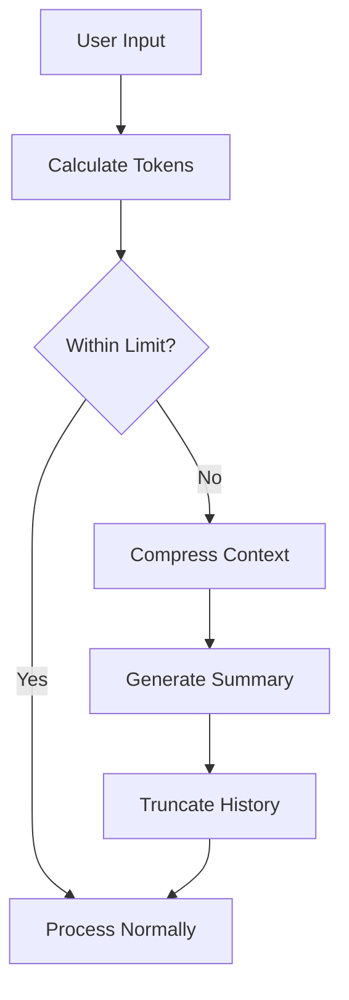
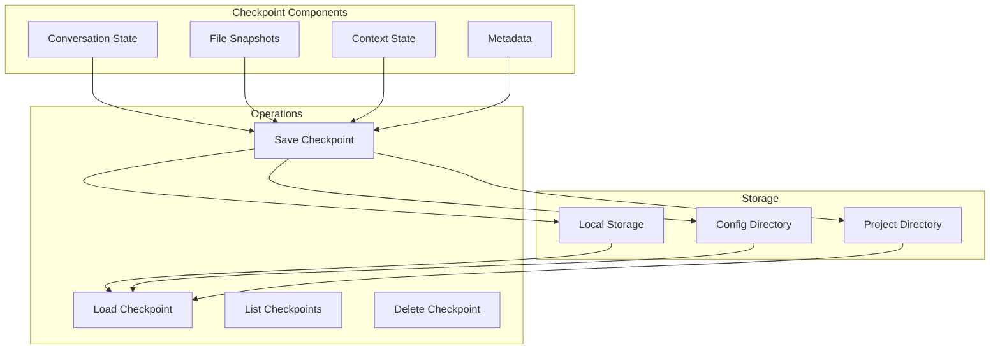
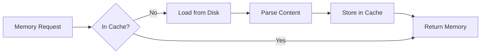

# Context and Memory Architecture

## Overview

The Context and Memory Architecture in Gemini CLI provides a sophisticated hierarchical system for managing AI instructions, conversation history, and persistent knowledge. This system enables contextual awareness across sessions while optimizing token usage and maintaining relevance.

## Memory Hierarchy



## Memory Types

### 1. Persistent Memory (GEMINI.md Files)

#### Global Memory
**Location**: `~/.gemini/GEMINI.md`
**Purpose**: User-wide preferences and instructions
**Scope**: All projects and sessions

```markdown
# Example Global GEMINI.md
- Always use TypeScript with strict mode
- Prefer functional programming patterns
- Follow company coding standards
- Use specific formatting preferences
```

#### Project Memory
**Location**: `./GEMINI.md` (project root)
**Purpose**: Project-specific context and instructions
**Scope**: Current project and subdirectories

```markdown
# Example Project GEMINI.md
- This is a React Native application
- Use React Navigation for routing
- Follow the existing component structure
- API endpoints are in src/api/
```

#### Directory Memory
**Location**: `./.gemini/GEMINI.md` (subdirectories)
**Purpose**: Directory-specific guidance
**Scope**: Current directory only

### 2. Session Memory



#### Components
```typescript
interface SessionMemory {
  messages: ConversationMessage[]
  toolExecutions: ToolExecution[]
  contextAdditions: string[]
  metadata: SessionMetadata
}

interface ConversationMessage {
  role: 'user' | 'assistant' | 'system'
  content: string
  timestamp: Date
  tokenCount: number
  toolCalls?: ToolCall[]
}
```

### 3. Runtime Memory

Runtime memory can be dynamically managed during a session:

```typescript
interface RuntimeMemory {
  // Added via /memory add command
  userAdditions: string[]
  
  // Tool execution results
  toolResults: Map<string, any>
  
  // Temporary context from file reads
  fileContext: FileContext[]
  
  // MCP server responses
  mcpContext: MCPContext[]
}
```

## Memory Loading Process



### Loading Priority
1. **Global memory** (lowest priority)
2. **Project memory** (medium priority)  
3. **Directory memory** (highest priority)
4. **Runtime additions** (override all)

## Context Management

### Context Window Management



### Token Optimization Strategies

#### 1. Sliding Window
```typescript
class SlidingWindowStrategy {
  maintainWindow(messages: Message[], maxTokens: number): Message[] {
    // Keep most recent messages within token limit
    let tokenCount = 0
    const kept: Message[] = []
    
    for (let i = messages.length - 1; i >= 0; i--) {
      if (tokenCount + messages[i].tokens <= maxTokens) {
        kept.unshift(messages[i])
        tokenCount += messages[i].tokens
      }
    }
    
    return kept
  }
}
```

#### 2. Importance-Based Compression
```typescript
class ImportanceCompression {
  compress(messages: Message[]): Message[] {
    // Assign importance scores
    const scored = messages.map(m => ({
      message: m,
      score: this.calculateImportance(m)
    }))
    
    // Sort by importance and truncate
    return scored
      .sort((a, b) => b.score - a.score)
      .slice(0, this.maxMessages)
      .map(s => s.message)
  }
  
  private calculateImportance(message: Message): number {
    // Factors: recency, tool usage, user mentions, error states
    let score = 0
    score += this.recencyScore(message)
    score += message.toolCalls ? 10 : 0
    score += message.isError ? 15 : 0
    return score
  }
}
```

#### 3. Semantic Summarization
```typescript
interface SummarizationStrategy {
  summarize(messages: Message[]): string
  shouldSummarize(tokenCount: number, limit: number): boolean
  preserveKeyInformation(messages: Message[]): KeyInfo[]
}
```

## Checkpoint System

### Checkpoint Architecture



### Checkpoint Structure
```typescript
interface Checkpoint {
  id: string
  tag: string
  timestamp: Date
  conversation: {
    messages: Message[]
    tokenUsage: TokenUsage
    model: string
  }
  files?: {
    path: string
    content: string
    hash: string
  }[]
  context: {
    memory: MergedMemory
    runtimeAdditions: string[]
  }
  metadata: {
    sessionId: string
    userId?: string
    projectPath: string
    version: string
  }
}
```

### Checkpoint Storage Locations
- **Linux/macOS**: `~/.config/google-generative-ai/checkpoints/`
- **Windows**: `%APPDATA%\google-generative-ai\checkpoints\`
- **Project-specific**: `./.gemini/checkpoints/`

## Memory Commands

### User Interface Commands

```typescript
interface MemoryCommands {
  // /memory add <text>
  add(text: string): void
  
  // /memory show
  show(): string
  
  // /memory refresh
  refresh(): void
  
  // /memory clear
  clear(): void
}
```

### Programmatic API

```typescript
class MemoryManager {
  // Load all memory sources
  async loadMemory(): Promise<MergedMemory>
  
  // Add runtime memory
  addRuntimeMemory(content: string): void
  
  // Compress context
  async compressContext(messages: Message[]): Promise<Message[]>
  
  // Create checkpoint
  async createCheckpoint(tag: string): Promise<Checkpoint>
  
  // Restore from checkpoint
  async restoreCheckpoint(tag: string): Promise<void>
}
```

## Context Injection Strategies

### 1. Static Injection
Memory loaded at session start and remains constant:
```typescript
const staticContext = await loadGeminiMdFiles()
prompt.addSystemContext(staticContext)
```

### 2. Dynamic Injection
Context updated based on current task:
```typescript
const dynamicContext = await determineRelevantContext(userInput)
prompt.addDynamicContext(dynamicContext)
```

### 3. Lazy Loading
Load context only when needed:
```typescript
if (userInput.mentions('database')) {
  const dbContext = await loadDatabaseContext()
  prompt.addContext(dbContext)
}
```

## Performance Considerations

### Caching Mechanisms



### Cache Implementation
```typescript
class MemoryCache {
  private cache: Map<string, CachedMemory> = new Map()
  private maxAge: number = 5 * 60 * 1000 // 5 minutes
  
  get(key: string): MergedMemory | null {
    const cached = this.cache.get(key)
    if (!cached) return null
    
    if (Date.now() - cached.timestamp > this.maxAge) {
      this.cache.delete(key)
      return null
    }
    
    return cached.memory
  }
  
  set(key: string, memory: MergedMemory): void {
    this.cache.set(key, {
      memory,
      timestamp: Date.now()
    })
  }
}
```

## Best Practices

### Memory Organization
1. **Global**: User preferences and general instructions
2. **Project**: Project-specific context and conventions
3. **Directory**: Module or component-specific guidance
4. **Runtime**: Temporary, session-specific information

### Token Management
1. Monitor token usage continuously
2. Implement progressive compression
3. Preserve critical information
4. Use caching effectively

### Checkpoint Strategy
1. Auto-checkpoint before destructive operations
2. Manual checkpoints for important states
3. Regular cleanup of old checkpoints
4. Version compatibility checks

## Security Considerations

### Memory Isolation
- Project memory doesn't leak between projects
- Sensitive information handling
- Secure checkpoint storage
- Access control for shared environments

### Data Privacy
```typescript
interface PrivacySettings {
  excludePatterns: string[]  // Files to never include
  sanitizeSecrets: boolean    // Remove API keys, tokens
  encryptCheckpoints: boolean // Encrypt saved states
  localOnly: boolean          // Disable cloud sync
}
```

## Future Enhancements

### Planned Features
- **Semantic Memory Search**: Find relevant context using embeddings
- **Intelligent Compression**: ML-based summarization
- **Distributed Checkpoints**: Cloud storage and sync
- **Context Versioning**: Track memory evolution
- **Smart Context Selection**: Auto-select relevant context

### Research Areas
- Vector database integration for semantic search
- Federated learning from conversation patterns
- Adaptive context window management
- Cross-session learning and transfer