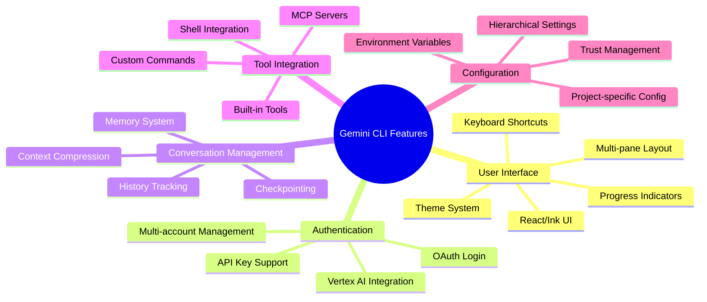
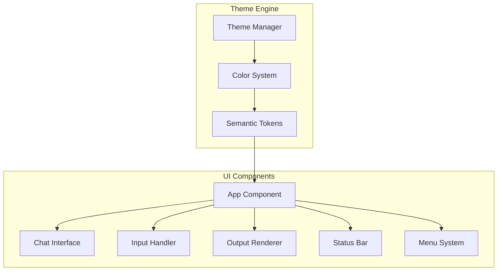
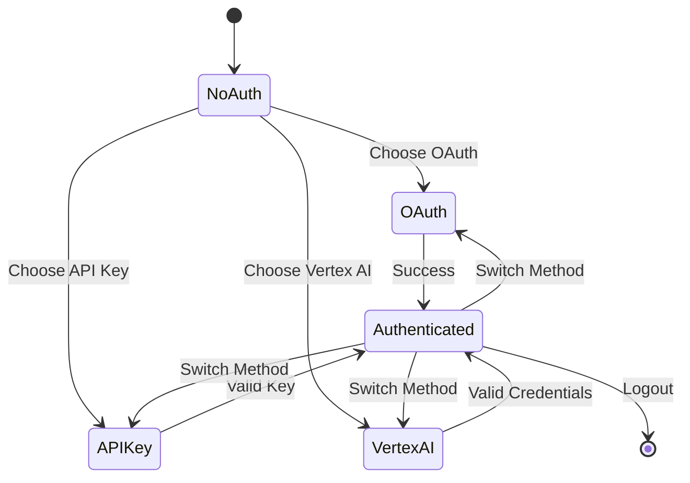
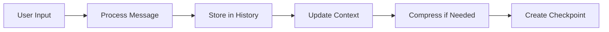
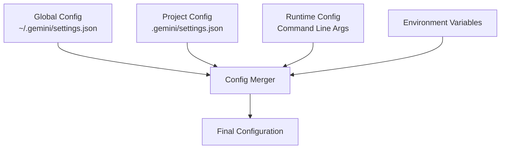
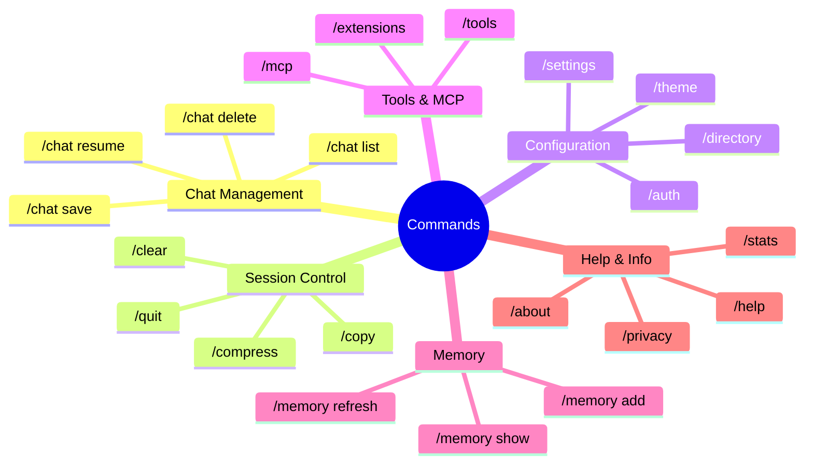

# Gemini CLI Features

## Overview

Gemini CLI provides a comprehensive set of features designed to create a powerful, user-friendly interface for interacting with Google's Gemini AI models. The system combines advanced terminal UI capabilities with sophisticated backend processing to deliver a rich interactive experience.

## Feature Architecture



## User Interface Features

### Terminal UI with React/Ink



### Key UI Components

#### 1. Chat Interface
```typescript
interface ChatInterface {
  // Message display
  messageRenderer: MessageRenderer
  codeHighlighter: SyntaxHighlighter
  markdownRenderer: MarkdownRenderer
  
  // Interactive elements
  toolConfirmation: ConfirmationDialog
  progressIndicator: ProgressIndicator
  errorDisplay: ErrorDisplay
  
  // Input handling
  inputProcessor: InputProcessor
  commandCompleter: CommandCompleter
  historyNavigator: HistoryNavigator
}
```

#### 2. Theme System
```typescript
interface ThemeDefinition {
  name: string
  colors: {
    primary: string
    secondary: string
    success: string
    warning: string
    error: string
    background: string
    text: string
  }
  styles: {
    code: CodeStyle
    markdown: MarkdownStyle
    ui: UIStyle
  }
}

class ThemeManager {
  loadThemes(): Theme[]
  applyTheme(theme: Theme): void
  createCustomTheme(definition: ThemeDefinition): Theme
  exportTheme(theme: Theme): string
}
```

### Keyboard Shortcuts and Navigation

```typescript
interface KeyBindings {
  // Navigation
  'Ctrl+C': 'interrupt'
  'Ctrl+D': 'exit'
  'Ctrl+L': 'clear'
  'Ctrl+R': 'search-history'
  'Tab': 'autocomplete'
  
  // Features
  'Ctrl+T': 'toggle-tools'
  'Ctrl+M': 'toggle-memory'
  'F1': 'help'
  'F2': 'settings'
  
  // Vim mode
  'Escape': 'vim-normal-mode'
  'i': 'vim-insert-mode'
  'h,j,k,l': 'vim-navigation'
}
```

## Authentication System

### Multi-Provider Authentication



### Authentication Implementation

```typescript
class AuthenticationManager {
  private currentMethod: AuthMethod
  private providers: Map<AuthMethod, AuthProvider>
  
  async authenticate(method: AuthMethod): Promise<AuthResult> {
    const provider = this.providers.get(method)
    if (!provider) {
      throw new Error(`Unknown auth method: ${method}`)
    }
    
    try {
      const credentials = await provider.authenticate()
      this.currentMethod = method
      await this.storeCredentials(credentials)
      return { success: true, method, credentials }
    } catch (error) {
      return { success: false, error }
    }
  }
  
  async refreshCredentials(): Promise<void> {
    const provider = this.providers.get(this.currentMethod)
    await provider.refresh()
  }
}
```

### Credential Storage

```typescript
interface CredentialStore {
  store(key: string, value: string): Promise<void>
  retrieve(key: string): Promise<string | null>
  delete(key: string): Promise<void>
  clear(): Promise<void>
}

class SecureCredentialStore implements CredentialStore {
  // Use system keychain on supported platforms
  private keychain: Keychain
  
  async store(key: string, value: string): Promise<void> {
    if (this.keychain.supported) {
      await this.keychain.setPassword('gemini-cli', key, value)
    } else {
      // Fallback to encrypted file storage
      await this.encryptedFileStore.store(key, value)
    }
  }
}
```

## Conversation Management

### History and State Management



### Conversation Features

```typescript
interface ConversationManager {
  // History management
  addMessage(message: Message): void
  getHistory(limit?: number): Message[]
  searchHistory(query: string): Message[]
  clearHistory(): void
  
  // Checkpointing
  createCheckpoint(tag: string): Promise<Checkpoint>
  loadCheckpoint(tag: string): Promise<void>
  listCheckpoints(): Checkpoint[]
  deleteCheckpoint(tag: string): void
  
  // Context management
  compressContext(): Promise<void>
  getTokenUsage(): TokenUsage
  optimizeForModel(model: string): void
}
```

### Automatic Checkpointing

```typescript
class AutoCheckpointManager {
  private config: CheckpointConfig
  
  async beforeToolExecution(tool: Tool, params: any): Promise<void> {
    if (this.shouldCheckpoint(tool)) {
      const tag = this.generateCheckpointTag(tool)
      await this.conversationManager.createCheckpoint(tag)
    }
  }
  
  private shouldCheckpoint(tool: Tool): boolean {
    // Checkpoint before destructive operations
    return tool.permissions.fileSystem === 'write' ||
           tool.permissions.shell === true ||
           tool.category === 'destructive'
  }
}
```

## Configuration System

### Hierarchical Configuration



### Configuration Schema

```typescript
interface GeminiConfig {
  // Authentication
  auth?: {
    method: 'oauth' | 'api-key' | 'vertex-ai'
    apiKey?: string
    project?: string
  }
  
  // UI preferences
  ui: {
    theme: string
    vimMode: boolean
    showTools: boolean
    showMemory: boolean
  }
  
  // Model settings
  model: {
    name: string
    temperature?: number
    maxTokens?: number
    topP?: number
  }
  
  // Tool configuration
  tools: {
    confirmation: 'always' | 'destructive' | 'never'
    timeout: number
    sandboxing: SandboxConfig
  }
  
  // MCP servers
  mcpServers: Record<string, MCPServerConfig>
  
  // File filtering
  fileFiltering: {
    useGitignore: boolean
    customIgnores: string[]
    maxFileSize: number
  }
}
```

### Settings Management

```typescript
class SettingsManager {
  private config: GeminiConfig
  private watchers: Set<ConfigWatcher> = new Set()
  
  async load(): Promise<GeminiConfig> {
    const global = await this.loadGlobalConfig()
    const project = await this.loadProjectConfig()
    const runtime = this.parseCommandLineArgs()
    const env = this.parseEnvironmentVariables()
    
    this.config = this.mergeConfigs(global, project, runtime, env)
    return this.config
  }
  
  async save(section: string, value: any): Promise<void> {
    this.updateConfig(section, value)
    await this.writeConfig()
    this.notifyWatchers()
  }
  
  watch(watcher: ConfigWatcher): void {
    this.watchers.add(watcher)
  }
}
```

## Command System

### Built-in Commands



### Custom Commands

```typescript
interface CustomCommand {
  name: string
  description: string
  prompt: string
  category?: string
  permissions?: CommandPermissions
  confirmation?: boolean
}

class CustomCommandLoader {
  async loadCommands(): Promise<CustomCommand[]> {
    const globalCommands = await this.loadFromDirectory('~/.gemini/commands')
    const projectCommands = await this.loadFromDirectory('./.gemini/commands')
    
    // Project commands override global ones with same name
    return this.mergeCommands(globalCommands, projectCommands)
  }
  
  private async parseCommandFile(filepath: string): Promise<CustomCommand> {
    const content = await fs.readFile(filepath, 'utf-8')
    return toml.parse(content) as CustomCommand
  }
}
```

## Integration Features

### IDE Integration

```typescript
interface IDEIntegration {
  // VS Code companion
  vscodeCompanion: {
    sendToTerminal(command: string): void
    openFile(path: string, line?: number): void
    showDiff(oldContent: string, newContent: string): void
  }
  
  // Protocol handlers
  protocolHandlers: {
    'gemini://': (url: URL) => void
    'vscode://': (url: URL) => void
  }
  
  // Terminal integration
  terminalIntegration: {
    setTitle(title: string): void
    notifyCompletion(success: boolean): void
    setStatus(status: string): void
  }
}
```

### GitHub Actions Integration

```typescript
interface GitHubActionsIntegration {
  // Workflow triggers
  onPullRequest(context: PRContext): Promise<void>
  onIssue(context: IssueContext): Promise<void>
  onPush(context: PushContext): Promise<void>
  
  // Comment generation
  generateReviewComments(diff: string): Promise<Comment[]>
  generateIssueResponse(issue: Issue): Promise<string>
  
  // Status reporting
  updateCheckStatus(status: CheckStatus): Promise<void>
}
```

## Advanced Features

### Streaming and Real-time Updates

```typescript
class StreamingManager {
  async handleStreamingResponse(stream: ReadableStream): Promise<void> {
    const reader = stream.getReader()
    const decoder = new TextDecoder()
    
    while (true) {
      const { done, value } = await reader.read()
      if (done) break
      
      const chunk = decoder.decode(value)
      this.processChunk(chunk)
    }
  }
  
  private processChunk(chunk: string): void {
    // Parse streaming JSON
    const messages = this.parseJSONLines(chunk)
    
    messages.forEach(message => {
      switch (message.type) {
        case 'content':
          this.ui.appendContent(message.content)
          break
        case 'tool_call':
          this.ui.showToolExecution(message.tool)
          break
        case 'error':
          this.ui.showError(message.error)
          break
      }
    })
  }
}
```

### File Operations and Context

```typescript
class FileContextManager {
  async processFileInclusions(input: string): Promise<ProcessedInput> {
    const fileRefs = this.extractFileReferences(input)
    const fileContents = await Promise.all(
      fileRefs.map(ref => this.readFile(ref))
    )
    
    return {
      prompt: this.buildPromptWithFiles(input, fileContents),
      tokenCount: this.calculateTokens(fileContents),
      files: fileRefs
    }
  }
  
  private extractFileReferences(input: string): FileReference[] {
    const regex = /@([^\s]+)/g
    const matches = input.match(regex)
    
    return matches?.map(match => ({
      path: match.substring(1),
      type: this.detectFileType(match)
    })) || []
  }
}
```

### Multi-directory Support

```typescript
class WorkspaceManager {
  private directories: Set<string> = new Set()
  private fileWatcher: FileWatcher
  
  addDirectory(path: string): void {
    const resolved = path.resolve(path)
    this.directories.add(resolved)
    this.fileWatcher.watch(resolved)
  }
  
  async getAllFiles(): Promise<FileInfo[]> {
    const allFiles: FileInfo[] = []
    
    for (const dir of this.directories) {
      const files = await this.scanDirectory(dir)
      allFiles.push(...files)
    }
    
    return this.deduplicateFiles(allFiles)
  }
  
  private async scanDirectory(dir: string): Promise<FileInfo[]> {
    const files = await glob('**/*', {
      cwd: dir,
      ignore: this.getIgnorePatterns(dir)
    })
    
    return files.map(file => ({
      path: path.join(dir, file),
      relativePath: file,
      directory: dir,
      size: fs.statSync(path.join(dir, file)).size
    }))
  }
}
```

## Performance Features

### Token Optimization

```typescript
class TokenOptimizer {
  async optimizePrompt(prompt: string): Promise<OptimizedPrompt> {
    const tokens = this.tokenize(prompt)
    
    // Apply optimization strategies
    const compressed = await this.compressContext(tokens)
    const cached = await this.applyCaching(compressed)
    const truncated = await this.smartTruncate(cached)
    
    return {
      prompt: this.detokenize(truncated),
      originalTokens: tokens.length,
      optimizedTokens: truncated.length,
      savings: tokens.length - truncated.length
    }
  }
  
  private async smartTruncate(tokens: Token[]): Promise<Token[]> {
    // Keep most important tokens within limit
    const importance = tokens.map(t => this.calculateImportance(t))
    const sorted = tokens
      .map((token, index) => ({ token, importance: importance[index] }))
      .sort((a, b) => b.importance - a.importance)
    
    return sorted.slice(0, this.maxTokens).map(t => t.token)
  }
}
```

### Caching System

```typescript
interface CacheManager {
  // Response caching
  cacheResponse(key: string, response: any): Promise<void>
  getCachedResponse(key: string): Promise<any | null>
  
  // Tool result caching
  cacheToolResult(tool: string, params: any, result: any): Promise<void>
  getCachedToolResult(tool: string, params: any): Promise<any | null>
  
  // Context caching
  cacheContext(hash: string, context: any): Promise<void>
  getCachedContext(hash: string): Promise<any | null>
}
```

## Monitoring and Analytics

### Usage Statistics

```typescript
interface UsageStats {
  session: {
    startTime: Date
    duration: number
    messageCount: number
    tokenUsage: TokenUsage
  }
  
  tools: {
    executionCount: Record<string, number>
    averageDuration: Record<string, number>
    successRate: Record<string, number>
  }
  
  models: {
    usage: Record<string, TokenUsage>
    performance: Record<string, number>
  }
}

class AnalyticsCollector {
  collectUsageStats(): UsageStats
  exportStats(): string
  clearStats(): void
  trackEvent(event: string, data: any): void
}
```

## Error Handling and Recovery

### Comprehensive Error Management

```typescript
class ErrorManager {
  private handlers: Map<ErrorType, ErrorHandler> = new Map()
  
  handle(error: Error, context: ErrorContext): ErrorResponse {
    const errorType = this.classifyError(error)
    const handler = this.handlers.get(errorType)
    
    if (handler) {
      return handler.handle(error, context)
    }
    
    return this.handleUnknownError(error, context)
  }
  
  private classifyError(error: Error): ErrorType {
    if (error.message.includes('ENOENT')) return ErrorType.FileNotFound
    if (error.message.includes('401')) return ErrorType.Authentication
    if (error.message.includes('429')) return ErrorType.RateLimit
    return ErrorType.Unknown
  }
}
```

## Security Features

### Trust and Security Management

```typescript
interface SecurityManager {
  // Trust levels
  getTrustLevel(directory: string): TrustLevel
  setTrustLevel(directory: string, level: TrustLevel): void
  
  // Sandboxing
  executeSandboxed(command: string, config: SandboxConfig): Promise<Result>
  
  // Audit logging
  logActivity(activity: ActivityLog): void
  getAuditLog(): ActivityLog[]
  
  // Credential protection
  sanitizeOutput(output: string): string
  detectSecrets(text: string): string[]
}
```

## Future Feature Roadmap

### Planned Features
- **Voice Interface**: Speech-to-text input and text-to-speech output
- **Collaboration Mode**: Multi-user sessions
- **Plugin Marketplace**: Community-contributed extensions
- **Mobile Companion**: Mobile app integration
- **Cloud Sync**: Cross-device synchronization

### Experimental Features
- **AI Code Review**: Automated code analysis
- **Natural Language Queries**: SQL and API query generation
- **Document Generation**: Automated documentation creation
- **Testing Assistant**: Test generation and validation
- **Deployment Helper**: Automated deployment workflows