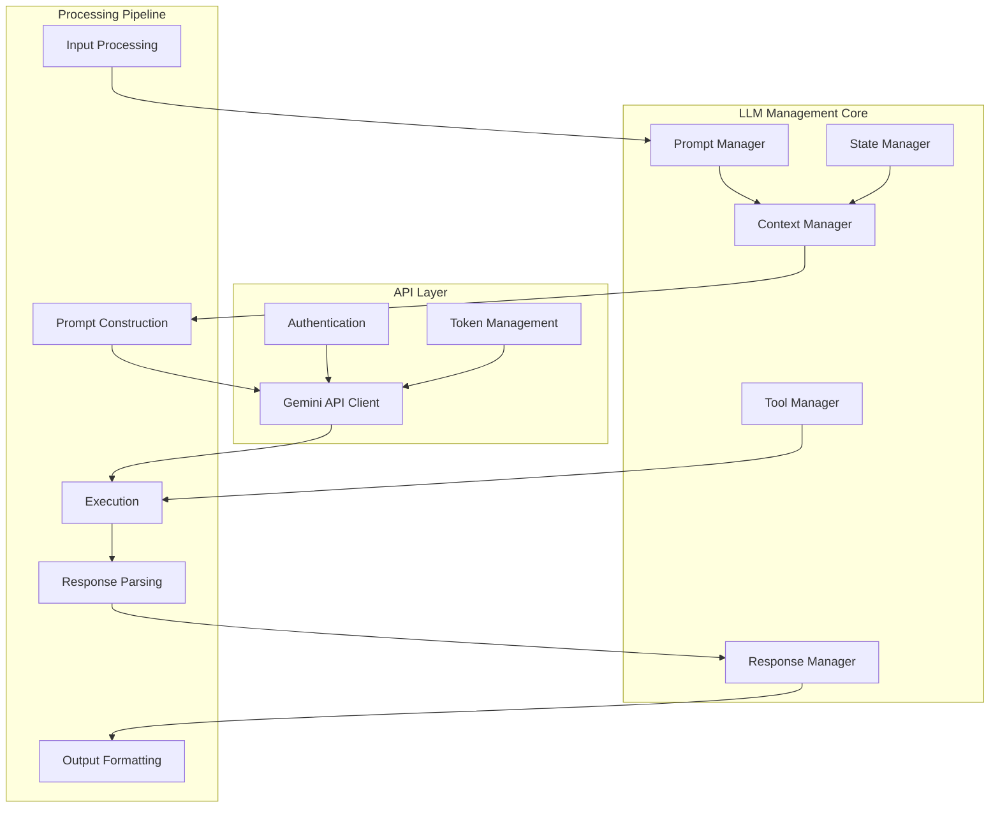
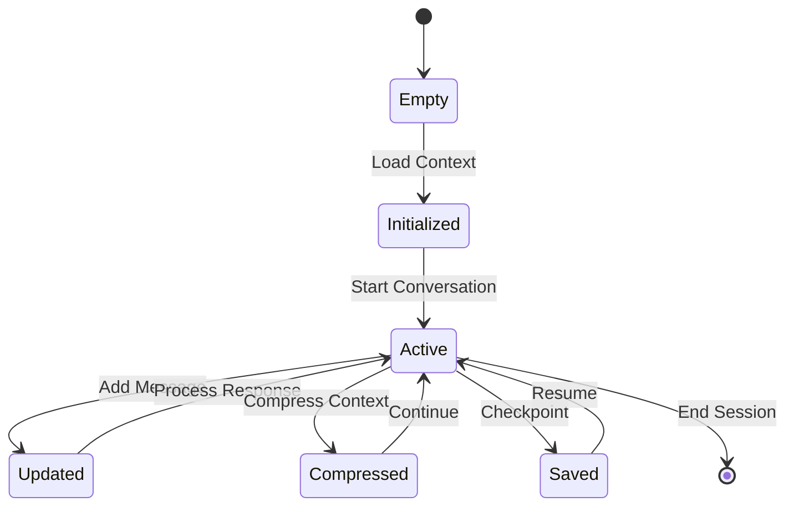
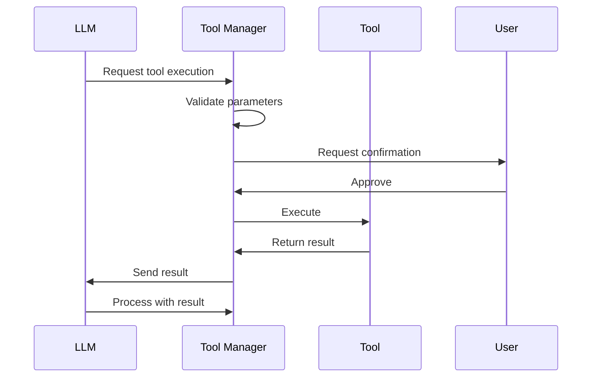
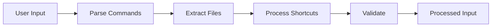
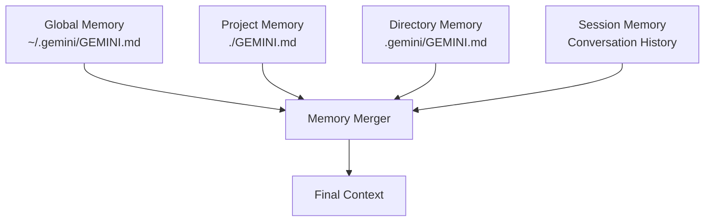
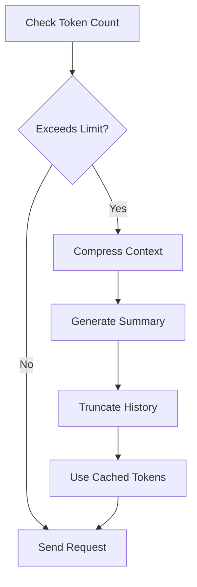
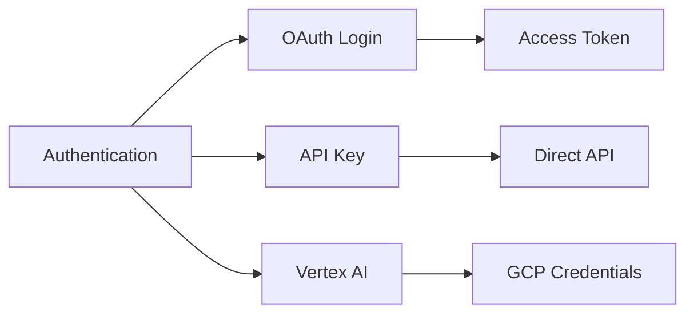
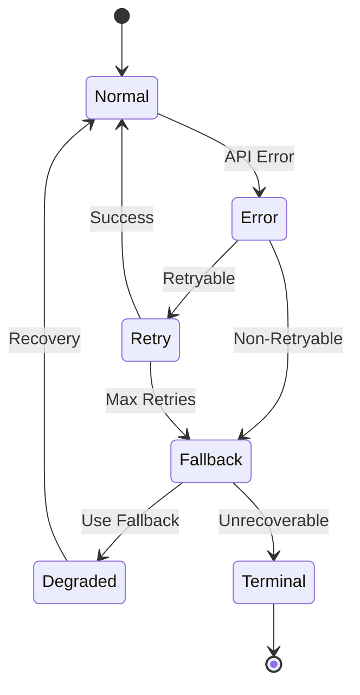

# LLM Management System

## Overview

The LLM Management System in Gemini CLI orchestrates all interactions with the Gemini API, managing context, state, and tool execution. This system is primarily implemented in the Core package and provides sophisticated prompt construction, response handling, and conversation management.

## Architecture



## Core Components

### 1. Prompt Manager
**Location**: `packages/core/src/services/llm/`

**Responsibilities**:
- Prompt template construction
- System instruction management
- Context window optimization
- Token counting and management

**Key Features**:
```typescript
interface PromptManager {
  constructPrompt(input: UserInput, context: Context): Prompt
  addSystemInstructions(instructions: string[]): void
  optimizeForTokenLimit(prompt: Prompt, limit: number): Prompt
  calculateTokenUsage(prompt: Prompt): TokenCount
}
```

### 2. Context Manager
**Purpose**: Manages conversation context and memory



**Features**:
- Hierarchical memory from GEMINI.md files
- Conversation history management
- Context compression strategies
- Dynamic context injection

### 3. State Manager
**Purpose**: Maintains conversation and session state

**State Components**:
```typescript
interface ConversationState {
  messages: Message[]
  tokenUsage: TokenUsage
  activeTools: Tool[]
  sessionId: string
  checkpoints: Checkpoint[]
  metadata: SessionMetadata
}
```

### 4. Tool Manager
**Purpose**: Orchestrates tool execution within LLM context



## Query Processing Pipeline

### 1. Input Processing


### 2. Prompt Construction
**Steps**:
1. Load system instructions
2. Inject hierarchical memory (GEMINI.md)
3. Add conversation history
4. Include tool definitions
5. Append user input
6. Optimize for token limit

### 3. Response Handling
```typescript
interface ResponseHandler {
  parseResponse(response: GeminiResponse): ParsedResponse
  extractToolCalls(response: ParsedResponse): ToolCall[]
  formatOutput(response: ParsedResponse): FormattedOutput
  handleStreaming(stream: ResponseStream): void
}
```

## Memory Architecture

### Hierarchical Memory System



### Memory Types

#### 1. Persistent Memory
- **Global Instructions**: User-wide preferences and instructions
- **Project Instructions**: Project-specific context
- **Directory Instructions**: Subdirectory-specific guidance

#### 2. Session Memory
- **Conversation History**: Current session messages
- **Tool Results**: Executed tool outcomes
- **Temporary Context**: Runtime additions via `/memory add`

#### 3. Compressed Memory
- **Summary Generation**: Automatic context compression
- **Token Optimization**: Reduces token usage while preserving information
- **Checkpoint Integration**: Saved conversation states

## Token Management

### Token Optimization Strategies



### Token Usage Tracking
```typescript
interface TokenUsage {
  inputTokens: number
  outputTokens: number
  cachedTokens?: number
  totalTokens: number
  cost?: number
  model: string
  timestamp: Date
}
```

## Model Configuration

### Supported Models
- **gemini-2.5-pro**: 1M context window
- **gemini-2.5-flash**: Fast, efficient model
- **gemini-1.5-pro**: Previous generation
- **gemini-1.5-flash**: Previous fast model

### Model Selection Logic
```typescript
function selectModel(config: Config): Model {
  // Priority order:
  // 1. User-specified model
  // 2. Project configuration
  // 3. Global settings
  // 4. Default model
  
  return config.model || 
         projectConfig.model || 
         globalSettings.model || 
         'gemini-2.5-pro'
}
```

## Authentication Management

### Authentication Methods



### Credential Storage
- **OAuth Tokens**: Secure system keychain
- **API Keys**: Environment variables or config
- **Vertex AI**: Google Cloud credentials

## Error Handling

### Error Recovery Strategies



### Error Types
1. **API Errors**: Rate limits, quota exceeded
2. **Network Errors**: Connectivity issues
3. **Tool Errors**: Execution failures
4. **Context Errors**: Token limit exceeded
5. **Authentication Errors**: Invalid credentials

## Performance Optimization

### Caching Strategies
- **Token Caching**: Reuse processed tokens
- **Response Caching**: Cache for identical prompts
- **Tool Result Caching**: Avoid redundant executions
- **Context Caching**: Preserve processed context

### Streaming Implementation
```typescript
interface StreamingHandler {
  onChunk(chunk: string): void
  onToolCall(tool: ToolCall): void
  onComplete(response: CompleteResponse): void
  onError(error: Error): void
}
```

## Integration Points

### Tool System Integration
- Dynamic tool registration
- Parameter validation
- Result formatting
- Error propagation

### MCP Server Integration
- Tool discovery
- Remote execution
- Result transformation
- State synchronization

### UI Integration
- Real-time updates
- Progress indicators
- Error display
- Confirmation dialogs

## Best Practices

### Context Management
1. Minimize context size for efficiency
2. Use hierarchical memory effectively
3. Implement smart compression
4. Monitor token usage

### Error Handling
1. Implement retry logic with backoff
2. Provide clear error messages
3. Maintain conversation continuity
4. Log errors for debugging

### Performance
1. Use streaming for real-time feedback
2. Implement caching where appropriate
3. Optimize prompt construction
4. Monitor API quotas

## Future Enhancements

### Planned Improvements
- Enhanced context compression algorithms
- Multi-model support and routing
- Improved caching mechanisms
- Advanced token optimization
- Parallel tool execution
- Enhanced error recovery

### Research Areas
- Semantic context compression
- Adaptive model selection
- Predictive prompt optimization
- Intelligent token allocation