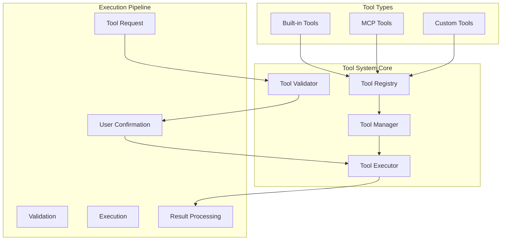
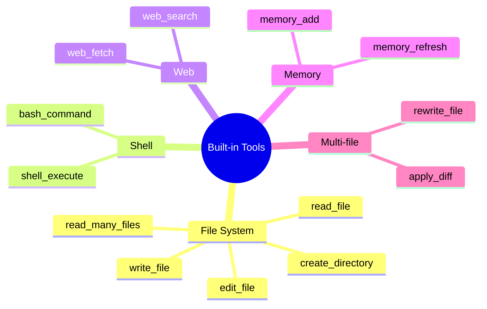
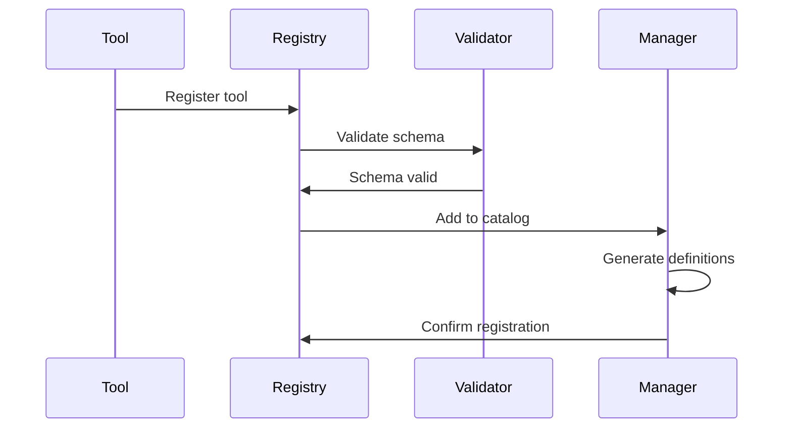
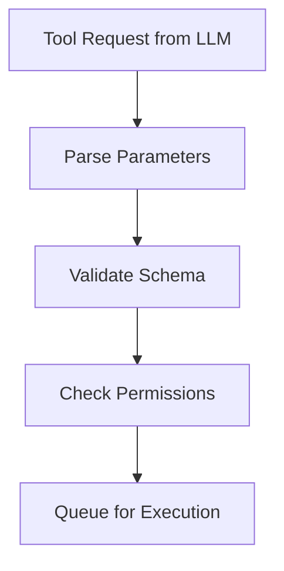
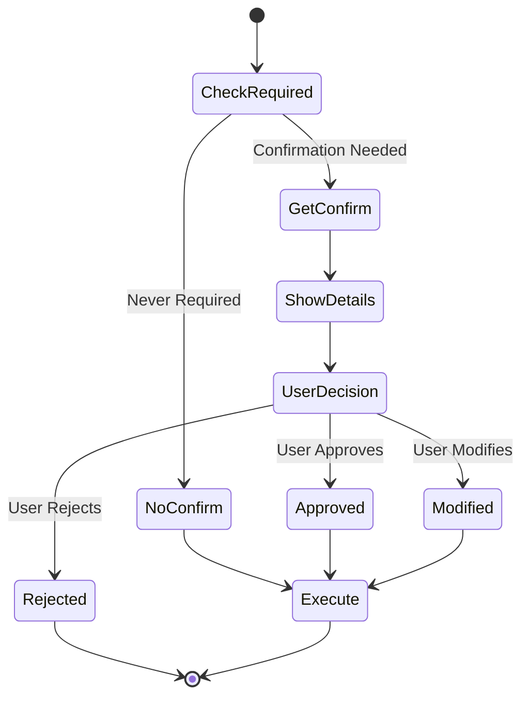
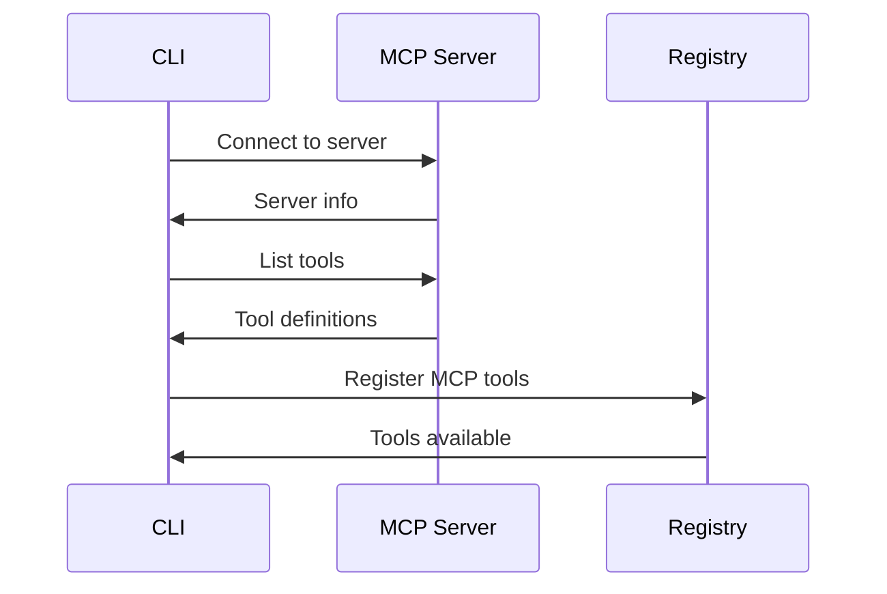
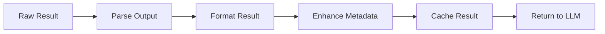
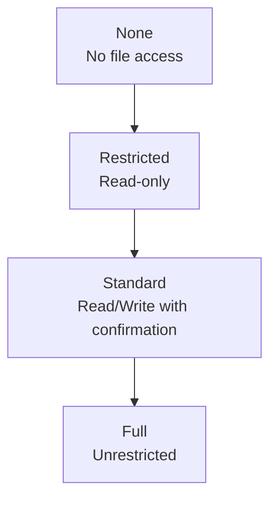
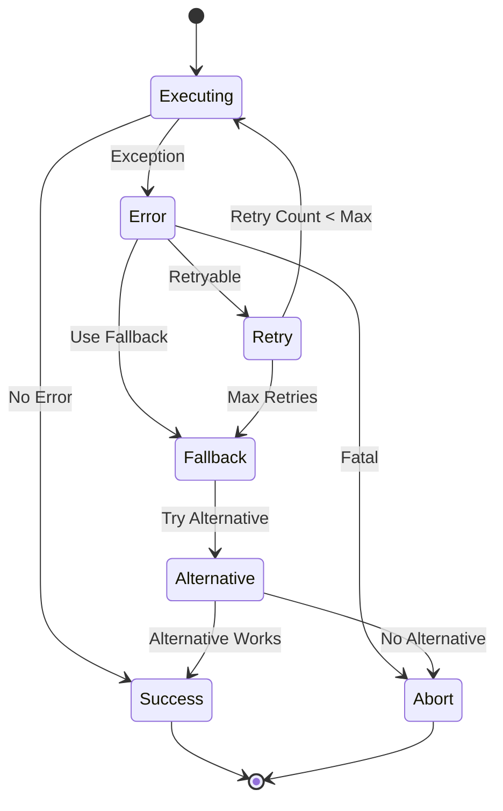

# Tool Orchestration System

## Overview

The Tool Orchestration System in Gemini CLI provides a sophisticated framework for extending the AI's capabilities through both built-in and external tools. This system manages tool registration, execution, validation, and result processing while maintaining security and user control.

## Architecture



## Tool Categories

### 1. Built-in Tools



### 2. MCP Tools
External tools provided through Model Context Protocol servers:
- Database operations
- API integrations
- Custom business logic
- Third-party services

### 3. Custom Tools
User-defined tools through the ToolBuilder interface

## Tool Registration

### Registration Process



### Tool Definition Schema

```typescript
interface ToolDefinition {
  name: string
  description: string
  category: ToolCategory
  inputSchema: {
    type: 'object'
    properties: Record<string, JSONSchema>
    required?: string[]
  }
  outputSchema?: JSONSchema
  permissions: ToolPermissions
  confirmation: ConfirmationRequirement
}

interface ToolPermissions {
  fileSystem: 'none' | 'read' | 'write'
  network: boolean
  shell: boolean
  sensitive: boolean
}

enum ConfirmationRequirement {
  Never = 'never',
  Always = 'always',
  Destructive = 'destructive',
  Smart = 'smart'
}
```

## Execution Pipeline

### 1. Request Processing



### 2. Validation Layer

```typescript
class ToolValidator {
  async validate(request: ToolRequest): Promise<ValidationResult> {
    // Schema validation
    const schemaValid = await this.validateSchema(
      request.params,
      request.tool.inputSchema
    )
    
    // Permission validation
    const permissionsValid = await this.checkPermissions(
      request.tool.permissions,
      this.currentTrustLevel
    )
    
    // Parameter validation
    const paramsValid = await this.validateParameters(
      request.params,
      request.tool.constraints
    )
    
    return {
      valid: schemaValid && permissionsValid && paramsValid,
      errors: [...],
      warnings: [...]
    }
  }
}
```

### 3. Confirmation System



### 4. Execution Engine

```typescript
class ToolExecutor {
  async execute(tool: Tool, params: any): Promise<ToolResult> {
    // Pre-execution hooks
    await this.runPreExecutionHooks(tool, params)
    
    // Checkpoint if needed
    if (tool.permissions.fileSystem === 'write') {
      await this.createCheckpoint()
    }
    
    try {
      // Execute with timeout
      const result = await this.executeWithTimeout(
        tool.execute(params),
        tool.timeout || 30000
      )
      
      // Post-execution processing
      return await this.processResult(result, tool)
      
    } catch (error) {
      // Error handling and recovery
      return this.handleExecutionError(error, tool)
    }
  }
  
  private async executeWithTimeout<T>(
    promise: Promise<T>,
    timeout: number
  ): Promise<T> {
    return Promise.race([
      promise,
      new Promise((_, reject) => 
        setTimeout(() => reject(new Error('Timeout')), timeout)
      )
    ])
  }
}
```

## Built-in Tools Implementation

### File System Tools

```typescript
class FileSystemTools {
  @Tool({
    name: 'read_file',
    permissions: { fileSystem: 'read' },
    confirmation: ConfirmationRequirement.Never
  })
  async readFile(params: { path: string }): Promise<ToolResult> {
    const content = await fs.readFile(params.path, 'utf-8')
    return {
      success: true,
      output: content,
      metadata: {
        size: content.length,
        lines: content.split('\n').length
      }
    }
  }
  
  @Tool({
    name: 'write_file',
    permissions: { fileSystem: 'write' },
    confirmation: ConfirmationRequirement.Always
  })
  async writeFile(params: { path: string, content: string }): Promise<ToolResult> {
    await fs.writeFile(params.path, params.content)
    return {
      success: true,
      output: `File written: ${params.path}`,
      metadata: {
        size: params.content.length,
        created: true
      }
    }
  }
}
```

### Shell Execution Tools

```typescript
class ShellTools {
  @Tool({
    name: 'bash_command',
    permissions: { shell: true },
    confirmation: ConfirmationRequirement.Always
  })
  async executeBash(params: { command: string }): Promise<ToolResult> {
    const { stdout, stderr, exitCode } = await this.runCommand(params.command)
    
    return {
      success: exitCode === 0,
      output: stdout,
      error: stderr,
      metadata: {
        exitCode,
        command: params.command,
        duration: Date.now() - startTime
      }
    }
  }
  
  private async runCommand(command: string): Promise<CommandResult> {
    // Sandbox execution if enabled
    if (this.sandboxEnabled) {
      return this.runInSandbox(command)
    }
    
    // Direct execution with safety checks
    return this.runDirect(command)
  }
}
```

## MCP Tool Integration

### MCP Tool Discovery



### MCP Tool Wrapper

```typescript
class MCPToolWrapper implements Tool {
  constructor(
    private server: MCPServer,
    private toolDef: MCPToolDefinition
  ) {}
  
  async execute(params: any): Promise<ToolResult> {
    try {
      // Send tool call to MCP server
      const response = await this.server.callTool({
        name: this.toolDef.name,
        arguments: params
      })
      
      // Transform MCP response to standard format
      return this.transformResponse(response)
    } catch (error) {
      return this.handleMCPError(error)
    }
  }
  
  private transformResponse(response: MCPResponse): ToolResult {
    return {
      success: !response.isError,
      output: response.content.map(c => c.text).join('\n'),
      metadata: response.metadata
    }
  }
}
```

## Tool Result Processing

### Result Pipeline



### Result Formatting

```typescript
interface ToolResult {
  success: boolean
  output: string | object
  error?: string
  metadata?: {
    duration?: number
    tokensUsed?: number
    filesAffected?: string[]
    [key: string]: any
  }
  artifacts?: ToolArtifact[]
}

interface ToolArtifact {
  type: 'file' | 'image' | 'data'
  name: string
  content: any
  mimeType?: string
}
```

## Security and Sandboxing

### Trust Levels



### Sandboxing Strategies

```typescript
interface SandboxConfig {
  type: 'none' | 'docker' | 'podman' | 'seatbelt'
  restrictions: {
    filesystem: FileSystemRestrictions
    network: NetworkRestrictions
    process: ProcessRestrictions
  }
  mounts?: string[]
  environment?: Record<string, string>
}

class Sandbox {
  async execute(command: string, config: SandboxConfig): Promise<Result> {
    switch (config.type) {
      case 'docker':
        return this.executeInDocker(command, config)
      case 'seatbelt':
        return this.executeWithSeatbelt(command, config)
      default:
        return this.executeUnsandboxed(command)
    }
  }
}
```

## Performance Optimization

### Tool Execution Optimization

```typescript
class ToolOptimizer {
  // Parallel execution for independent tools
  async executeParallel(tools: ToolCall[]): Promise<ToolResult[]> {
    const independent = this.identifyIndependent(tools)
    return Promise.all(independent.map(t => this.execute(t)))
  }
  
  // Batch similar operations
  batchOperations(tools: ToolCall[]): ToolCall[] {
    const batched = new Map<string, ToolCall[]>()
    
    tools.forEach(tool => {
      const key = `${tool.name}_${tool.category}`
      if (!batched.has(key)) batched.set(key, [])
      batched.get(key)!.push(tool)
    })
    
    return Array.from(batched.values()).map(this.mergeBatch)
  }
  
  // Cache repeated operations
  private cache = new Map<string, ToolResult>()
  
  async executeWithCache(tool: ToolCall): Promise<ToolResult> {
    const key = this.getCacheKey(tool)
    
    if (this.cache.has(key)) {
      return this.cache.get(key)!
    }
    
    const result = await this.execute(tool)
    this.cache.set(key, result)
    return result
  }
}
```

## Error Handling

### Error Recovery Strategies



### Error Types and Handling

```typescript
enum ToolErrorType {
  ValidationError = 'validation',
  PermissionError = 'permission',
  ExecutionError = 'execution',
  TimeoutError = 'timeout',
  NetworkError = 'network',
  UnknownError = 'unknown'
}

class ToolErrorHandler {
  handle(error: ToolError): ErrorResponse {
    switch (error.type) {
      case ToolErrorType.ValidationError:
        return this.suggestCorrection(error)
      case ToolErrorType.PermissionError:
        return this.requestPermission(error)
      case ToolErrorType.TimeoutError:
        return this.offerRetry(error)
      default:
        return this.genericError(error)
    }
  }
}
```

## Monitoring and Telemetry

### Tool Usage Metrics

```typescript
interface ToolMetrics {
  toolName: string
  executionCount: number
  averageDuration: number
  successRate: number
  errorRate: number
  lastExecution: Date
}

class ToolTelemetry {
  trackExecution(tool: string, result: ToolResult): void {
    this.metrics.record({
      tool,
      success: result.success,
      duration: result.metadata?.duration,
      timestamp: Date.now()
    })
  }
  
  getStatistics(): ToolStatistics {
    return {
      mostUsed: this.getMostUsedTools(),
      slowest: this.getSlowestTools(),
      errorProne: this.getErrorProneTools()
    }
  }
}
```

## Best Practices

### Tool Development
1. Clear, descriptive tool names
2. Comprehensive parameter validation
3. Meaningful error messages
4. Proper cleanup on failure
5. Idempotent operations where possible

### Security
1. Always validate inputs
2. Implement proper sandboxing
3. Require confirmation for destructive operations
4. Log all tool executions
5. Implement rate limiting

### Performance
1. Cache when appropriate
2. Batch similar operations
3. Implement timeouts
4. Use async operations
5. Monitor resource usage

## Future Enhancements

### Planned Features
- **Tool Composition**: Chain tools together
- **Conditional Execution**: Tools that run based on conditions
- **Tool Marketplace**: Share and discover community tools
- **Visual Tool Builder**: GUI for creating custom tools
- **Tool Versioning**: Manage tool versions and compatibility

### Research Areas
- Intelligent tool selection based on context
- Automatic tool composition for complex tasks
- Predictive tool caching
- Cross-platform tool compatibility
- Tool execution optimization using ML