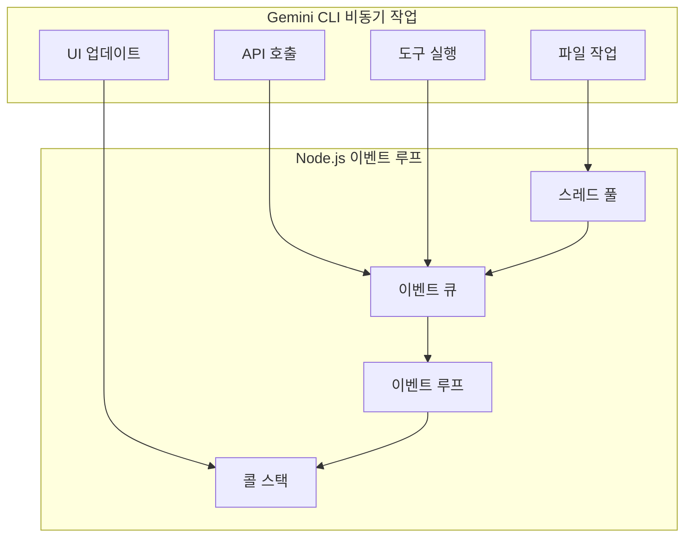

# 비동기 처리 아키텍처

## 개요

Gemini CLI는 Node.js의 이벤트 기반 아키텍처를 활용하여 동시 작업을 효율적으로 처리합니다. 이 시스템은 API 통신, 도구 실행, 파일 작업, UI 업데이트를 위한 정교한 비동기 패턴을 구현하여 복잡한 워크플로우를 관리하면서도 반응성 있는 사용자 경험을 보장합니다.

## 핵심 비동기 패턴

### 이벤트 루프 아키텍처



### 비동기 패턴 구현

#### 1. Promise 기반 API 통신

```typescript
class GeminiAPIClient {
  async sendRequest(request: APIRequest): Promise<APIResponse> {
    try {
      // 동시 요청 처리
      const [authToken, rateLimitCheck] = await Promise.all([
        this.getAuthToken(),
        this.checkRateLimit()
      ])
      
      if (!rateLimitCheck.allowed) {
        await this.waitForRateLimit(rateLimitCheck.resetTime)
      }
      
      // 스트리밍 응답 처리
      const response = await this.makeStreamingRequest(request, authToken)
      return await this.processStreamingResponse(response)
      
    } catch (error) {
      return this.handleAPIError(error)
    }
  }
  
  private async makeStreamingRequest(
    request: APIRequest,
    token: string
  ): Promise<ReadableStream> {
    const response = await fetch(this.apiUrl, {
      method: 'POST',
      headers: {
        'Authorization': `Bearer ${token}`,
        'Content-Type': 'application/json'
      },
      body: JSON.stringify(request)
    })
    
    return response.body!
  }
  
  private async processStreamingResponse(
    stream: ReadableStream
  ): Promise<APIResponse> {
    const reader = stream.getReader()
    const decoder = new TextDecoder()
    let fullResponse = ''
    
    while (true) {
      const { done, value } = await reader.read()
      if (done) break
      
      const chunk = decoder.decode(value)
      fullResponse += chunk
      
      // 실시간 UI 업데이트를 위한 진행률 이벤트 방출
      this.emit('chunk', chunk)
    }
    
    return JSON.parse(fullResponse)
  }
}
```

#### 2. 동시 도구 실행

```typescript
class ToolExecutor {
  private executionQueue: AsyncQueue<ToolExecution> = new AsyncQueue()
  private maxConcurrency: number = 3
  
  async executeTools(tools: ToolCall[]): Promise<ToolResult[]> {
    // 도구 간 의존성 분석
    const dependencyGraph = this.buildDependencyGraph(tools)
    const executionPlan = this.createExecutionPlan(dependencyGraph)
    
    const results: ToolResult[] = []
    
    for (const batch of executionPlan) {
      // 독립적인 도구들을 동시 실행
      const batchResults = await this.executeBatch(batch)
      results.push(...batchResults)
    }
    
    return results
  }
  
  private async executeBatch(tools: ToolCall[]): Promise<ToolResult[]> {
    // 리소스 고갈 방지를 위한 동시성 제한
    const semaphore = new Semaphore(this.maxConcurrency)
    
    return Promise.all(
      tools.map(async (tool) => {
        await semaphore.acquire()
        try {
          return await this.executeSingleTool(tool)
        } finally {
          semaphore.release()
        }
      })
    )
  }
  
  private async executeSingleTool(tool: ToolCall): Promise<ToolResult> {
    // 실행을 타임아웃으로 래핑
    const timeout = tool.timeout || 30000
    
    return Promise.race([
      this.performToolExecution(tool),
      this.createTimeout(timeout, `도구 ${tool.name} 타임아웃`)
    ])
  }
}
```

### 세마포어 구현

```typescript
class Semaphore {
  private permits: number
  private waiting: Array<() => void> = []
  
  constructor(permits: number) {
    this.permits = permits
  }
  
  async acquire(): Promise<void> {
    if (this.permits > 0) {
      this.permits--
      return
    }
    
    return new Promise(resolve => {
      this.waiting.push(resolve)
    })
  }
  
  release(): void {
    if (this.waiting.length > 0) {
      const next = this.waiting.shift()!
      next()
    } else {
      this.permits++
    }
  }
}
```

## 파일 시스템 작업

### 비동기 파일 처리

```typescript
class FileSystemManager {
  private fileCache: Map<string, FileContent> = new Map()
  private readLocks: Map<string, Promise<any>> = new Map()
  
  async readMultipleFiles(paths: string[]): Promise<FileContent[]> {
    // 중복 제거 및 파일 읽기 일괄 처리
    const uniquePaths = [...new Set(paths)]
    const chunks = this.chunkPaths(uniquePaths, 10) // 한 번에 10개 파일 읽기
    
    const results: FileContent[] = []
    
    for (const chunk of chunks) {
      const chunkResults = await Promise.allSettled(
        chunk.map(path => this.readFileWithCaching(path))
      )
      
      results.push(...this.processSettledResults(chunkResults))
    }
    
    return results
  }
  
  private async readFileWithCaching(path: string): Promise<FileContent> {
    // 캐시 먼저 확인
    if (this.fileCache.has(path)) {
      return this.fileCache.get(path)!
    }
    
    // 락으로 중복 읽기 방지
    if (this.readLocks.has(path)) {
      return this.readLocks.get(path)!
    }
    
    const readPromise = this.performFileRead(path)
    this.readLocks.set(path, readPromise)
    
    try {
      const content = await readPromise
      this.fileCache.set(path, content)
      return content
    } finally {
      this.readLocks.delete(path)
    }
  }
  
  private async performFileRead(path: string): Promise<FileContent> {
    const stats = await fs.stat(path)
    
    if (stats.size > this.maxFileSize) {
      throw new Error(`파일이 너무 큽니다: ${path}`)
    }
    
    const content = await fs.readFile(path, 'utf-8')
    
    return {
      path,
      content,
      size: stats.size,
      modifiedTime: stats.mtime,
      encoding: 'utf-8'
    }
  }
}
```

### 디렉토리 감시

```typescript
class DirectoryWatcher {
  private watchers: Map<string, FSWatcher> = new Map()
  private eventEmitter: EventEmitter = new EventEmitter()
  
  async watchDirectory(path: string): Promise<void> {
    if (this.watchers.has(path)) {
      return // 이미 감시 중
    }
    
    const watcher = fs.watch(path, { recursive: true }, 
      (eventType, filename) => {
        this.handleFileEvent(path, eventType, filename)
      }
    )
    
    this.watchers.set(path, watcher)
  }
  
  private handleFileEvent(
    directory: string,
    eventType: string,
    filename: string
  ): void {
    // 스팸 방지를 위한 이벤트 디바운싱
    const key = `${directory}:${filename}`
    
    if (this.eventDebouncer.has(key)) {
      clearTimeout(this.eventDebouncer.get(key))
    }
    
    this.eventDebouncer.set(key, setTimeout(() => {
      this.processFileEvent(directory, eventType, filename)
      this.eventDebouncer.delete(key)
    }, 100))
  }
  
  private async processFileEvent(
    directory: string,
    eventType: string,
    filename: string
  ): Promise<void> {
    const fullPath = path.join(directory, filename)
    
    try {
      switch (eventType) {
        case 'rename':
          await this.handleFileRename(fullPath)
          break
        case 'change':
          await this.handleFileChange(fullPath)
          break
      }
    } catch (error) {
      console.error('파일 이벤트 처리 오류:', error)
    }
  }
}
```

## UI 업데이트 및 렌더링

### React/Ink 비동기 업데이트

```typescript
class UIUpdateManager {
  private updateQueue: UpdateQueue<UIUpdate> = new UpdateQueue()
  private renderScheduled: boolean = false
  
  scheduleUpdate(update: UIUpdate): void {
    this.updateQueue.enqueue(update)
    
    if (!this.renderScheduled) {
      this.renderScheduled = true
      setImmediate(() => this.processUpdates())
    }
  }
  
  private async processUpdates(): Promise<void> {
    this.renderScheduled = false
    const updates = this.updateQueue.drainAll()
    
    // 성능을 위한 업데이트 일괄 처리
    const batches = this.batchUpdates(updates)
    
    for (const batch of batches) {
      await this.processBatch(batch)
      
      // 배치 간 이벤트 루프에 양보
      await new Promise(resolve => setImmediate(resolve))
    }
  }
  
  private async processBatch(updates: UIUpdate[]): Promise<void> {
    // 원자적으로 업데이트 적용
    const state = this.getCurrentState()
    const newState = updates.reduce((acc, update) => {
      return this.applyUpdate(acc, update)
    }, state)
    
    this.setState(newState)
  }
}
```

### 스트리밍 UI 업데이트

```typescript
class StreamingRenderer {
  private contentBuffer: string = ''
  private lastRenderTime: number = 0
  private renderThrottleMs: number = 50
  
  handleStreamingContent(chunk: string): void {
    this.contentBuffer += chunk
    
    // 성능을 위한 렌더링 스로틀링
    const now = Date.now()
    if (now - this.lastRenderTime > this.renderThrottleMs) {
      this.renderContent()
      this.lastRenderTime = now
    }
  }
  
  private renderContent(): void {
    // CLI용 requestAnimationFrame 등가물 사용
    process.nextTick(() => {
      this.updateDisplay(this.contentBuffer)
    })
  }
  
  flushContent(): void {
    if (this.contentBuffer) {
      this.renderContent()
      this.contentBuffer = ''
    }
  }
}
```

## MCP 서버 통신

### 비동기 MCP 프로토콜

```typescript
class MCPServerConnection {
  private messageQueue: AsyncQueue<MCPMessage> = new AsyncQueue()
  private pendingRequests: Map<string, PendingRequest> = new Map()
  private connectionState: ConnectionState = 'disconnected'
  
  async sendRequest(message: MCPMessage): Promise<MCPResponse> {
    if (this.connectionState !== 'connected') {
      await this.ensureConnected()
    }
    
    const requestId = this.generateRequestId()
    message.id = requestId
    
    const responsePromise = this.createPendingRequest(requestId)
    
    await this.sendMessage(message)
    
    // 요청에 타임아웃 설정
    const timeout = setTimeout(() => {
      this.rejectPendingRequest(requestId, new Error('요청 타임아웃'))
    }, 30000)
    
    try {
      const response = await responsePromise
      clearTimeout(timeout)
      return response
    } catch (error) {
      clearTimeout(timeout)
      throw error
    }
  }
  
  private createPendingRequest(id: string): Promise<MCPResponse> {
    return new Promise((resolve, reject) => {
      this.pendingRequests.set(id, { resolve, reject })
    })
  }
  
  private handleIncomingMessage(message: MCPMessage): void {
    if (message.id && this.pendingRequests.has(message.id.toString())) {
      const pending = this.pendingRequests.get(message.id.toString())!
      this.pendingRequests.delete(message.id.toString())
      
      if (message.error) {
        pending.reject(new Error(message.error.message))
      } else {
        pending.resolve(message)
      }
    } else {
      // 서버가 시작한 메시지 처리
      this.handleServerMessage(message)
    }
  }
}
```

### 연결 풀링

```typescript
class MCPConnectionPool {
  private pools: Map<string, ConnectionPool> = new Map()
  private defaultPoolSize: number = 3
  
  async getConnection(serverName: string): Promise<MCPConnection> {
    let pool = this.pools.get(serverName)
    
    if (!pool) {
      pool = new ConnectionPool(this.defaultPoolSize)
      this.pools.set(serverName, pool)
    }
    
    return pool.acquire()
  }
  
  releaseConnection(serverName: string, connection: MCPConnection): void {
    const pool = this.pools.get(serverName)
    if (pool) {
      pool.release(connection)
    }
  }
}

class ConnectionPool {
  private available: MCPConnection[] = []
  private inUse: Set<MCPConnection> = new Set()
  private waiting: Array<(conn: MCPConnection) => void> = []
  
  async acquire(): Promise<MCPConnection> {
    if (this.available.length > 0) {
      const conn = this.available.pop()!
      this.inUse.add(conn)
      return conn
    }
    
    if (this.inUse.size < this.maxSize) {
      const conn = await this.createConnection()
      this.inUse.add(conn)
      return conn
    }
    
    // 사용 가능한 연결 대기
    return new Promise(resolve => {
      this.waiting.push(resolve)
    })
  }
  
  release(connection: MCPConnection): void {
    this.inUse.delete(connection)
    
    if (this.waiting.length > 0) {
      const waiter = this.waiting.shift()!
      this.inUse.add(connection)
      waiter(connection)
    } else {
      this.available.push(connection)
    }
  }
}
```

## 비동기 작업의 오류 처리

### Promise 오류 처리

```typescript
class AsyncErrorHandler {
  async withRetry<T>(
    operation: () => Promise<T>,
    maxRetries: number = 3,
    backoffMs: number = 1000
  ): Promise<T> {
    let lastError: Error
    
    for (let attempt = 0; attempt <= maxRetries; attempt++) {
      try {
        return await operation()
      } catch (error) {
        lastError = error as Error
        
        if (attempt === maxRetries) {
          break
        }
        
        if (this.shouldRetry(error)) {
          await this.delay(backoffMs * Math.pow(2, attempt))
          continue
        }
        
        throw error
      }
    }
    
    throw lastError!
  }
  
  private shouldRetry(error: Error): boolean {
    // 네트워크 오류, 타임아웃, 속도 제한에 대해 재시도
    return error.message.includes('ECONNRESET') ||
           error.message.includes('ETIMEDOUT') ||
           error.message.includes('429')
  }
  
  private delay(ms: number): Promise<void> {
    return new Promise(resolve => setTimeout(resolve, ms))
  }
}
```

### 서킷 브레이커 패턴

```typescript
class CircuitBreaker {
  private failures: number = 0
  private lastFailureTime: number = 0
  private state: 'closed' | 'open' | 'half-open' = 'closed'
  
  async execute<T>(operation: () => Promise<T>): Promise<T> {
    if (this.state === 'open') {
      if (Date.now() - this.lastFailureTime > this.resetTimeoutMs) {
        this.state = 'half-open'
      } else {
        throw new Error('서킷 브레이커가 열려있습니다')
      }
    }
    
    try {
      const result = await operation()
      this.onSuccess()
      return result
    } catch (error) {
      this.onFailure()
      throw error
    }
  }
  
  private onSuccess(): void {
    this.failures = 0
    this.state = 'closed'
  }
  
  private onFailure(): void {
    this.failures++
    this.lastFailureTime = Date.now()
    
    if (this.failures >= this.failureThreshold) {
      this.state = 'open'
    }
  }
}
```

## 성능 최적화

### 비동기 큐 관리

```typescript
class AsyncQueue<T> {
  private queue: T[] = []
  private processing: boolean = false
  private processors: number = 0
  private maxConcurrency: number
  
  constructor(maxConcurrency: number = 5) {
    this.maxConcurrency = maxConcurrency
  }
  
  async enqueue(item: T, processor: (item: T) => Promise<void>): Promise<void> {
    this.queue.push(item)
    
    if (this.processors < this.maxConcurrency) {
      this.startProcessor(processor)
    }
  }
  
  private async startProcessor(processor: (item: T) => Promise<void>): Promise<void> {
    this.processors++
    
    while (this.queue.length > 0) {
      const item = this.queue.shift()!
      
      try {
        await processor(item)
      } catch (error) {
        console.error('큐 프로세서 오류:', error)
      }
    }
    
    this.processors--
  }
}
```

### 메모리 관리

```typescript
class AsyncMemoryManager {
  private memoryUsage: NodeJS.MemoryUsage
  private gcThresholdMB: number = 100
  private monitoringInterval: NodeJS.Timer
  
  startMonitoring(): void {
    this.monitoringInterval = setInterval(() => {
      this.checkMemoryUsage()
    }, 5000)
  }
  
  private checkMemoryUsage(): void {
    const usage = process.memoryUsage()
    const heapUsedMB = usage.heapUsed / 1024 / 1024
    
    if (heapUsedMB > this.gcThresholdMB) {
      // 사용 가능한 경우 가비지 컬렉션 강제 실행
      if (global.gc) {
        global.gc()
      }
      
      // 캐시 지우기
      this.clearCaches()
    }
  }
  
  private clearCaches(): void {
    // 파일 캐시 지우기
    if (this.fileCache.size > 100) {
      const entries = Array.from(this.fileCache.entries())
      const toDelete = entries.slice(0, entries.length / 2)
      toDelete.forEach(([key]) => this.fileCache.delete(key))
    }
  }
}
```

## 모범 사례

### Async/Await 모범 사례

```typescript
// ✅ 좋음: 동시 작업
async function processFiles(files: string[]): Promise<ProcessedFile[]> {
  return Promise.all(files.map(file => processFile(file)))
}

// ✅ 좋음: 필요시 순차 처리
async function processFilesSequentially(files: string[]): Promise<ProcessedFile[]> {
  const results: ProcessedFile[] = []
  
  for (const file of files) {
    const result = await processFile(file)
    results.push(result)
  }
  
  return results
}

// ✅ 좋음: 오류 처리
async function robustOperation(): Promise<Result> {
  try {
    const result = await riskyOperation()
    return { success: true, data: result }
  } catch (error) {
    console.error('작업 실패:', error)
    return { success: false, error: error.message }
  }
}
```

### 리소스 정리

```typescript
class ResourceManager {
  private resources: Set<Disposable> = new Set()
  
  async withResource<T extends Disposable, R>(
    createResource: () => Promise<T>,
    useResource: (resource: T) => Promise<R>
  ): Promise<R> {
    const resource = await createResource()
    this.resources.add(resource)
    
    try {
      return await useResource(resource)
    } finally {
      this.resources.delete(resource)
      await resource.dispose()
    }
  }
  
  async dispose(): Promise<void> {
    const disposePromises = Array.from(this.resources).map(r => r.dispose())
    await Promise.all(disposePromises)
    this.resources.clear()
  }
}
```

## 모니터링 및 디버깅

### 비동기 작업 추적

```typescript
class AsyncTracker {
  private operations: Map<string, AsyncOperation> = new Map()
  
  trackOperation<T>(name: string, operation: () => Promise<T>): Promise<T> {
    const id = this.generateId()
    const startTime = Date.now()
    
    this.operations.set(id, {
      name,
      startTime,
      status: 'running'
    })
    
    return operation()
      .then(result => {
        this.completeOperation(id, 'success')
        return result
      })
      .catch(error => {
        this.completeOperation(id, 'error', error)
        throw error
      })
  }
  
  private completeOperation(id: string, status: string, error?: Error): void {
    const op = this.operations.get(id)
    if (op) {
      op.status = status
      op.duration = Date.now() - op.startTime
      op.error = error
      
      // 느린 작업 로깅
      if (op.duration > 5000) {
        console.warn(`느린 작업: ${op.name}이(가) ${op.duration}ms 소요됨`)
      }
    }
  }
}
```

## 향후 개선사항

### 계획된 개선사항
- **워커 스레드 통합**: CPU 집약적 작업을 워커 스레드에서 처리
- **스트림 처리**: 향상된 스트리밍 기능
- **고급 캐싱**: 더 정교한 캐싱 전략
- **성능 모니터링**: 실시간 성능 메트릭
- **비동기 디버깅**: 비동기 작업을 위한 더 나은 디버깅 도구

### 연구 영역
- 계산 집약적 작업을 위한 WebAssembly 통합
- 고급 스케줄링 알고리즘
- 예측적 프리페칭
- 적응형 동시성 제어
- 크로스 플랫폼 최적화 기법