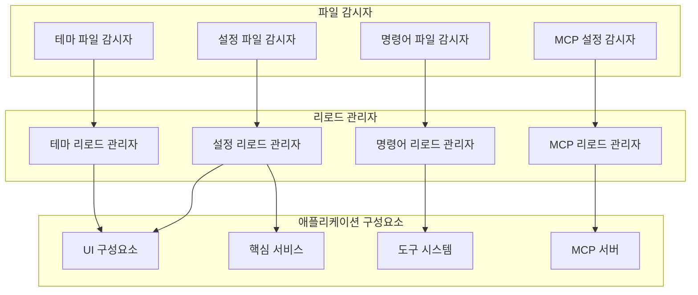
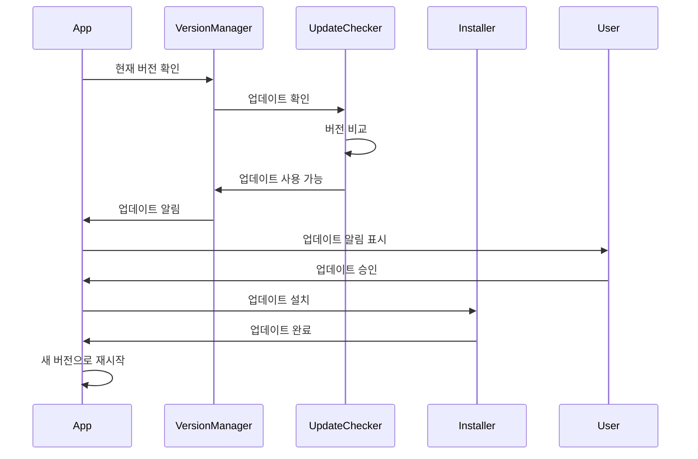

# 코드 업데이트 메커니즘

## 개요

Gemini CLI는 동적 설정 변경, 컴포넌트의 핫 리로딩, 버전 관리, 서비스 중단 없는 원활한 업데이트를 가능하게 하는 정교한 코드 업데이트 메커니즘을 구현합니다. 이러한 메커니즘은 지속적인 개선을 지원하면서도 시스템이 반응성과 유지보수성을 유지하도록 보장합니다.

## 핫 리로드 아키텍처

### 설정 핫 리로딩



### 파일 시스템 모니터링

```typescript
class HotReloadManager {
  private watchers: Map<string, FileWatcher> = new Map()
  private reloadHandlers: Map<string, ReloadHandler> = new Map()
  private debounceTime: number = 200
  
  watchFile(path: string, handler: ReloadHandler): void {
    const watcher = new FileWatcher(path, {
      debounce: this.debounceTime,
      onChange: async (filePath) => {
        await this.handleFileChange(filePath, handler)
      }
    })
    
    this.watchers.set(path, watcher)
    this.reloadHandlers.set(path, handler)
  }
  
  private async handleFileChange(path: string, handler: ReloadHandler): Promise<void> {
    try {
      console.log(`파일 변경됨: ${path}`)
      
      // 리로딩 전 파일 검증
      const validation = await this.validateFile(path)
      if (!validation.valid) {
        console.error(`잘못된 파일: ${validation.error}`)
        return
      }
      
      // 리로드 핸들러 실행
      await handler.reload(path)
      console.log(`성공적으로 리로드됨: ${path}`)
      
    } catch (error) {
      console.error(`${path} 리로드 실패:`, error)
      // UI 알림을 위한 오류 이벤트 방출
      this.emit('reload-error', { path, error })
    }
  }
  
  private async validateFile(path: string): Promise<ValidationResult> {
    const ext = path.extname(path)
    
    switch (ext) {
      case '.json':
        return this.validateJSON(path)
      case '.toml':
        return this.validateTOML(path)
      case '.js':
      case '.ts':
        return this.validateJavaScript(path)
      default:
        return { valid: true }
    }
  }
}
```

### 설정 리로드 구현

```typescript
class ConfigurationReloader implements ReloadHandler {
  private config: Configuration
  private subscribers: Set<ConfigSubscriber> = new Set()
  
  async reload(configPath: string): Promise<void> {
    // 새 설정 로드
    const newConfig = await this.loadConfiguration(configPath)
    
    // 현재 설정과 비교
    const changes = this.detectChanges(this.config, newConfig)
    
    if (changes.length === 0) {
      return // 변경사항 없음
    }
    
    // 새 설정 검증
    const validation = await this.validateConfiguration(newConfig)
    if (!validation.valid) {
      throw new Error(`잘못된 설정: ${validation.errors.join(', ')}`)
    }
    
    // 변경사항을 점진적으로 적용
    await this.applyConfigurationChanges(changes, newConfig)
    
    // 현재 설정 업데이트
    this.config = newConfig
    
    // 구독자에게 알림
    await this.notifySubscribers(changes)
  }
  
  private detectChanges(oldConfig: Configuration, newConfig: Configuration): ConfigChange[] {
    const changes: ConfigChange[] = []
    
    // 설정 객체의 깊은 비교
    const oldFlat = this.flattenObject(oldConfig)
    const newFlat = this.flattenObject(newConfig)
    
    // 변경되거나 추가된 키 찾기
    for (const [key, newValue] of Object.entries(newFlat)) {
      if (oldFlat[key] !== newValue) {
        changes.push({
          type: oldFlat.hasOwnProperty(key) ? 'modified' : 'added',
          key,
          oldValue: oldFlat[key],
          newValue
        })
      }
    }
    
    // 제거된 키 찾기
    for (const key of Object.keys(oldFlat)) {
      if (!newFlat.hasOwnProperty(key)) {
        changes.push({
          type: 'removed',
          key,
          oldValue: oldFlat[key],
          newValue: undefined
        })
      }
    }
    
    return changes
  }
  
  private async applyConfigurationChanges(
    changes: ConfigChange[],
    newConfig: Configuration
  ): Promise<void> {
    // 컴포넌트별로 변경사항 그룹화
    const componentChanges = this.groupChangesByComponent(changes)
    
    for (const [component, componentChanges] of componentChanges) {
      const handler = this.getComponentHandler(component)
      if (handler) {
        await handler.applyChanges(componentChanges, newConfig)
      }
    }
  }
}
```

## 테마 핫 리로딩

### 동적 테마 업데이트

```typescript
class ThemeReloader implements ReloadHandler {
  private themeManager: ThemeManager
  private activeTheme: Theme
  
  async reload(themePath: string): Promise<void> {
    try {
      // 테마 파일 로드 및 파싱
      const themeDefinition = await this.loadThemeDefinition(themePath)
      
      // 테마 구조 검증
      this.validateThemeDefinition(themeDefinition)
      
      // 테마 스타일 컴파일
      const compiledTheme = await this.compileTheme(themeDefinition)
      
      // 애니메이션과 함께 테마를 부드럽게 적용
      await this.applyThemeWithTransition(compiledTheme)
      
      this.activeTheme = compiledTheme
      
    } catch (error) {
      console.error('테마 리로드 실패:', error)
      // 오류 시 이전 테마로 복원
      await this.revertToPreviousTheme()
      throw error
    }
  }
  
  private async applyThemeWithTransition(theme: Theme): Promise<void> {
    // 테마 간 부드러운 전환 생성
    const transitionDuration = 300 // ms
    
    // 새 테마를 점진적으로 적용
    return new Promise((resolve) => {
      let progress = 0
      const step = 100 / transitionDuration
      
      const transition = setInterval(() => {
        progress += step
        
        if (progress >= 100) {
          clearInterval(transition)
          this.themeManager.setTheme(theme)
          resolve()
        } else {
          // 이전 테마와 새 테마 간 보간
          const interpolated = this.interpolateThemes(
            this.activeTheme,
            theme,
            progress / 100
          )
          this.themeManager.setTheme(interpolated)
        }
      }, 10)
    })
  }
  
  private interpolateThemes(oldTheme: Theme, newTheme: Theme, progress: number): Theme {
    return {
      ...newTheme,
      colors: Object.fromEntries(
        Object.entries(newTheme.colors).map(([key, newColor]) => {
          const oldColor = oldTheme.colors[key]
          return [key, this.interpolateColor(oldColor, newColor, progress)]
        })
      )
    }
  }
}
```

## 명령어 핫 리로딩

### 동적 명령어 등록

```typescript
class CommandReloader implements ReloadHandler {
  private commandRegistry: CommandRegistry
  private watchedDirectories: Set<string> = new Set()
  
  async reload(commandPath: string): Promise<void> {
    const isDirectory = await this.isDirectory(commandPath)
    
    if (isDirectory) {
      await this.reloadCommandDirectory(commandPath)
    } else {
      await this.reloadSingleCommand(commandPath)
    }
  }
  
  private async reloadCommandDirectory(directoryPath: string): Promise<void> {
    // 모든 명령어 파일 찾기
    const commandFiles = await this.findCommandFiles(directoryPath)
    
    // 이 디렉토리의 기존 명령어 제거
    const existingCommands = this.commandRegistry.getCommandsByPath(directoryPath)
    for (const command of existingCommands) {
      this.commandRegistry.unregister(command.name)
    }
    
    // 새로운/업데이트된 명령어 로드
    const commands = await Promise.all(
      commandFiles.map(file => this.loadCommandFile(file))
    )
    
    // 새 명령어 등록
    for (const command of commands) {
      this.commandRegistry.register(command)
    }
    
    console.log(`${directoryPath}에서 ${commands.length}개 명령어 리로드됨`)
  }
  
  private async loadCommandFile(filePath: string): Promise<Command> {
    const content = await fs.readFile(filePath, 'utf-8')
    const definition = toml.parse(content)
    
    // 파일 경로에서 명령어 이름 생성
    const commandName = this.getCommandNameFromPath(filePath)
    
    return {
      name: commandName,
      description: definition.description || `${filePath}의 명령어`,
      prompt: definition.prompt,
      permissions: definition.permissions || {},
      confirmation: definition.confirmation || 'smart',
      filePath
    }
  }
  
  private getCommandNameFromPath(filePath: string): string {
    const relative = path.relative(this.getCommandsDirectory(), filePath)
    const withoutExt = relative.replace(/\.toml$/, '')
    return withoutExt.replace(/[/\\]/g, ':')
  }
}
```

## MCP 서버 핫 리로딩

### 동적 서버 관리

```typescript
class MCPServerReloader implements ReloadHandler {
  private mcpManager: MCPManager
  private serverConnections: Map<string, MCPServer> = new Map()
  
  async reload(configPath: string): Promise<void> {
    const newConfig = await this.loadMCPConfig(configPath)
    const currentServers = new Set(this.serverConnections.keys())
    const newServers = new Set(Object.keys(newConfig.mcpServers))
    
    // 제거할 서버 찾기
    const serversToRemove = this.setDifference(currentServers, newServers)
    
    // 추가할 서버 찾기
    const serversToAdd = this.setDifference(newServers, currentServers)
    
    // 업데이트할 서버 찾기
    const serversToUpdate = this.findServersToUpdate(newConfig)
    
    // 변경사항 실행
    await this.executeServerChanges({
      remove: serversToRemove,
      add: serversToAdd,
      update: serversToUpdate,
      config: newConfig
    })
  }
  
  private async executeServerChanges(changes: ServerChanges): Promise<void> {
    // 연결 해제된 서버 제거
    for (const serverName of changes.remove) {
      await this.disconnectServer(serverName)
    }
    
    // 기존 서버 업데이트
    for (const serverName of changes.update) {
      await this.updateServer(serverName, changes.config.mcpServers[serverName])
    }
    
    // 새 서버 추가
    for (const serverName of changes.add) {
      await this.connectServer(serverName, changes.config.mcpServers[serverName])
    }
  }
  
  private async updateServer(serverName: string, config: MCPServerConfig): Promise<void> {
    const existingServer = this.serverConnections.get(serverName)
    if (!existingServer) return
    
    // 재연결이 필요한지 확인
    if (this.requiresReconnection(existingServer.config, config)) {
      await this.disconnectServer(serverName)
      await this.connectServer(serverName, config)
    } else {
      // 설정을 현재 위치에서 업데이트
      await existingServer.updateConfig(config)
    }
  }
  
  private requiresReconnection(oldConfig: MCPServerConfig, newConfig: MCPServerConfig): boolean {
    // 전송 방식이나 연결 세부사항이 변경된 경우 재연결 필요
    return oldConfig.transport !== newConfig.transport ||
           oldConfig.command !== newConfig.command ||
           oldConfig.url !== newConfig.url ||
           JSON.stringify(oldConfig.args) !== JSON.stringify(newConfig.args)
  }
}
```

## 버전 관리

### 애플리케이션 버전 추적



### 버전 관리자 구현

```typescript
class VersionManager {
  private currentVersion: string
  private updateChannel: 'stable' | 'preview' | 'nightly'
  
  constructor() {
    this.currentVersion = this.getCurrentVersion()
    this.updateChannel = this.getUpdateChannel()
  }
  
  async checkForUpdates(): Promise<UpdateInfo | null> {
    try {
      const response = await fetch(this.getUpdateEndpoint())
      const updateInfo = await response.json()
      
      if (this.isNewerVersion(updateInfo.version, this.currentVersion)) {
        return {
          version: updateInfo.version,
          releaseNotes: updateInfo.releaseNotes,
          downloadUrl: updateInfo.downloadUrl,
          size: updateInfo.size,
          checksums: updateInfo.checksums
        }
      }
      
      return null
    } catch (error) {
      console.error('업데이트 확인 실패:', error)
      return null
    }
  }
  
  async installUpdate(updateInfo: UpdateInfo): Promise<void> {
    // 업데이트 다운로드
    const updatePath = await this.downloadUpdate(updateInfo)
    
    // 체크섬 검증
    await this.verifyChecksum(updatePath, updateInfo.checksums)
    
    // 현재 설치 백업
    const backupPath = await this.createBackup()
    
    try {
      // 업데이트 설치
      await this.installUpdateFile(updatePath)
      
      // 정리
      await fs.unlink(updatePath)
      await this.removeBackup(backupPath)
      
    } catch (error) {
      // 실패 시 백업에서 복원
      await this.restoreFromBackup(backupPath)
      throw error
    }
  }
  
  private isNewerVersion(remoteVersion: string, localVersion: string): boolean {
    const remote = semver.parse(remoteVersion)
    const local = semver.parse(localVersion)
    
    if (!remote || !local) {
      return false
    }
    
    return semver.gt(remote, local)
  }
}
```

### 의존성 주입 및 모듈 업데이트

```typescript
class DependencyInjector {
  private container: Map<string, any> = new Map()
  private dependencies: Map<string, DependencyDefinition> = new Map()
  
  register<T>(name: string, factory: () => T, options: DependencyOptions = {}): void {
    this.dependencies.set(name, {
      name,
      factory,
      singleton: options.singleton ?? true,
      hotReloadable: options.hotReloadable ?? false
    })
    
    if (options.hotReloadable) {
      this.setupHotReloading(name)
    }
  }
  
  private setupHotReloading(name: string): void {
    const dependency = this.dependencies.get(name)!
    
    // 의존성 소스의 변경사항 감시
    const sourcePath = this.getDependencySourcePath(name)
    if (sourcePath) {
      this.hotReloadManager.watchFile(sourcePath, {
        async reload(path: string): Promise<void> {
          await this.reloadDependency(name)
        }
      })
    }
  }
  
  private async reloadDependency(name: string): Promise<void> {
    const dependency = this.dependencies.get(name)!
    
    // 기존 인스턴스 제거
    this.container.delete(name)
    
    // Node.js 모듈인 경우 모듈 캐시 지우기
    const modulePath = this.getDependencyModulePath(name)
    if (modulePath && require.cache[modulePath]) {
      delete require.cache[modulePath]
    }
    
    // 새 인스턴스 생성
    const newInstance = dependency.factory()
    this.container.set(name, newInstance)
    
    // 의존하는 객체들에게 알림
    await this.notifyDependents(name, newInstance)
  }
  
  private async notifyDependents(dependencyName: string, newInstance: any): Promise<void> {
    for (const [name, dependency] of this.dependencies) {
      if (dependency.dependsOn?.includes(dependencyName)) {
        await this.reloadDependency(name)
      }
    }
  }
}
```

## 빌드 시스템 통합

### 점진적 빌드

```typescript
class IncrementalBuilder {
  private buildCache: Map<string, BuildCacheEntry> = new Map()
  private dependencyGraph: DependencyGraph
  
  async build(changedFiles: string[]): Promise<BuildResult> {
    // 무엇을 다시 빌드해야 하는지 분석
    const affectedModules = this.dependencyGraph.getAffectedModules(changedFiles)
    
    // 빌드 순서를 위한 위상 정렬
    const buildOrder = this.dependencyGraph.topologicalSort(affectedModules)
    
    const results: BuildModuleResult[] = []
    
    for (const module of buildOrder) {
      const result = await this.buildModule(module)
      results.push(result)
      
      if (!result.success) {
        return { success: false, results, error: result.error }
      }
    }
    
    return { success: true, results }
  }
  
  private async buildModule(module: string): Promise<BuildModuleResult> {
    const cacheEntry = this.buildCache.get(module)
    const sourceFiles = this.dependencyGraph.getSourceFiles(module)
    const currentHashes = await this.calculateFileHashes(sourceFiles)
    
    // 재빌드가 필요한지 확인
    if (cacheEntry && this.hashesMatch(cacheEntry.sourceHashes, currentHashes)) {
      return { success: true, module, cached: true }
    }
    
    try {
      // 이 모듈에 대한 빌드 실행
      const buildResult = await this.executeBuild(module)
      
      // 캐시 업데이트
      this.buildCache.set(module, {
        module,
        sourceHashes: currentHashes,
        buildTime: Date.now(),
        outputs: buildResult.outputs
      })
      
      return { success: true, module, outputs: buildResult.outputs }
      
    } catch (error) {
      return { success: false, module, error }
    }
  }
}
```

### 애셋 핫 교체

```typescript
class AssetHotReplacement {
  private assetManifest: Map<string, AssetInfo> = new Map()
  private liveConnections: Set<WebSocket> = new Set()
  
  watchAssets(assetDirectory: string): void {
    const watcher = fs.watch(assetDirectory, { recursive: true }, 
      (eventType, filename) => {
        this.handleAssetChange(assetDirectory, eventType, filename)
      }
    )
  }
  
  private async handleAssetChange(
    directory: string,
    eventType: string,
    filename: string
  ): Promise<void> {
    const fullPath = path.join(directory, filename)
    const assetKey = this.getAssetKey(fullPath)
    
    switch (eventType) {
      case 'change':
        await this.handleAssetUpdate(assetKey, fullPath)
        break
      case 'rename':
        await this.handleAssetRename(assetKey, fullPath)
        break
    }
  }
  
  private async handleAssetUpdate(assetKey: string, path: string): Promise<void> {
    // 업데이트된 애셋 읽기
    const content = await fs.readFile(path)
    const hash = this.calculateHash(content)
    
    // 매니페스트 업데이트
    this.assetManifest.set(assetKey, {
      path,
      hash,
      lastModified: Date.now()
    })
    
    // 라이브 연결에 알림
    const message = {
      type: 'asset-updated',
      assetKey,
      hash,
      content: content.toString('base64')
    }
    
    this.broadcast(message)
  }
  
  private broadcast(message: any): void {
    const messageStr = JSON.stringify(message)
    
    for (const connection of this.liveConnections) {
      if (connection.readyState === WebSocket.OPEN) {
        connection.send(messageStr)
      }
    }
  }
}
```

## 오류 처리 및 롤백

### 안전한 업데이트 메커니즘

```typescript
class SafeUpdateManager {
  private rollbackStack: RollbackAction[] = []
  private updateInProgress: boolean = false
  
  async performSafeUpdate(updateAction: UpdateAction): Promise<void> {
    if (this.updateInProgress) {
      throw new Error('업데이트가 이미 진행 중입니다')
    }
    
    this.updateInProgress = true
    this.rollbackStack = []
    
    try {
      await this.executeUpdate(updateAction)
      this.clearRollbackStack()
    } catch (error) {
      console.error('업데이트 실패, 롤백 수행:', error)
      await this.performRollback()
      throw error
    } finally {
      this.updateInProgress = false
    }
  }
  
  private async executeUpdate(action: UpdateAction): Promise<void> {
    // 변경 전 롤백 액션 생성
    const rollbackAction = await this.createRollbackAction(action)
    this.rollbackStack.push(rollbackAction)
    
    // 업데이트 실행
    await action.execute()
    
    // 업데이트가 성공적인지 확인
    const verification = await this.verifyUpdate(action)
    if (!verification.success) {
      throw new Error(`업데이트 검증 실패: ${verification.error}`)
    }
  }
  
  private async performRollback(): Promise<void> {
    // 롤백 액션을 역순으로 실행
    for (let i = this.rollbackStack.length - 1; i >= 0; i--) {
      const rollbackAction = this.rollbackStack[i]
      try {
        await rollbackAction.execute()
      } catch (error) {
        console.error('롤백 액션 실패:', error)
        // 다른 롤백 액션 계속 진행
      }
    }
  }
}
```

## 성능 최적화

### 지연 로딩 및 코드 분할

```typescript
class ModuleLoader {
  private loadedModules: Map<string, any> = new Map()
  private loadingPromises: Map<string, Promise<any>> = new Map()
  
  async loadModule(moduleName: string): Promise<any> {
    // 이미 로드된 모듈이면 캐시된 모듈 반환
    if (this.loadedModules.has(moduleName)) {
      return this.loadedModules.get(moduleName)
    }
    
    // 이미 로딩 중이면 기존 로딩 프로미스 반환
    if (this.loadingPromises.has(moduleName)) {
      return this.loadingPromises.get(moduleName)
    }
    
    // 모듈 로딩 시작
    const loadingPromise = this.performModuleLoad(moduleName)
    this.loadingPromises.set(moduleName, loadingPromise)
    
    try {
      const module = await loadingPromise
      this.loadedModules.set(moduleName, module)
      return module
    } finally {
      this.loadingPromises.delete(moduleName)
    }
  }
  
  private async performModuleLoad(moduleName: string): Promise<any> {
    const modulePath = this.resolveModulePath(moduleName)
    
    // ES 모듈의 경우 동적 import 사용
    if (this.isESModule(modulePath)) {
      return await import(modulePath)
    }
    
    // CommonJS 모듈의 경우 require 사용
    return require(modulePath)
  }
  
  unloadModule(moduleName: string): void {
    // 캐시에서 제거
    this.loadedModules.delete(moduleName)
    
    // Node.js require 캐시에서 지우기
    const modulePath = this.resolveModulePath(moduleName)
    if (require.cache[modulePath]) {
      delete require.cache[modulePath]
    }
  }
}
```

## 모범 사례

### 핫 리로드 모범 사례

1. **우아한 성능 저하**: 핫 리로드가 실패해도 시스템이 계속 작동
2. **검증**: 변경사항을 적용하기 전 항상 설정 검증
3. **원자적 업데이트**: 일관성 없는 상태 방지를 위한 원자적 변경사항 적용
4. **롤백 기능**: 실패 시 롤백할 수 있는 능력 유지
5. **성능**: 실행 중인 시스템에 대한 영향 최소화

### 오류 복구

```typescript
class ErrorRecoveryManager {
  private errorThreshold: number = 5
  private errorCount: number = 0
  private lastErrorTime: number = 0
  private recoveryStrategies: Map<string, RecoveryStrategy> = new Map()
  
  async handleError(error: Error, context: ErrorContext): Promise<void> {
    this.errorCount++
    this.lastErrorTime = Date.now()
    
    // 너무 많은 오류 발생 시 핫 리로딩 임시 비활성화
    if (this.errorCount > this.errorThreshold) {
      this.disableHotReloading()
      return
    }
    
    const strategy = this.recoveryStrategies.get(error.constructor.name)
    if (strategy) {
      await strategy.recover(error, context)
    }
  }
  
  private disableHotReloading(): void {
    console.warn('핫 리로드 오류가 너무 많아 임시로 비활성화됨')
    
    // 5분 후 다시 활성화
    setTimeout(() => {
      this.errorCount = 0
      this.enableHotReloading()
    }, 5 * 60 * 1000)
  }
}
```

## 향후 개선사항

### 계획된 개선사항
- **분산 핫 리로딩**: 여러 인스턴스에 걸친 핫 리로드
- **스마트 의존성 추적**: 더 나은 의존성 분석
- **무중단 업데이트**: 중단 없는 원활한 업데이트
- **설정 검증**: 사용자 정의 규칙을 포함한 고급 검증
- **업데이트 롤백 UI**: 롤백 관리를 위한 사용자 인터페이스

### 연구 영역
- 점진적 컴파일 기법
- 고급 캐싱 전략
- 예측적 프리로딩
- 크로스 플랫폼 호환성
- 메모리 효율적인 핫 리로딩