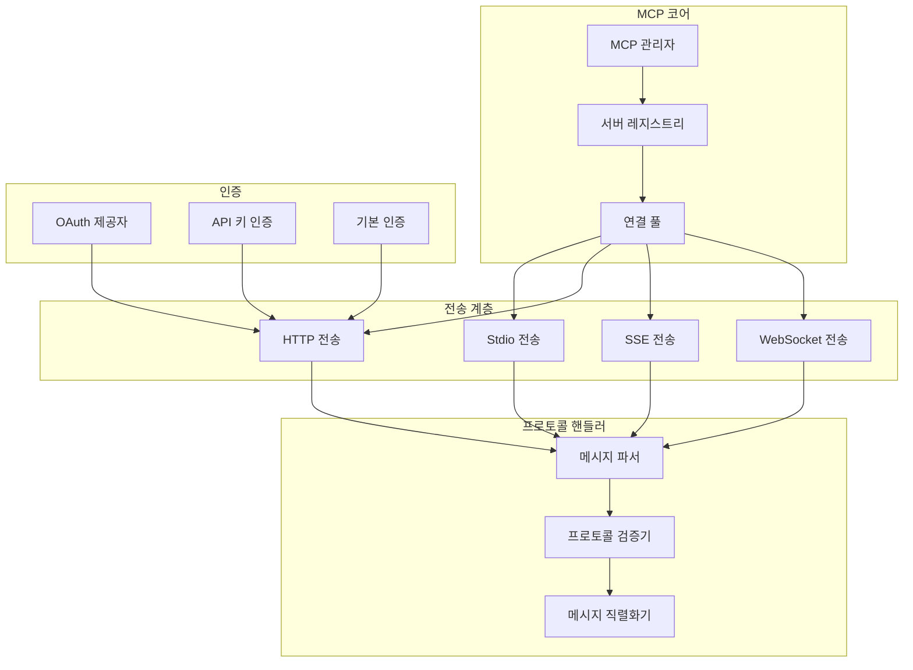

# 컴포넌트 관계 다이어그램

이 문서는 Gemini CLI 아키텍처의 여러 컴포넌트 간 관계를 보여주는 종합적인 다이어그램을 포함하고 있습니다.

## 시스템 수준 컴포넌트 아키텍처


## 패키지 의존성 그래프

```mermaid
graph LR
    subgraph "패키지"
        CLI[packages/cli]
        Core[packages/core]
        TestUtils[packages/test-utils]
        VSCode[packages/vscode-ide-companion]
    end
    
    subgraph "외부 의존성"
        React[react]
        Ink[ink]
        GeminiAPI[@google/genai]
        MCPsdk[@modelcontextprotocol/sdk]
        NodePTY[node-pty]
    end
    
    CLI --> Core
    CLI --> React
    CLI --> Ink
    CLI --> NodePTY
    
    Core --> GeminiAPI
    Core --> MCPsdk
    
    TestUtils --> CLI
    TestUtils --> Core
    
    VSCode --> Core
```

## 도구 시스템 컴포넌트 관계


## MCP 서버 통합 컴포넌트



## 인증 플로우 컴포넌트


## 설정 시스템 컴포넌트


## 명령어 처리 컴포넌트


## UI 컴포넌트 계층구조


## 메모리 및 컨텍스트 컴포넌트


## 오류 처리 컴포넌트 네트워크


## 컴포넌트 간 데이터 흐름


## 테스트 컴포넌트 관계


## 보안 컴포넌트 관계


이러한 컴포넌트 관계 다이어그램은 Gemini CLI 시스템의 여러 부분이 서로 상호작용하는 방식에 대한 종합적인 시각을 제공하며, 의존성, 데이터 흐름, 아키텍처 경계를 보여줍니다.