# 데이터 흐름 다이어그램

이 문서는 Gemini CLI 시스템을 통해 정보가 어떻게 이동하는지를 보여주는 종합적인 데이터 흐름 다이어그램을 포함하고 있습니다.

## 전체 시스템 데이터 흐름

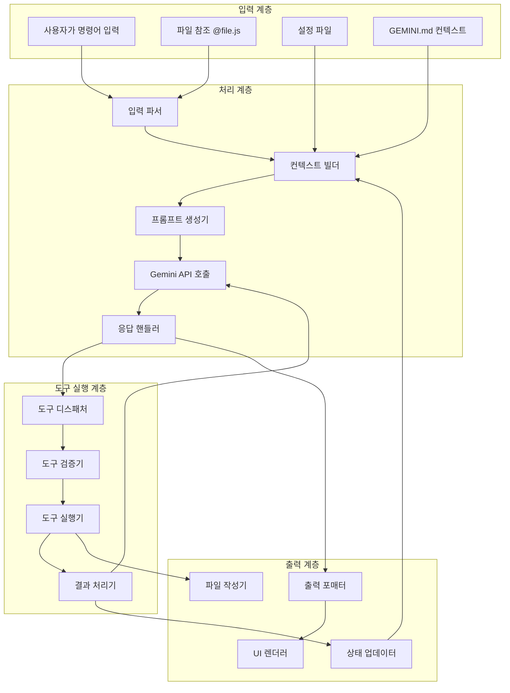

## 요청-응답 사이클 데이터 흐름

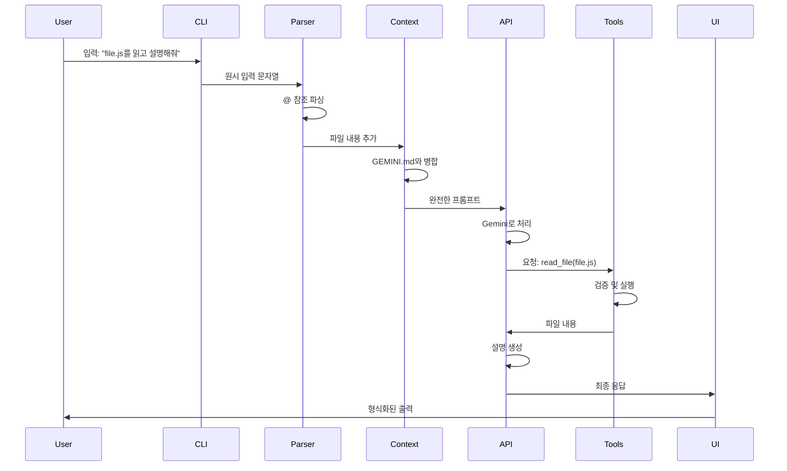

## 파일 작업 데이터 흐름

```mermaid
flowchart LR
    subgraph "파일 탐색"
        UserPath[사용자 경로 입력]
        PathResolver[경로 해결기]
        GitIgnoreFilter[Git Ignore 필터]
        FileList[필터링된 파일 목록]
    end
    
    subgraph "파일 읽기"
        FileReader[파일 리더]
        ContentCache[콘텐츠 캐시]
        SizeChecker[크기 검사기]
        EncodingDetector[인코딩 탐지기]
    end
    
    subgraph "콘텐츠 처리"
        ContentParser[콘텐츠 파서]
        MetadataExtractor[메타데이터 추출기]
        TokenCounter[토큰 카운터]
        ContentOptimizer[콘텐츠 최적화기]
    end
    
    UserPath --> PathResolver
    PathResolver --> GitIgnoreFilter
    GitIgnoreFilter --> FileList
    
    FileList --> FileReader
    FileReader --> ContentCache
    FileReader --> SizeChecker
    SizeChecker --> EncodingDetector
    
    EncodingDetector --> ContentParser
    ContentParser --> MetadataExtractor
    MetadataExtractor --> TokenCounter
    TokenCounter --> ContentOptimizer
    
    ContentOptimizer --> PromptBuilder[프롬프트 빌더]
```

## 설정 데이터 흐름

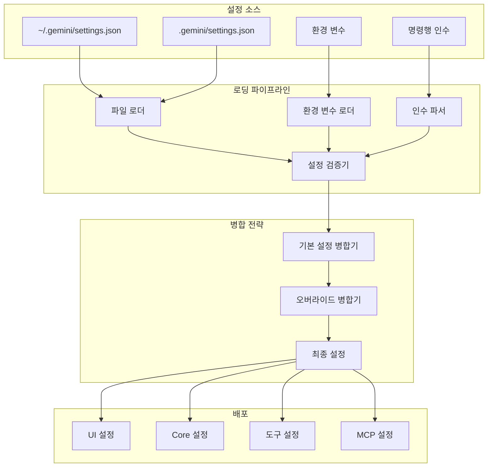

## 인증 데이터 흐름

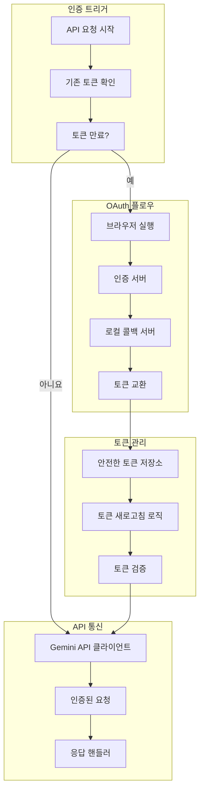

## 도구 실행 데이터 흐름

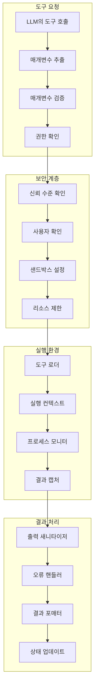

## MCP 서버 통신 흐름

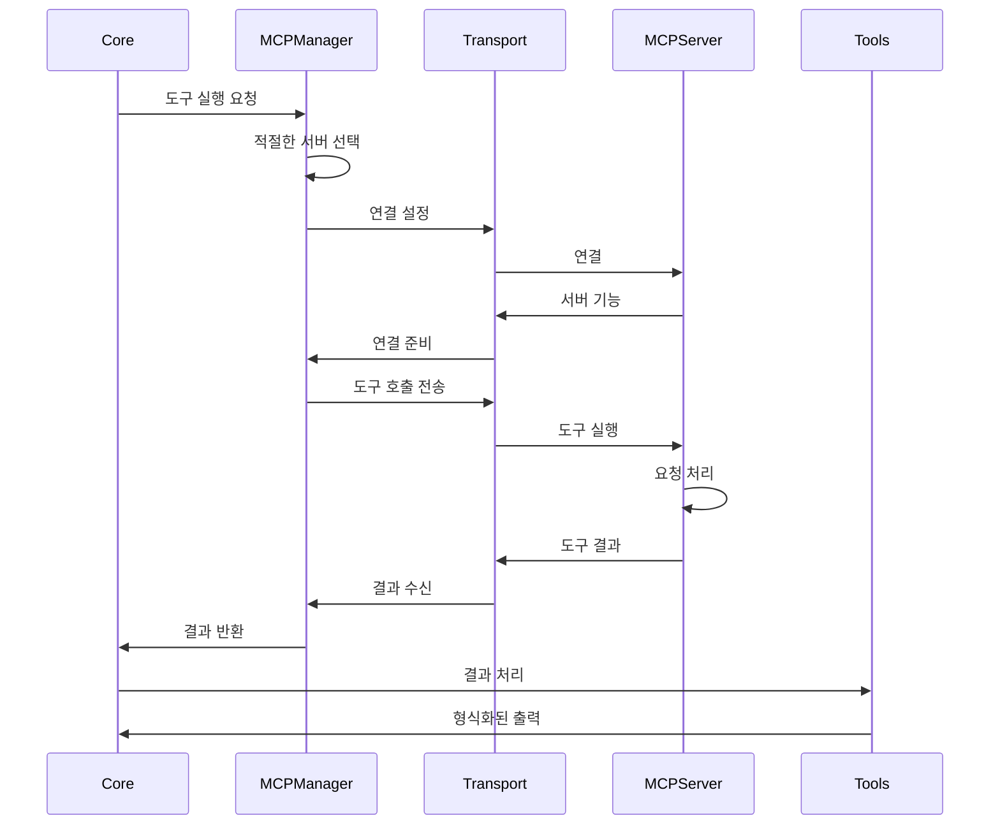

## 메모리 및 컨텍스트 흐름

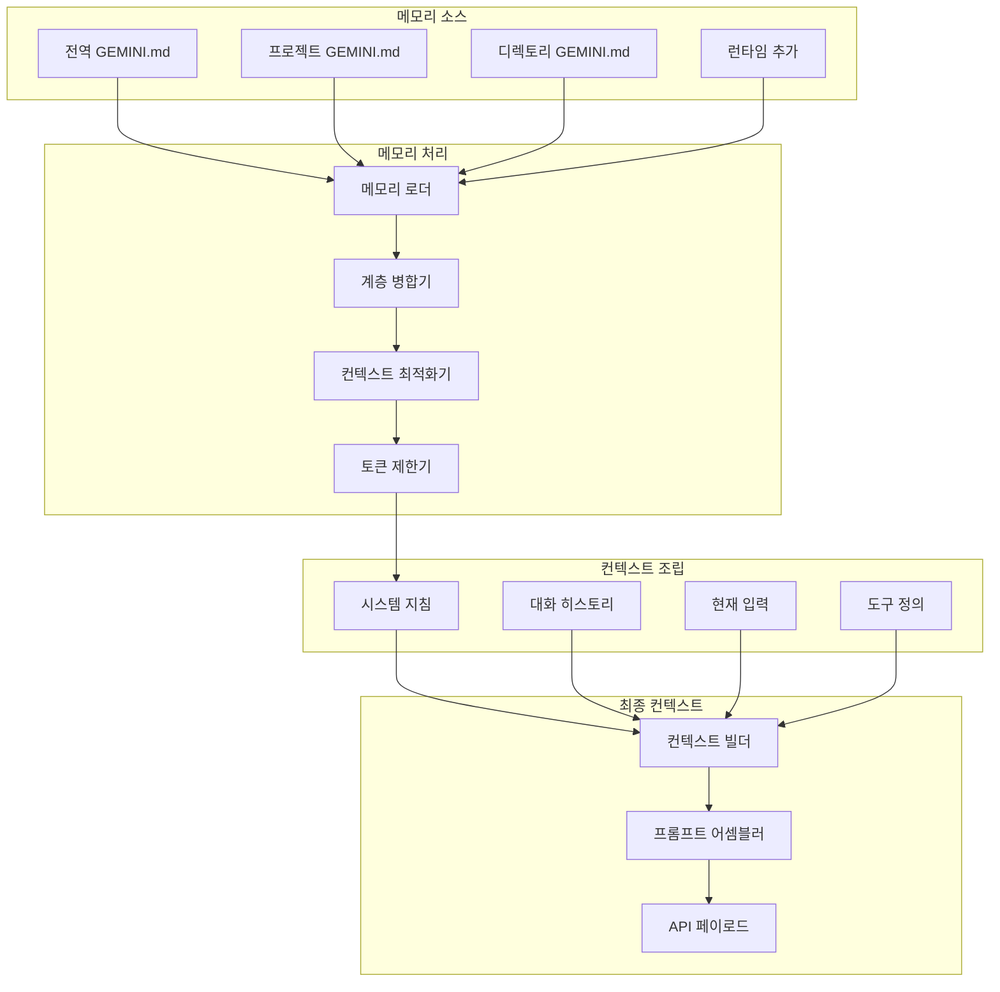

## 스트리밍 응답 데이터 흐름

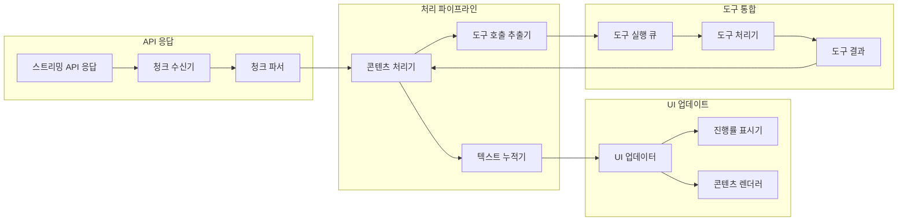

## 오류 전파 흐름

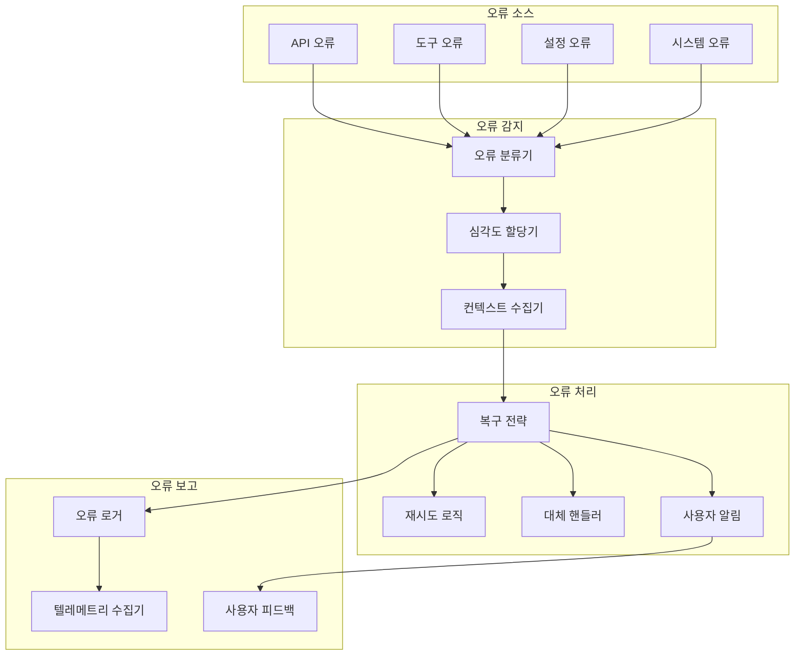

## 체크포인트 및 상태 관리 흐름

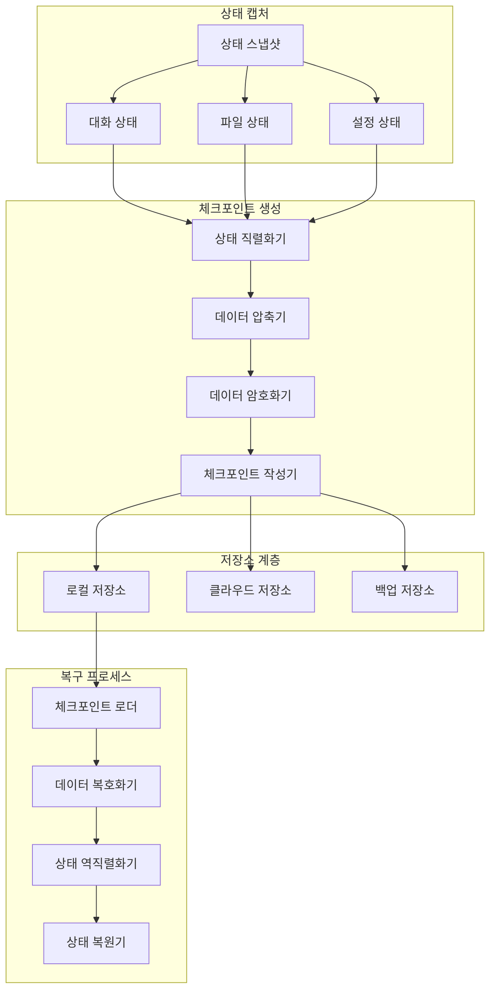

## 성능 모니터링 데이터 흐름

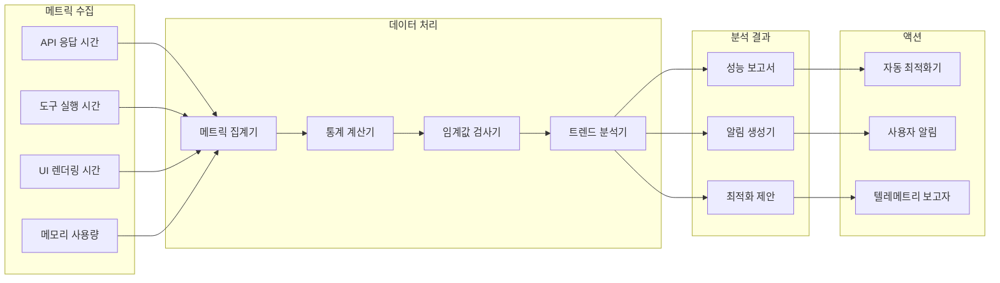

이러한 데이터 흐름 다이어그램은 사용자 입력에서 최종 출력까지, 그 과정에서 발생하는 모든 처리 단계, 변환, 상태 변경을 포함하여 Gemini CLI 시스템을 통해 정보가 어떻게 이동하는지에 대한 종합적인 시각을 제공합니다.