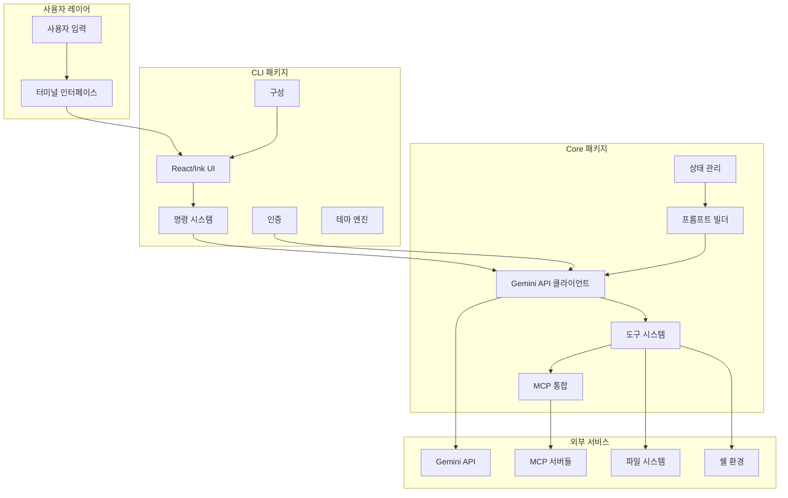
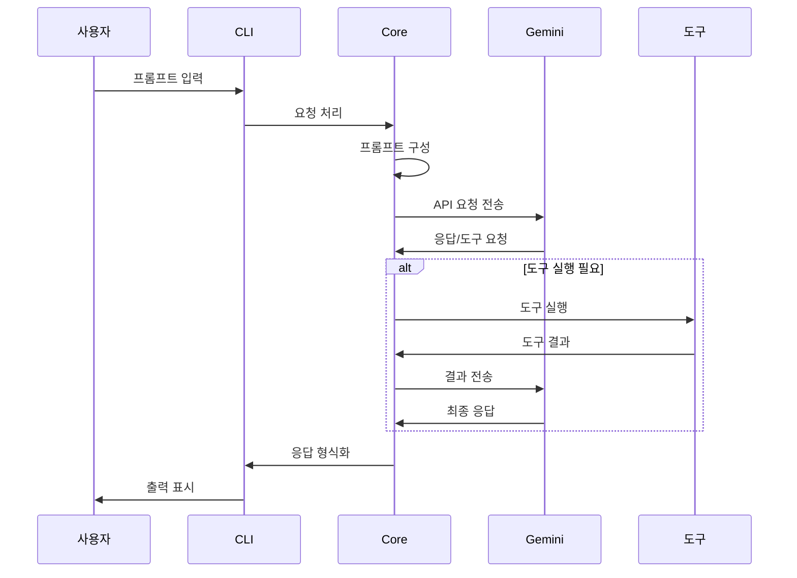
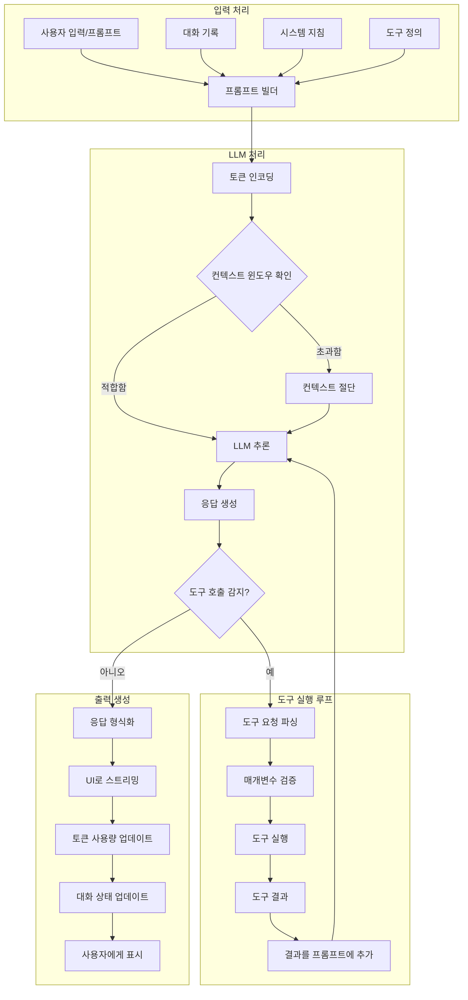
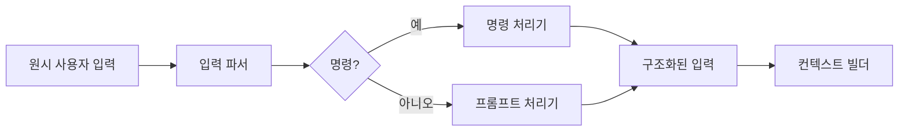
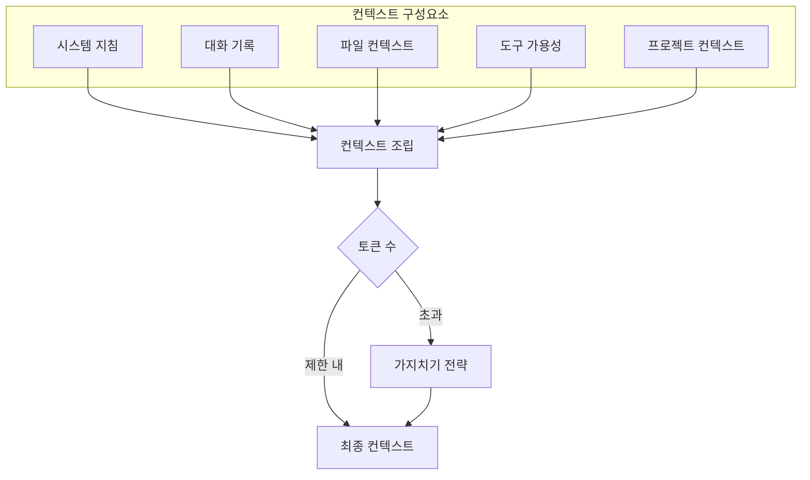
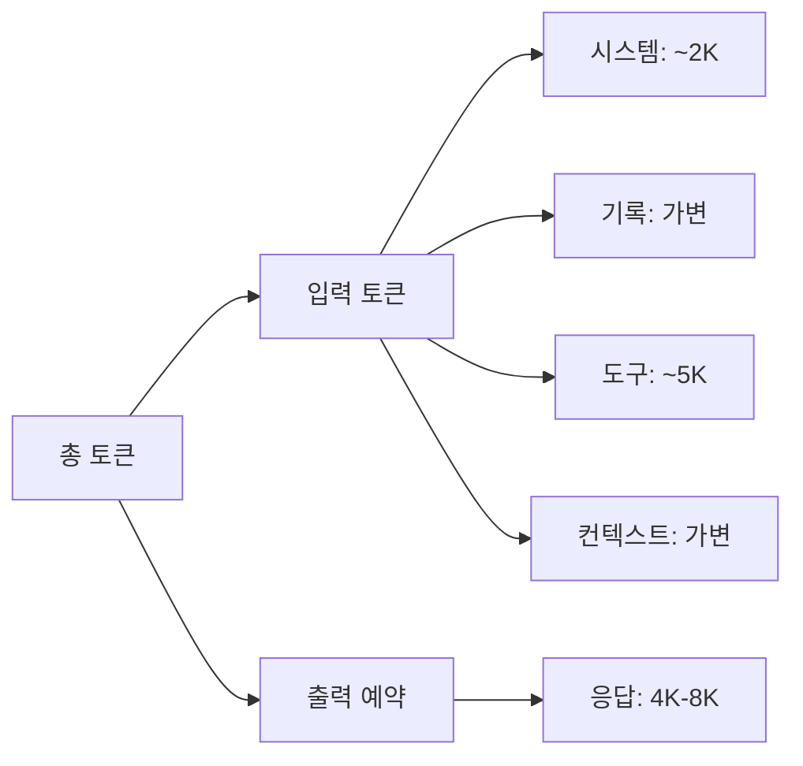
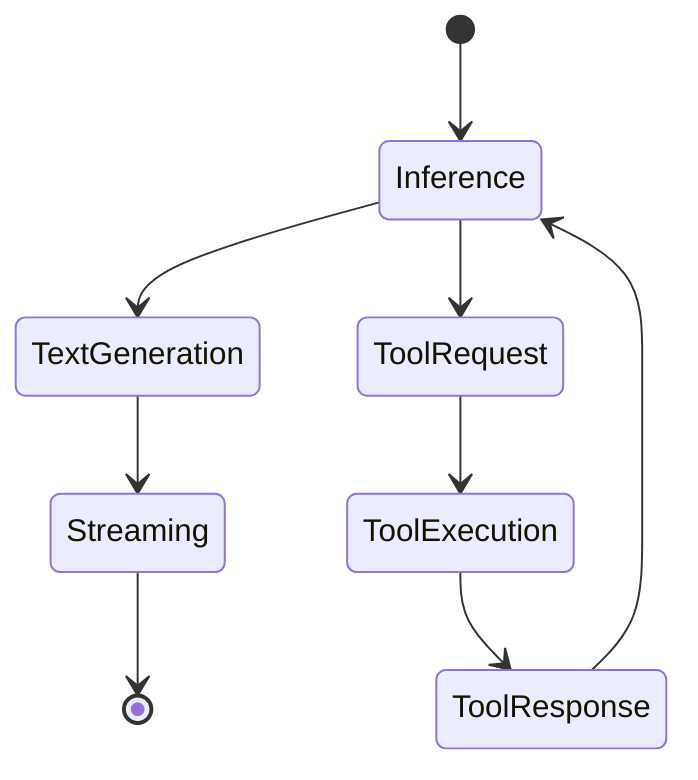
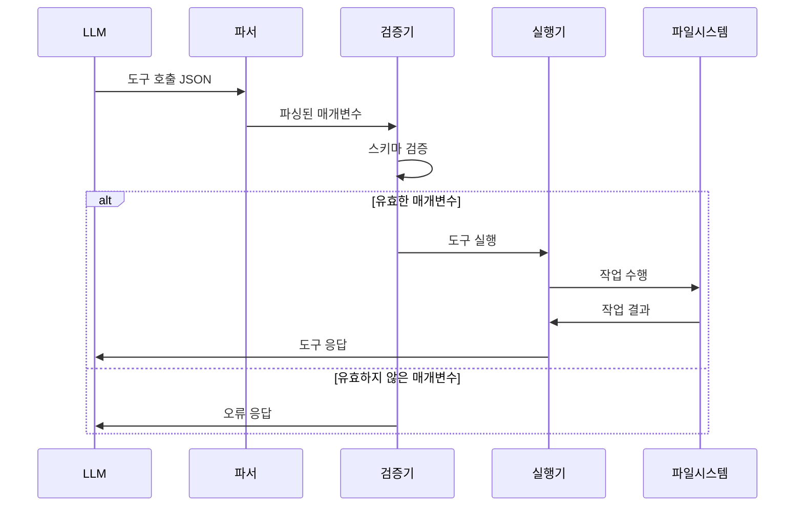
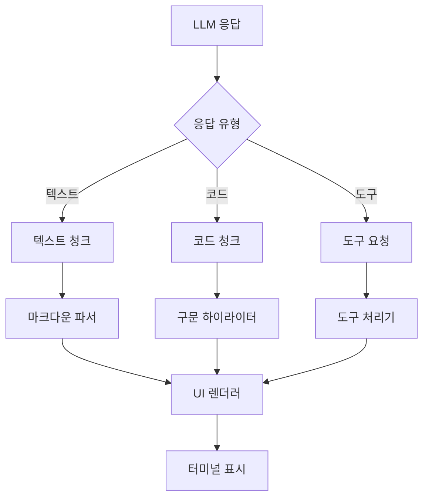
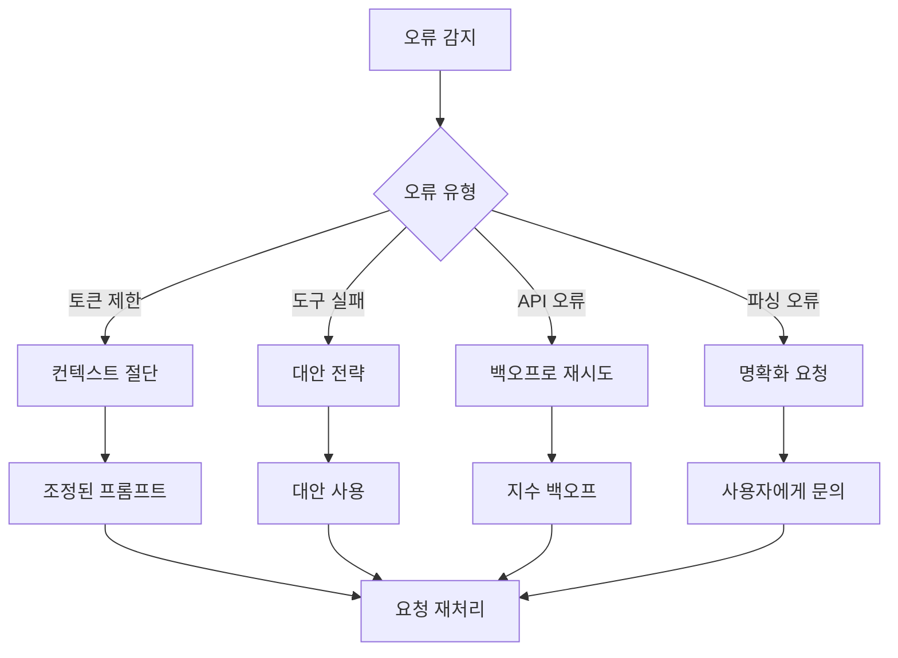

# Gemini CLI 아키텍처 개요

## 요약

Gemini CLI는 Google의 Gemini AI 모델을 터미널에서 직접 사용할 수 있게 하는 정교한 명령줄 인터페이스입니다. 모듈형 모노레포 아키텍처를 기반으로 구축되어, React 기반 터미널 UI, 확장 가능한 도구 시스템, 그리고 포괄적인 통합 기능을 통해 풍부한 상호작용 경험을 제공합니다.

## 시스템 아키텍처



## 패키지 구조

이 프로젝트는 npm workspaces로 관리되는 모노레포 구조를 따릅니다:

```
gemini-cli/
├── packages/
│   ├── cli/          # 사용자 대면 CLI 애플리케이션
│   ├── core/         # 백엔드 로직 및 API 통합
│   ├── test-utils/   # 공유 테스트 유틸리티
│   └── vscode-ide-companion/  # VS Code 통합
├── docs/             # 포괄적인 문서
├── integration-tests/# 엔드투엔드 테스팅
└── scripts/          # 빌드 및 개발 스크립트
```

## 핵심 컴포넌트

### 1. CLI 패키지 (`packages/cli`)
**목적**: 모든 사용자 대면 상호작용 및 UI 렌더링 처리

**주요 책임**:
- React와 Ink를 사용한 터미널 UI 렌더링
- 명령 처리 및 라우팅
- 테마 관리 및 커스터마이징
- 인증 플로우 관리
- 구성 처리
- 사용자 입력 처리 및 검증

### 2. Core 패키지 (`packages/core`)
**목적**: Gemini API 및 도구 오케스트레이션을 관리하는 백엔드 엔진

**주요 책임**:
- Gemini API 통신
- 도구 등록 및 실행
- MCP 서버 통합
- 프롬프트 구성 및 관리
- 대화 상태 관리
- 보안 및 샌드박싱

### 3. 도구 시스템
**목적**: Gemini의 기능을 확장하기 위한 확장 가능한 프레임워크

**내장 도구들**:
- 파일 시스템 작업 (읽기, 쓰기, 편집)
- 쉘 명령 실행
- 웹 가져오기 및 검색
- 메모리 관리
- 다중 파일 작업

### 4. MCP 통합
**목적**: 커스텀 도구 서버를 위한 Model Context Protocol 지원

**특징**:
- 다중 전송 방식 지원 (Stdio, SSE, HTTP)
- OAuth 인증
- 동적 도구 탐지
- 풍부한 콘텐츠 처리

## 데이터 플로우 패턴

### 요청-응답 사이클



## LLM 처리 워크플로우

### 개요
LLM(Large Language Model) 처리 워크플로우는 Gemini가 사용자 입력을 처리하고, 컨텍스트를 관리하며, 도구를 실행하고, 응답을 생성하는 방법을 설명합니다. 이 다단계 파이프라인은 도구 실행 기능을 갖춘 지능적이고 컨텍스트 인식 상호작용을 보장합니다.

### 상세한 LLM 입력-출력 워크플로우



### 입력 컴포넌트

#### 1. 사용자 입력 처리


**입력 유형**:
- **직접 프롬프트**: 자연어 쿼리 및 지침
- **명령**: 슬래시 명령 (예: `/edit`, `/search`)
- **파일 참조**: 파일 포함을 위한 `@filename` 구문
- **쉘 삽입**: 명령 출력 포함을 위한 `!{command}`

#### 2. 컨텍스트 관리


**컨텍스트 우선순위**:
1. **시스템 지침**: 핵심 동작 정의
2. **최근 메시지**: 최신 대화 턴
3. **도구 정의**: 사용 가능한 도구 스키마
4. **파일 컨텍스트**: 참조된 파일 내용
5. **이력 컨텍스트**: 오래된 대화 (가지치기 가능)

### LLM 처리 파이프라인

#### 1. 프롬프트 구성
```typescript
interface PromptStructure {
  system: string           // 시스템 지침 및 동작
  messages: Message[]       // 대화 기록
  tools: ToolDefinition[]   // 사용 가능한 도구 스키마
  context: {
    files: FileContext[]    // 참조된 파일
    project: ProjectInfo    // 프로젝트 메타데이터
    memory: MemoryContext   // 영구 메모리
  }
}
```

#### 2. 토큰 관리


**토큰 할당 전략**:
- **모델 제한**: 128K 토큰 (Gemini 1.5)
- **입력 예산**: ~120K 토큰
- **출력 예약**: ~8K 토큰
- **동적 가지치기**: 가장 오래된 컨텍스트 우선

#### 3. 응답 생성


### 도구 실행 워크플로우

#### 도구 감지 및 파싱


#### 도구 유형 및 실행
```yaml
내장_도구:
  - read_file:
      입력: file_path, range
      출력: file_contents
      실행: 동기 파일시스템 읽기
  
  - write_file:
      입력: file_path, content
      출력: success/error
      실행: 비동기 파일시스템 쓰기
  
  - run_shell:
      입력: command, timeout
      출력: stdout, stderr, exit_code
      실행: 서브프로세스 생성
  
  - search:
      입력: query, path, pattern
      출력: matched_files, snippets
      실행: ripgrep 통합

mcp_도구:
  - 동적_등록: true
  - 실행: MCP 프로토콜을 통해
  - 응답: 구조화된 JSON
```

### 출력 처리

#### 응답 스트리밍


#### 상태 관리
```typescript
interface ConversationState {
  messages: Message[]
  tokenUsage: {
    input: number
    output: number
    total: number
  }
  toolExecutions: ToolExecution[]
  checkpoints: Checkpoint[]
  memory: PersistentMemory
}
```

### 오류 처리 및 복구



### 성능 최적화

#### 캐싱 전략
```yaml
캐시_레이어:
  토큰_캐시:
    - 시스템_프롬프트: 영구
    - 도구_정의: 세션
    - 일반_응답: LRU 캐시
  
  파일_캐시:
    - 읽기_파일: TTL 5분
    - 프로젝트_구조: TTL 10분
  
  api_캐시:
    - 모델_구성: 영구
    - 속도_제한: 동적
```

#### 스트리밍 최적화
- **점진적 렌더링**: 청크가 도착하는 대로 표시
- **병렬 처리**: 스트리밍 중 도구 실행
- **버퍼 관리**: 효율적인 메모리 사용
- **청크 집계**: UI 업데이트 감소

## 주요 설계 원칙

### 1. 모듈성
- UI(CLI)와 비즈니스 로직(Core) 간의 명확한 분리
- 플러그인 아키텍처를 가진 확장 가능한 도구 시스템
- 독립적인 패키지 개발 및 테스팅

### 2. 확장성
- 커스텀 도구를 위한 Tool Builder 패턴
- 외부 기능을 위한 MCP 서버 통합
- 커스텀 명령을 지원하는 명령 시스템
- 테마 커스터마이징 지원

### 3. 사용자 경험
- React 컴포넌트를 사용한 풍부한 터미널 UI
- 실시간 구문 하이라이팅
- 대화형 명령 완성
- Vim 모드 지원
- 대화 체크포인팅

### 4. 보안
- 샌드박싱 지원 (Docker, Podman, macOS Seatbelt)
- 도구 실행 확인
- 신뢰 수준 관리
- 안전한 자격 증명 저장

## 기술 스택

### 핵심 기술
- **런타임**: Node.js (>=20.0.0)
- **언어**: TypeScript
- **UI 프레임워크**: 터미널 렌더링을 위한 React with Ink
- **테스팅**: 단위 및 통합 테스트를 위한 Vitest
- **빌드 시스템**: 번들링을 위한 ESBuild

### 주요 라이브러리
- **@google/genai**: Gemini API 클라이언트
- **@modelcontextprotocol/sdk**: MCP 통합
- **ink**: CLI를 위한 React 렌더러
- **yargs**: 명령줄 인수 파싱
- **node-pty**: 터미널 에뮬레이션

## 확장 포인트

### 1. 커스텀 도구
ToolBuilder 인터페이스를 통해 도구를 추가할 수 있습니다:
```typescript
interface ToolBuilder {
  name: string
  description: string
  parameters: JSONSchema
  execute: (params) => Promise<ToolResponse>
}
```

### 2. MCP 서버
외부 도구 서버는 다음을 통해 통합될 수 있습니다:
- 로컬 프로세스를 위한 Stdio 전송
- 원격 서버를 위한 HTTP/SSE
- 인증된 서비스를 위한 OAuth

### 3. 커스텀 명령
다음 위치의 TOML 기반 명령 정의:
- `~/.gemini/commands/` (전역)
- `.gemini/commands/` (프로젝트별)

### 4. 테마
다음을 지원하는 커스터마이징 가능한 UI 테마:
- 의미적 색상 토큰
- 컴포넌트 스타일링
- 마크다운 렌더링

## 성능 고려사항

### 최적화 전략
- API 비용 절감을 위한 토큰 캐싱
- 도구 및 명령의 지연 로딩
- .gemini-ignore를 사용한 효율적인 파일 필터링
- 실시간 피드백을 위한 스트리밍 응답

### 리소스 관리
- 구성 가능한 컨텍스트 윈도우
- 메모리 사용량 모니터링
- 대용량 대화를 위한 체크포인트 관리
- 효율적인 다중 파일 작업

## 보안 아키텍처

### 신뢰 수준
1. **없음**: 파일 시스템 접근 없음
2. **제한됨**: 읽기 전용 작업
3. **표준**: 확인과 함께 읽기/쓰기
4. **전체**: 무제한 접근

### 샌드박싱 옵션
- 컨테이너 기반 (Docker/Podman)
- macOS Seatbelt 프로필
- 네트워크 제한을 위한 커스텀 프록시 서버

## 통합 기능

### IDE 통합
- VS Code 동반 확장
- 터미널 통합
- 커스텀 프로토콜 핸들러

### CI/CD 통합
- GitHub Actions 지원
- 자동화를 위한 비대화형 모드
- 스크립트 가능한 인터페이스

### 버전 제어
- Git 인식 파일 필터링
- 체크포인트 관리
- 구성 버전 관리

## 미래 아키텍처 고려사항

### 확장성
- MCP 서버의 수평 확장
- 분산 도구 실행
- 클라우드 기반 체크포인트 저장

### 확장성
- 플러그인 마켓플레이스
- 커뮤니티 도구 저장소
- 향상된 MCP 기능

### 성능
- 개선된 캐싱 전략
- 병렬 도구 실행
- 최적화된 토큰 사용

## 결론

Gemini CLI 아키텍처는 모듈형 설계, 확장 가능한 프레임워크, 그리고 포괄적인 기능 세트를 통해 뛰어난 엔지니어링 실천을 보여줍니다. 관심사의 명확한 분리, 견고한 도구 시스템, 그리고 신중한 추상화 레이어는 향후 요구사항을 충족하도록 발전할 수 있으면서도 하위 호환성을 유지하는 강력하고 유지보수 가능한 시스템을 만들어냅니다.