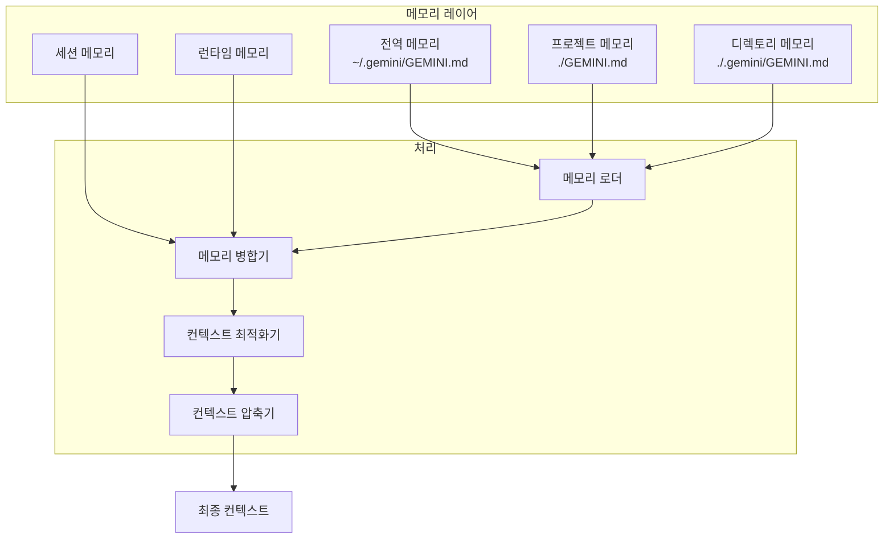
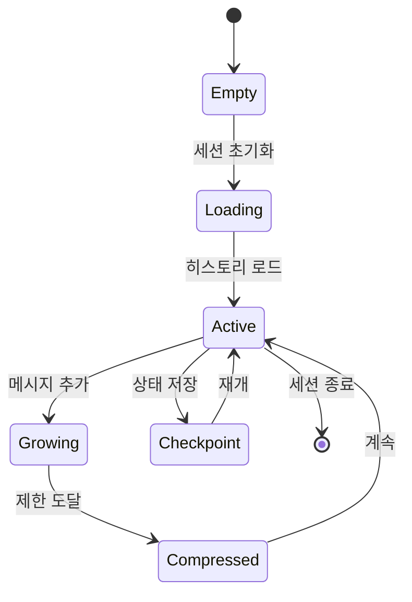
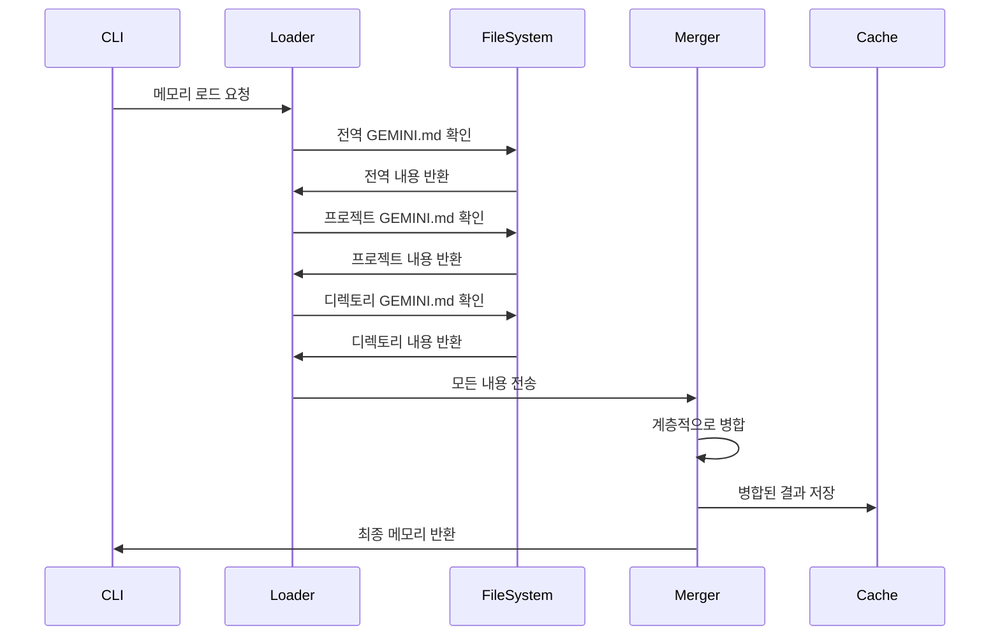
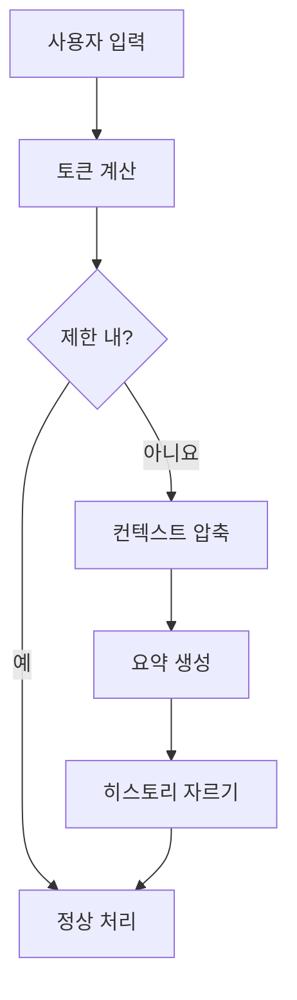
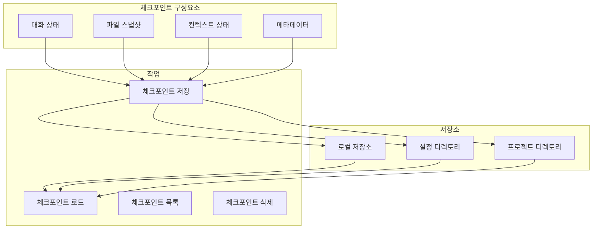
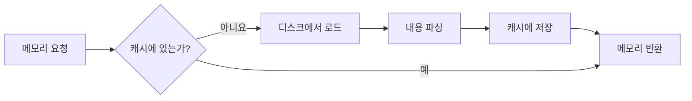

# 컨텍스트 및 메모리 아키텍처

## 개요

Gemini CLI의 컨텍스트 및 메모리 아키텍처는 AI 지침, 대화 히스토리, 영구 지식을 관리하는 정교한 계층적 시스템을 제공합니다. 이 시스템은 토큰 사용량을 최적화하고 관련성을 유지하면서 세션 간 컨텍스트 인식을 가능하게 합니다.

## 메모리 계층구조



## 메모리 유형

### 1. 영구 메모리 (GEMINI.md 파일)

#### 전역 메모리
**위치**: `~/.gemini/GEMINI.md`
**목적**: 사용자 전반적인 설정 및 지침
**범위**: 모든 프로젝트 및 세션

```markdown
# 전역 GEMINI.md 예시
- 항상 strict 모드와 함께 TypeScript 사용
- 함수형 프로그래밍 패턴 선호
- 회사 코딩 표준 준수
- 특정 포맷팅 설정 사용
```

#### 프로젝트 메모리
**위치**: `./GEMINI.md` (프로젝트 루트)
**목적**: 프로젝트별 컨텍스트 및 지침
**범위**: 현재 프로젝트 및 하위 디렉토리

```markdown
# 프로젝트 GEMINI.md 예시
- 이것은 React Native 애플리케이션입니다
- 라우팅에 React Navigation 사용
- 기존 컴포넌트 구조를 따르세요
- API 엔드포인트는 src/api/에 있습니다
```

#### 디렉토리 메모리
**위치**: `./.gemini/GEMINI.md` (하위 디렉토리)
**목적**: 디렉토리별 가이드
**범위**: 현재 디렉토리만

### 2. 세션 메모리



#### 구성 요소
```typescript
interface SessionMemory {
  messages: ConversationMessage[]
  toolExecutions: ToolExecution[]
  contextAdditions: string[]
  metadata: SessionMetadata
}

interface ConversationMessage {
  role: 'user' | 'assistant' | 'system'
  content: string
  timestamp: Date
  tokenCount: number
  toolCalls?: ToolCall[]
}
```

### 3. 런타임 메모리

런타임 메모리는 세션 중에 동적으로 관리될 수 있습니다:

```typescript
interface RuntimeMemory {
  // /memory add 명령을 통해 추가된 내용
  userAdditions: string[]
  
  // 도구 실행 결과
  toolResults: Map<string, any>
  
  // 파일 읽기에서 온 임시 컨텍스트
  fileContext: FileContext[]
  
  // MCP 서버 응답
  mcpContext: MCPContext[]
}
```

## 메모리 로딩 프로세스



### 로딩 우선순위
1. **전역 메모리** (최하위 우선순위)
2. **프로젝트 메모리** (중간 우선순위)
3. **디렉토리 메모리** (최고 우선순위)
4. **런타임 추가** (모두 오버라이드)

## 컨텍스트 관리

### 컨텍스트 윈도우 관리



### 토큰 최적화 전략

#### 1. 슬라이딩 윈도우
```typescript
class SlidingWindowStrategy {
  maintainWindow(messages: Message[], maxTokens: number): Message[] {
    // 토큰 제한 내에서 가장 최신 메시지 유지
    let tokenCount = 0
    const kept: Message[] = []
    
    for (let i = messages.length - 1; i >= 0; i--) {
      if (tokenCount + messages[i].tokens <= maxTokens) {
        kept.unshift(messages[i])
        tokenCount += messages[i].tokens
      }
    }
    
    return kept
  }
}
```

#### 2. 중요도 기반 압축
```typescript
class ImportanceCompression {
  compress(messages: Message[]): Message[] {
    // 중요도 점수 할당
    const scored = messages.map(m => ({
      message: m,
      score: this.calculateImportance(m)
    }))
    
    // 중요도별로 정렬하고 자르기
    return scored
      .sort((a, b) => b.score - a.score)
      .slice(0, this.maxMessages)
      .map(s => s.message)
  }
  
  private calculateImportance(message: Message): number {
    // 요소: 최신성, 도구 사용, 사용자 언급, 오류 상태
    let score = 0
    score += this.recencyScore(message)
    score += message.toolCalls ? 10 : 0
    score += message.isError ? 15 : 0
    return score
  }
}
```

#### 3. 의미론적 요약
```typescript
interface SummarizationStrategy {
  summarize(messages: Message[]): string
  shouldSummarize(tokenCount: number, limit: number): boolean
  preserveKeyInformation(messages: Message[]): KeyInfo[]
}
```

## 체크포인트 시스템

### 체크포인트 아키텍처



### 체크포인트 구조
```typescript
interface Checkpoint {
  id: string
  tag: string
  timestamp: Date
  conversation: {
    messages: Message[]
    tokenUsage: TokenUsage
    model: string
  }
  files?: {
    path: string
    content: string
    hash: string
  }[]
  context: {
    memory: MergedMemory
    runtimeAdditions: string[]
  }
  metadata: {
    sessionId: string
    userId?: string
    projectPath: string
    version: string
  }
}
```

### 체크포인트 저장 위치
- **Linux/macOS**: `~/.config/google-generative-ai/checkpoints/`
- **Windows**: `%APPDATA%\google-generative-ai\checkpoints\`
- **프로젝트별**: `./.gemini/checkpoints/`

## 메모리 명령어

### 사용자 인터페이스 명령어

```typescript
interface MemoryCommands {
  // /memory add <text>
  add(text: string): void
  
  // /memory show
  show(): string
  
  // /memory refresh
  refresh(): void
  
  // /memory clear
  clear(): void
}
```

### 프로그래매틱 API

```typescript
class MemoryManager {
  // 모든 메모리 소스 로드
  async loadMemory(): Promise<MergedMemory>
  
  // 런타임 메모리 추가
  addRuntimeMemory(content: string): void
  
  // 컨텍스트 압축
  async compressContext(messages: Message[]): Promise<Message[]>
  
  // 체크포인트 생성
  async createCheckpoint(tag: string): Promise<Checkpoint>
  
  // 체크포인트에서 복원
  async restoreCheckpoint(tag: string): Promise<void>
}
```

## 컨텍스트 주입 전략

### 1. 정적 주입
세션 시작 시 메모리를 로드하고 일정하게 유지:
```typescript
const staticContext = await loadGeminiMdFiles()
prompt.addSystemContext(staticContext)
```

### 2. 동적 주입
현재 작업에 기반한 컨텍스트 업데이트:
```typescript
const dynamicContext = await determineRelevantContext(userInput)
prompt.addDynamicContext(dynamicContext)
```

### 3. 지연 로딩
필요할 때만 컨텍스트 로드:
```typescript
if (userInput.mentions('database')) {
  const dbContext = await loadDatabaseContext()
  prompt.addContext(dbContext)
}
```

## 성능 고려사항

### 캐싱 메커니즘



### 캐시 구현
```typescript
class MemoryCache {
  private cache: Map<string, CachedMemory> = new Map()
  private maxAge: number = 5 * 60 * 1000 // 5분
  
  get(key: string): MergedMemory | null {
    const cached = this.cache.get(key)
    if (!cached) return null
    
    if (Date.now() - cached.timestamp > this.maxAge) {
      this.cache.delete(key)
      return null
    }
    
    return cached.memory
  }
  
  set(key: string, memory: MergedMemory): void {
    this.cache.set(key, {
      memory,
      timestamp: Date.now()
    })
  }
}
```

## 모범 사례

### 메모리 구성
1. **전역**: 사용자 설정 및 일반 지침
2. **프로젝트**: 프로젝트별 컨텍스트 및 관습
3. **디렉토리**: 모듈 또는 컴포넌트별 가이드
4. **런타임**: 임시, 세션별 정보

### 토큰 관리
1. 토큰 사용량을 지속적으로 모니터링
2. 점진적 압축 구현
3. 중요한 정보 보존
4. 효과적인 캐싱 사용

### 체크포인트 전략
1. 파괴적 작업 전 자동 체크포인트
2. 중요한 상태에 대한 수동 체크포인트
3. 오래된 체크포인트의 정기적 정리
4. 버전 호환성 검사

## 보안 고려사항

### 메모리 격리
- 프로젝트 간 메모리 누수 방지
- 민감한 정보 처리
- 안전한 체크포인트 저장
- 공유 환경에서의 접근 제어

### 데이터 프라이버시
```typescript
interface PrivacySettings {
  excludePatterns: string[]  // 절대 포함하지 않을 파일
  sanitizeSecrets: boolean    // API 키, 토큰 제거
  encryptCheckpoints: boolean // 저장된 상태 암호화
  localOnly: boolean          // 클라우드 동기화 비활성화
}
```

## 향후 개선사항

### 계획된 기능
- **의미론적 메모리 검색**: 임베딩을 사용한 관련 컨텍스트 찾기
- **지능적 압축**: ML 기반 요약
- **분산 체크포인트**: 클라우드 저장 및 동기화
- **컨텍스트 버전 관리**: 메모리 진화 추적
- **스마트 컨텍스트 선택**: 관련 컨텍스트 자동 선택

### 연구 영역
- 의미론적 검색을 위한 벡터 데이터베이스 통합
- 대화 패턴에서의 연합 학습
- 적응형 컨텍스트 윈도우 관리
- 세션 간 학습 및 전이