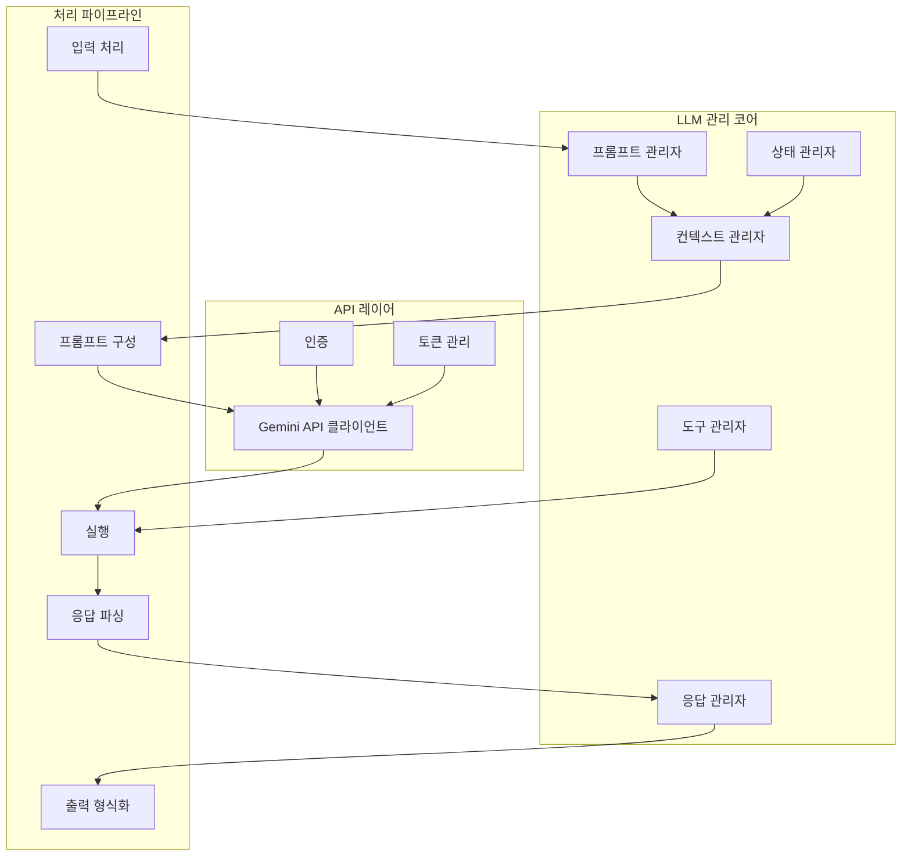
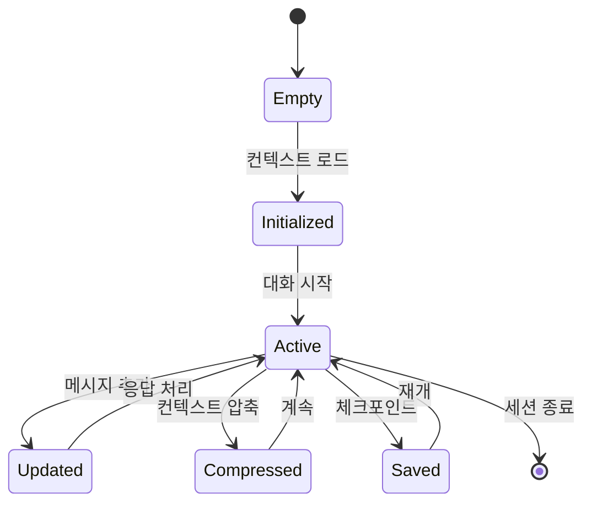
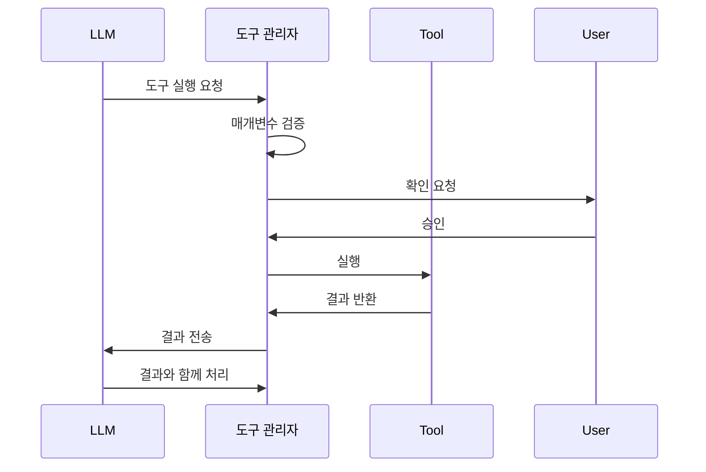
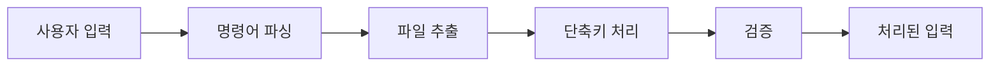
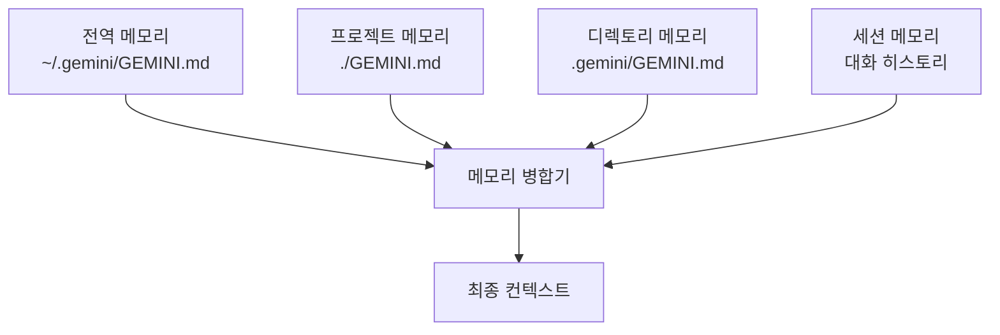
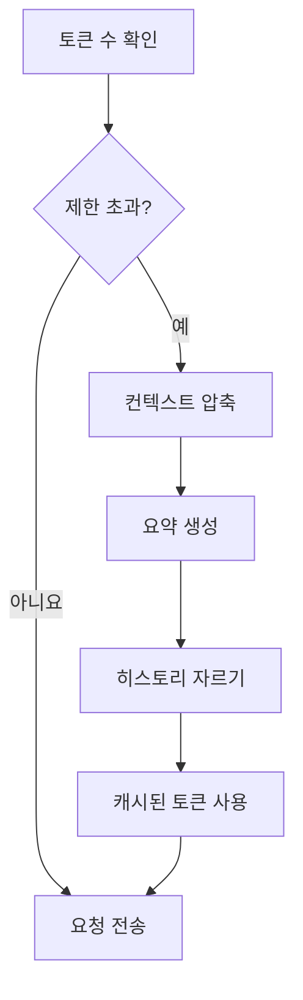
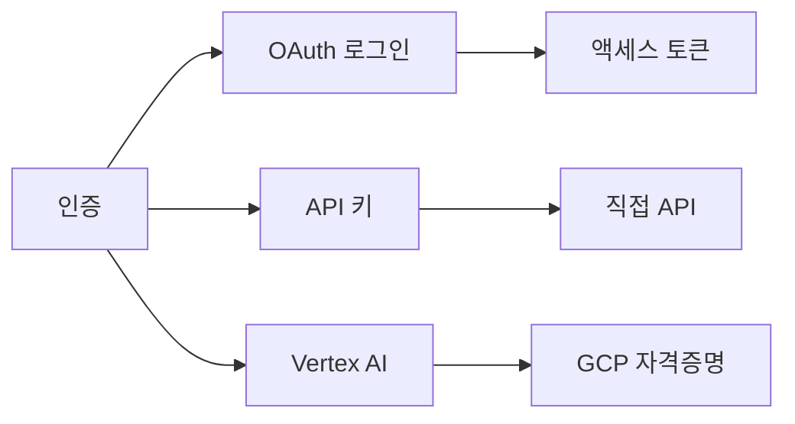
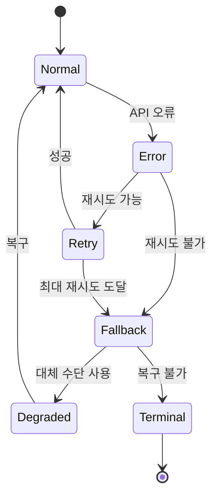

# LLM 관리 시스템

## 개요

Gemini CLI의 LLM 관리 시스템은 Gemini API와의 모든 상호작용을 오케스트레이션하며, 컨텍스트, 상태, 도구 실행을 관리합니다. 이 시스템은 주로 Core 패키지에서 구현되며 정교한 프롬프트 구성, 응답 처리, 대화 관리를 제공합니다.

## 아키텍처



## 핵심 구성 요소

### 1. 프롬프트 관리자
**위치**: `packages/core/src/services/llm/`

**책임**:
- 프롬프트 템플릿 구성
- 시스템 지침 관리
- 컨텍스트 윈도우 최적화
- 토큰 카운팅 및 관리

**주요 기능**:
```typescript
interface PromptManager {
  constructPrompt(input: UserInput, context: Context): Prompt
  addSystemInstructions(instructions: string[]): void
  optimizeForTokenLimit(prompt: Prompt, limit: number): Prompt
  calculateTokenUsage(prompt: Prompt): TokenCount
}
```

### 2. 컨텍스트 관리자
**목적**: 대화 컨텍스트 및 메모리 관리



**기능**:
- GEMINI.md 파일로부터 계층적 메모리
- 대화 히스토리 관리
- 컨텍스트 압축 전략
- 동적 컨텍스트 주입

### 3. 상태 관리자
**목적**: 대화 및 세션 상태 유지

**상태 구성 요소**:
```typescript
interface ConversationState {
  messages: Message[]
  tokenUsage: TokenUsage
  activeTools: Tool[]
  sessionId: string
  checkpoints: Checkpoint[]
  metadata: SessionMetadata
}
```

### 4. 도구 관리자
**목적**: LLM 컨텍스트 내에서 도구 실행 오케스트레이션



## 쿼리 처리 파이프라인

### 1. 입력 처리


### 2. 프롬프트 구성
**단계**:
1. 시스템 지침 로드
2. 계층적 메모리 주입 (GEMINI.md)
3. 대화 히스토리 추가
4. 도구 정의 포함
5. 사용자 입력 추가
6. 토큰 제한에 맞게 최적화

### 3. 응답 처리
```typescript
interface ResponseHandler {
  parseResponse(response: GeminiResponse): ParsedResponse
  extractToolCalls(response: ParsedResponse): ToolCall[]
  formatOutput(response: ParsedResponse): FormattedOutput
  handleStreaming(stream: ResponseStream): void
}
```

## 메모리 아키텍처

### 계층적 메모리 시스템



### 메모리 유형

#### 1. 영구 메모리
- **전역 지침**: 사용자 전반적인 설정 및 지침
- **프로젝트 지침**: 프로젝트별 컨텍스트
- **디렉토리 지침**: 하위 디렉토리별 가이드

#### 2. 세션 메모리
- **대화 히스토리**: 현재 세션 메시지
- **도구 결과**: 실행된 도구 결과
- **임시 컨텍스트**: `/memory add`를 통한 런타임 추가

#### 3. 압축된 메모리
- **요약 생성**: 자동 컨텍스트 압축
- **토큰 최적화**: 정보를 보존하면서 토큰 사용량 감소
- **체크포인트 통합**: 저장된 대화 상태

## 토큰 관리

### 토큰 최적화 전략



### 토큰 사용량 추적
```typescript
interface TokenUsage {
  inputTokens: number
  outputTokens: number
  cachedTokens?: number
  totalTokens: number
  cost?: number
  model: string
  timestamp: Date
}
```

## 모델 설정

### 지원되는 모델
- **gemini-2.5-pro**: 1M 컨텍스트 윈도우
- **gemini-2.5-flash**: 빠르고 효율적인 모델
- **gemini-1.5-pro**: 이전 세대
- **gemini-1.5-flash**: 이전 빠른 모델

### 모델 선택 로직
```typescript
function selectModel(config: Config): Model {
  // 우선순위 순서:
  // 1. 사용자 지정 모델
  // 2. 프로젝트 설정
  // 3. 전역 설정
  // 4. 기본 모델
  
  return config.model || 
         projectConfig.model || 
         globalSettings.model || 
         'gemini-2.5-pro'
}
```

## 인증 관리

### 인증 방법



### 자격증명 저장
- **OAuth 토큰**: 보안 시스템 키체인
- **API 키**: 환경 변수 또는 설정
- **Vertex AI**: Google Cloud 자격증명

## 오류 처리

### 오류 복구 전략



### 오류 유형
1. **API 오류**: 속도 제한, 할당량 초과
2. **네트워크 오류**: 연결 문제
3. **도구 오류**: 실행 실패
4. **컨텍스트 오류**: 토큰 제한 초과
5. **인증 오류**: 잘못된 자격증명

## 성능 최적화

### 캐싱 전략
- **토큰 캐싱**: 처리된 토큰 재사용
- **응답 캐싱**: 동일한 프롬프트에 대한 캐시
- **도구 결과 캐싱**: 중복 실행 방지
- **컨텍스트 캐싱**: 처리된 컨텍스트 보존

### 스트리밍 구현
```typescript
interface StreamingHandler {
  onChunk(chunk: string): void
  onToolCall(tool: ToolCall): void
  onComplete(response: CompleteResponse): void
  onError(error: Error): void
}
```

## 통합 지점

### 도구 시스템 통합
- 동적 도구 등록
- 매개변수 검증
- 결과 형식화
- 오류 전파

### MCP 서버 통합
- 도구 탐지
- 원격 실행
- 결과 변환
- 상태 동기화

### UI 통합
- 실시간 업데이트
- 진행 표시기
- 오류 표시
- 확인 대화상자

## 모범 사례

### 컨텍스트 관리
1. 효율성을 위해 컨텍스트 크기 최소화
2. 계층적 메모리를 효과적으로 사용
3. 스마트 압축 구현
4. 토큰 사용량 모니터링

### 오류 처리
1. 백오프를 포함한 재시도 로직 구현
2. 명확한 오류 메시지 제공
3. 대화 연속성 유지
4. 디버깅을 위한 오류 로깅

### 성능
1. 실시간 피드백을 위한 스트리밍 사용
2. 적절한 곳에 캐싱 구현
3. 프롬프트 구성 최적화
4. API 할당량 모니터링

## 향후 개선사항

### 계획된 개선사항
- 향상된 컨텍스트 압축 알고리즘
- 다중 모델 지원 및 라우팅
- 개선된 캐싱 메커니즘
- 고급 토큰 최적화
- 병렬 도구 실행
- 향상된 오류 복구

### 연구 영역
- 의미론적 컨텍스트 압축
- 적응형 모델 선택
- 예측적 프롬프트 최적화
- 지능적 토큰 할당