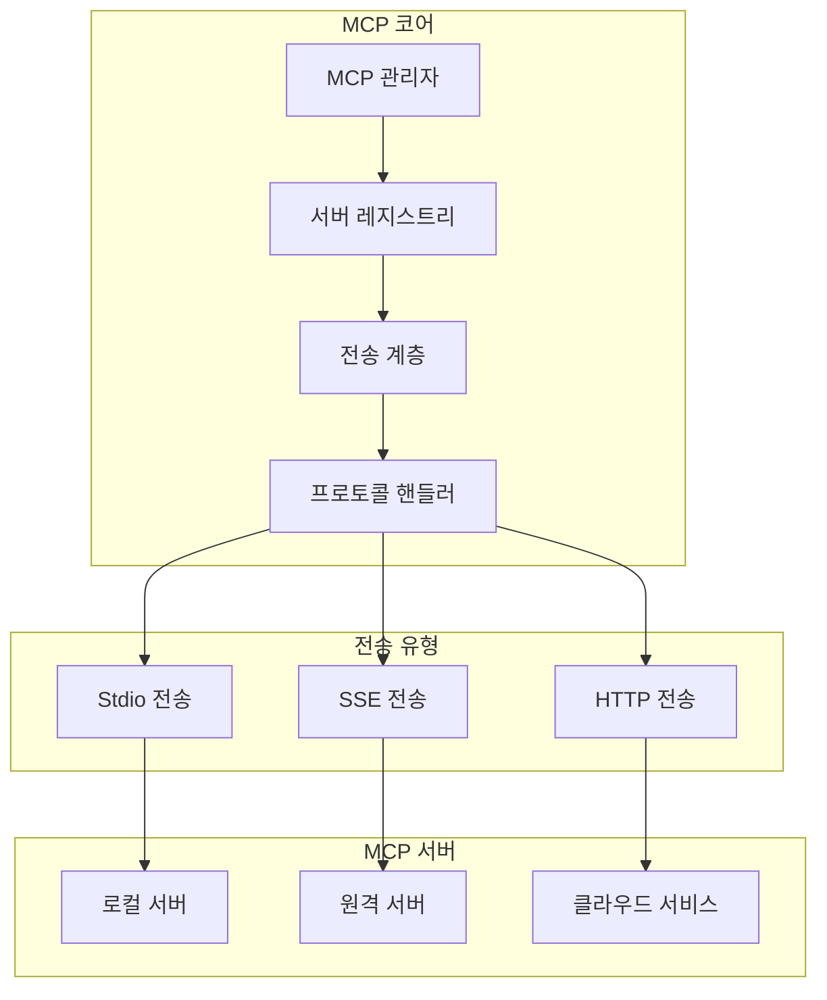
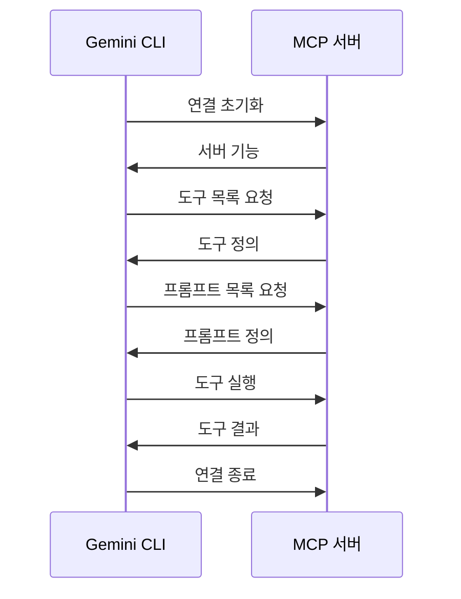
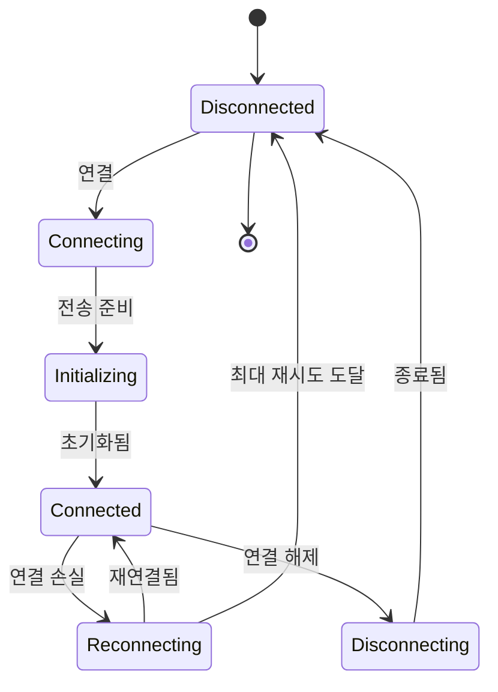
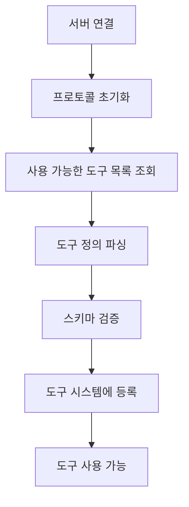
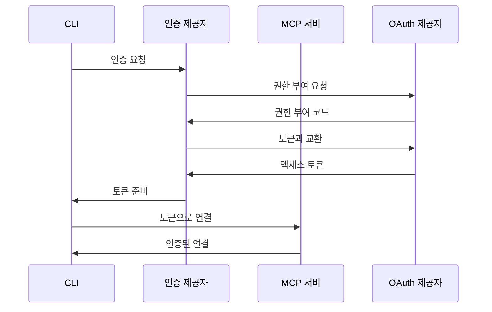

# MCP (Model Context Protocol) 구현

## 개요

Gemini CLI의 Model Context Protocol (MCP) 구현은 외부 도구 서버와의 통합을 가능하게 하는 강력한 확장성 프레임워크를 제공합니다. 이 시스템은 동적 도구 탐지, 다중 전송 통신, 서드파티 기능의 원활한 통합을 가능하게 합니다.

## 아키텍처



## MCP 프로토콜

### 프로토콜 명세



### 메시지 형식

```typescript
interface MCPMessage {
  jsonrpc: '2.0'
  id?: string | number
  method?: string
  params?: any
  result?: any
  error?: MCPError
}

interface MCPError {
  code: number
  message: string
  data?: any
}

// 표준 MCP 메서드
enum MCPMethod {
  Initialize = 'initialize',
  ListTools = 'tools/list',
  CallTool = 'tools/call',
  ListPrompts = 'prompts/list',
  GetPrompt = 'prompts/get',
  ListResources = 'resources/list',
  ReadResource = 'resources/read'
}
```

## 전송 구현

### 1. Stdio 전송

```typescript
class StdioTransport implements MCPTransport {
  private process: ChildProcess
  private messageBuffer: string = ''
  
  async connect(config: StdioConfig): Promise<void> {
    this.process = spawn(config.command, config.args, {
      stdio: ['pipe', 'pipe', 'pipe'],
      env: { ...process.env, ...config.env }
    })
    
    this.process.stdout.on('data', (data) => {
      this.handleData(data.toString())
    })
    
    this.process.stderr.on('data', (data) => {
      this.handleError(data.toString())
    })
  }
  
  async send(message: MCPMessage): Promise<void> {
    const json = JSON.stringify(message)
    this.process.stdin.write(json + '\n')
  }
  
  private handleData(data: string): void {
    this.messageBuffer += data
    const messages = this.extractMessages(this.messageBuffer)
    messages.forEach(msg => this.onMessage(msg))
  }
}
```

### 2. SSE (Server-Sent Events) 전송

```typescript
class SSETransport implements MCPTransport {
  private eventSource: EventSource
  private fetchClient: FetchClient
  
  async connect(config: SSEConfig): Promise<void> {
    // 서버-클라이언트 메시지를 위한 SSE 연결 설정
    this.eventSource = new EventSource(config.url)
    
    this.eventSource.onmessage = (event) => {
      const message = JSON.parse(event.data)
      this.onMessage(message)
    }
    
    // 클라이언트-서버 메시지를 위한 fetch 사용
    this.fetchClient = new FetchClient(config.url)
  }
  
  async send(message: MCPMessage): Promise<void> {
    await this.fetchClient.post('/message', message)
  }
}
```

### 3. HTTP 전송

```typescript
class HTTPTransport implements MCPTransport {
  private client: HTTPClient
  private authProvider?: AuthProvider
  
  async connect(config: HTTPConfig): Promise<void> {
    this.client = new HTTPClient(config.baseUrl)
    
    if (config.auth) {
      this.authProvider = await this.createAuthProvider(config.auth)
    }
  }
  
  async send(message: MCPMessage): Promise<MCPMessage> {
    const headers = await this.getHeaders()
    const response = await this.client.post('/rpc', message, { headers })
    return response.data
  }
  
  private async getHeaders(): Promise<Headers> {
    const headers: Headers = { 'Content-Type': 'application/json' }
    
    if (this.authProvider) {
      const token = await this.authProvider.getToken()
      headers['Authorization'] = `Bearer ${token}`
    }
    
    return headers
  }
}
```

## 서버 설정

### 설정 스키마

```typescript
interface MCPServerConfig {
  name: string
  description?: string
  transport: 'stdio' | 'sse' | 'http'
  
  // Stdio 설정
  command?: string
  args?: string[]
  env?: Record<string, string>
  
  // SSE/HTTP 설정
  url?: string
  headers?: Record<string, string>
  
  // 인증
  auth?: {
    type: 'oauth' | 'api-key' | 'basic'
    clientId?: string
    clientSecret?: string
    scope?: string
    apiKey?: string
    username?: string
    password?: string
  }
  
  // 고급 옵션
  timeout?: number
  retryAttempts?: number
  autoReconnect?: boolean
}
```

### 설정 파일

```json
{
  "mcpServers": {
    "github": {
      "transport": "stdio",
      "command": "npx",
      "args": ["-y", "@modelcontextprotocol/server-github"],
      "env": {
        "GITHUB_TOKEN": "${GITHUB_TOKEN}"
      }
    },
    "database": {
      "transport": "http",
      "url": "https://api.example.com/mcp",
      "auth": {
        "type": "oauth",
        "clientId": "client-id",
        "scope": "mcp.tools"
      }
    },
    "local-tools": {
      "transport": "stdio",
      "command": "/usr/local/bin/my-mcp-server"
    }
  }
}
```

## 서버 관리

### 연결 라이프사이클



### 서버 관리자 구현

```typescript
class MCPServerManager {
  private servers: Map<string, MCPServer> = new Map()
  private config: MCPConfig
  
  async initialize(config: MCPConfig): Promise<void> {
    this.config = config
    
    // 설정된 모든 서버에 연결
    for (const [name, serverConfig] of Object.entries(config.mcpServers)) {
      try {
        await this.connectServer(name, serverConfig)
      } catch (error) {
        console.warn(`${name} 연결 실패:`, error)
      }
    }
  }
  
  async connectServer(name: string, config: MCPServerConfig): Promise<void> {
    const transport = this.createTransport(config)
    const server = new MCPServer(name, transport, config)
    
    await server.connect()
    await server.initialize()
    
    this.servers.set(name, server)
    
    // 이 서버의 도구 등록
    const tools = await server.listTools()
    this.registerTools(server, tools)
  }
  
  private createTransport(config: MCPServerConfig): MCPTransport {
    switch (config.transport) {
      case 'stdio':
        return new StdioTransport(config)
      case 'sse':
        return new SSETransport(config)
      case 'http':
        return new HTTPTransport(config)
      default:
        throw new Error(`알 수 없는 전송 방식: ${config.transport}`)
    }
  }
}
```

## 도구 탐지 및 등록

### 도구 탐지 프로세스



### 도구 등록

```typescript
class MCPToolRegistry {
  private tools: Map<string, MCPTool> = new Map()
  
  async registerServerTools(server: MCPServer): Promise<void> {
    const toolDefs = await server.listTools()
    
    for (const toolDef of toolDefs) {
      const tool = new MCPTool(server, toolDef)
      const qualifiedName = `${server.name}:${toolDef.name}`
      
      // 도구 정의 검증
      this.validateTool(toolDef)
      
      // 도구 등록
      this.tools.set(qualifiedName, tool)
      
      // 메인 도구 시스템에 등록
      await this.toolSystem.register({
        name: qualifiedName,
        description: toolDef.description,
        inputSchema: toolDef.inputSchema,
        execute: (params) => tool.execute(params)
      })
    }
  }
  
  private validateTool(toolDef: MCPToolDefinition): void {
    if (!toolDef.name || !toolDef.description) {
      throw new Error('잘못된 도구 정의')
    }
    
    if (toolDef.inputSchema) {
      this.validateSchema(toolDef.inputSchema)
    }
  }
}
```

## 인증

### OAuth 플로우



### 인증 구현

```typescript
class OAuthProvider implements AuthProvider {
  private tokenCache: TokenCache
  
  async authenticate(config: OAuthConfig): Promise<string> {
    // 먼저 캐시 확인
    const cached = await this.tokenCache.get(config.clientId)
    if (cached && !this.isExpired(cached)) {
      return cached.accessToken
    }
    
    // OAuth 플로우 수행
    const authUrl = this.buildAuthUrl(config)
    const code = await this.getAuthorizationCode(authUrl)
    const tokens = await this.exchangeCodeForTokens(code, config)
    
    // 토큰 캐시
    await this.tokenCache.set(config.clientId, tokens)
    
    return tokens.accessToken
  }
  
  private async refreshToken(refreshToken: string, config: OAuthConfig): Promise<Tokens> {
    const response = await fetch(config.tokenUrl, {
      method: 'POST',
      body: JSON.stringify({
        grant_type: 'refresh_token',
        refresh_token: refreshToken,
        client_id: config.clientId,
        client_secret: config.clientSecret
      })
    })
    
    return response.json()
  }
}
```

## 프롬프트 관리

### MCP 프롬프트

```typescript
interface MCPPrompt {
  name: string
  description: string
  arguments?: {
    name: string
    description: string
    required?: boolean
  }[]
}

class MCPPromptManager {
  async getPrompts(server: MCPServer): Promise<MCPPrompt[]> {
    return server.listPrompts()
  }
  
  async executePrompt(
    server: MCPServer,
    promptName: string,
    args: Record<string, any>
  ): Promise<string> {
    const prompt = await server.getPrompt({
      name: promptName,
      arguments: args
    })
    
    return prompt.messages
      .map(m => m.content.text)
      .join('\n')
  }
}
```

## 리소스 액세스

### 리소스 관리

```typescript
interface MCPResource {
  uri: string
  name: string
  description?: string
  mimeType?: string
}

class MCPResourceManager {
  async listResources(server: MCPServer): Promise<MCPResource[]> {
    return server.listResources()
  }
  
  async readResource(server: MCPServer, uri: string): Promise<any> {
    const resource = await server.readResource({ uri })
    
    // 다양한 콘텐츠 타입 처리
    if (resource.contents.text) {
      return resource.contents.text
    } else if (resource.contents.blob) {
      return Buffer.from(resource.contents.blob, 'base64')
    } else {
      return resource.contents
    }
  }
}
```

## 오류 처리

### 오류 유형

```typescript
enum MCPErrorCode {
  ParseError = -32700,
  InvalidRequest = -32600,
  MethodNotFound = -32601,
  InvalidParams = -32602,
  InternalError = -32603,
  
  // 사용자 정의 오류
  TransportError = -32000,
  AuthenticationError = -32001,
  TimeoutError = -32002,
  ServerError = -32003
}

class MCPErrorHandler {
  handle(error: MCPError, context: ErrorContext): ErrorResponse {
    switch (error.code) {
      case MCPErrorCode.AuthenticationError:
        return this.handleAuthError(error, context)
      case MCPErrorCode.TimeoutError:
        return this.handleTimeout(error, context)
      case MCPErrorCode.TransportError:
        return this.handleTransportError(error, context)
      default:
        return this.handleGenericError(error, context)
    }
  }
  
  private async handleAuthError(error: MCPError, context: ErrorContext): Promise<ErrorResponse> {
    // 인증 새로 고침 시도
    try {
      await context.server.reauthenticate()
      return { retry: true }
    } catch {
      return { 
        message: '인증에 실패했습니다. 서버를 다시 설정해 주세요.',
        fatal: true
      }
    }
  }
}
```

## 성능 최적화

### 연결 풀링

```typescript
class MCPConnectionPool {
  private connections: Map<string, MCPConnection[]> = new Map()
  private maxConnections: number = 5
  
  async getConnection(server: MCPServer): Promise<MCPConnection> {
    const pool = this.connections.get(server.name) || []
    
    // 사용 가능한 연결 찾기
    const available = pool.find(c => !c.inUse)
    if (available) {
      available.inUse = true
      return available
    }
    
    // 제한 미만이면 새 연결 생성
    if (pool.length < this.maxConnections) {
      const connection = await this.createConnection(server)
      pool.push(connection)
      this.connections.set(server.name, pool)
      return connection
    }
    
    // 사용 가능한 연결 대기
    return this.waitForConnection(server)
  }
  
  releaseConnection(connection: MCPConnection): void {
    connection.inUse = false
  }
}
```

### 요청 일괄 처리

```typescript
class MCPRequestBatcher {
  private pendingRequests: Map<string, PendingRequest[]> = new Map()
  private batchTimeout: number = 50 // ms
  
  async request(server: MCPServer, message: MCPMessage): Promise<any> {
    return new Promise((resolve, reject) => {
      const key = `${server.name}_${message.method}`
      
      if (!this.pendingRequests.has(key)) {
        this.pendingRequests.set(key, [])
        setTimeout(() => this.flush(server, key), this.batchTimeout)
      }
      
      this.pendingRequests.get(key)!.push({
        message,
        resolve,
        reject
      })
    })
  }
  
  private async flush(server: MCPServer, key: string): Promise<void> {
    const requests = this.pendingRequests.get(key) || []
    this.pendingRequests.delete(key)
    
    if (requests.length === 0) return
    
    try {
      // 일괄 요청 전송
      const results = await server.batch(
        requests.map(r => r.message)
      )
      
      // 개별 프로미스 해결
      results.forEach((result, i) => {
        requests[i].resolve(result)
      })
    } catch (error) {
      requests.forEach(r => r.reject(error))
    }
  }
}
```

## 모범 사례

### 서버 개발
1. 적절한 오류 처리 구현
2. 우아한 종료 지원
3. 모든 입력 검증
4. 포괄적인 도구 설명 제공
5. 요청 타임아웃 구현

### 클라이언트 통합
1. 연결 실패를 우아하게 처리
2. 재시도 로직 구현
3. 서버 기능 캐시
4. 서버 상태 모니터링
5. 디버깅을 위한 모든 상호작용 로깅

### 보안
1. 서버 인증서 검증 (HTTPS)
2. 안전한 자격증명 저장
3. 속도 제한 구현
4. 도구 실행 감사
5. 서버 프로세스 샌드박스

## 향후 개선사항

### 계획된 기능
- **서버 탐지**: MCP 서버의 자동 탐지
- **서버 마켓플레이스**: 커뮤니티 서버 레지스트리
- **핫 리로드**: 재시작 없는 동적 서버 업데이트
- **서버 구성**: 여러 서버 연결
- **비주얼 서버 빌더**: MCP 서버 생성을 위한 GUI

### 연구 영역
- 연합 MCP 네트워크
- 서버 간 통신
- 분산 도구 실행
- 크로스 플랫폼 서버 호환성
- 성능 최적화 기법