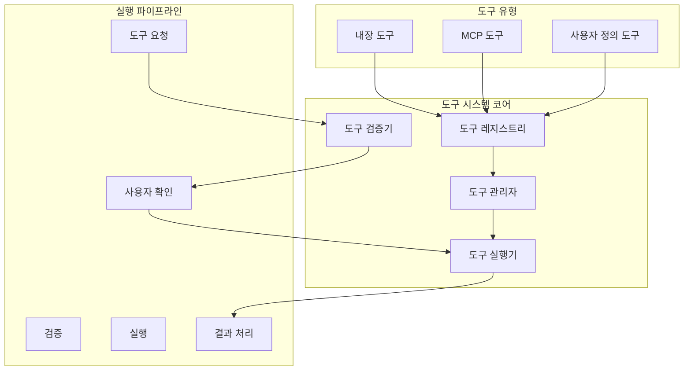
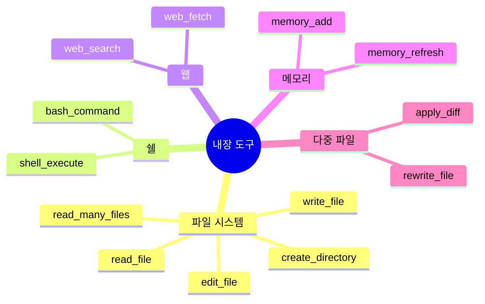
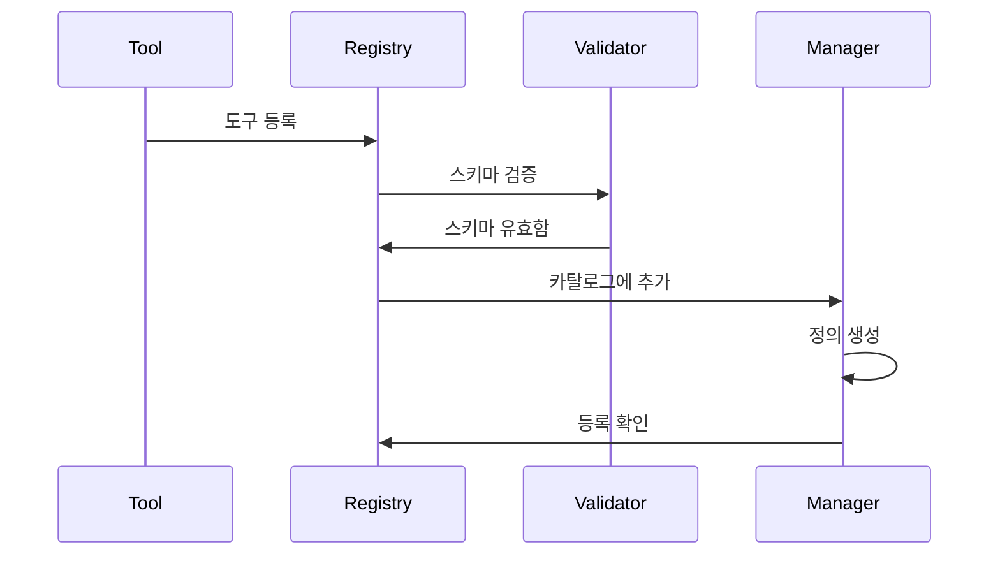
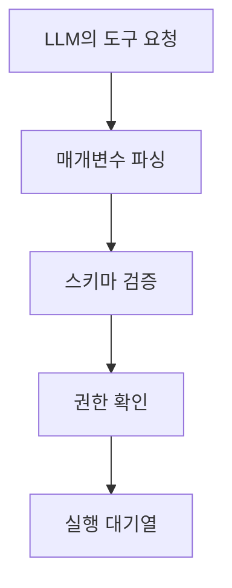
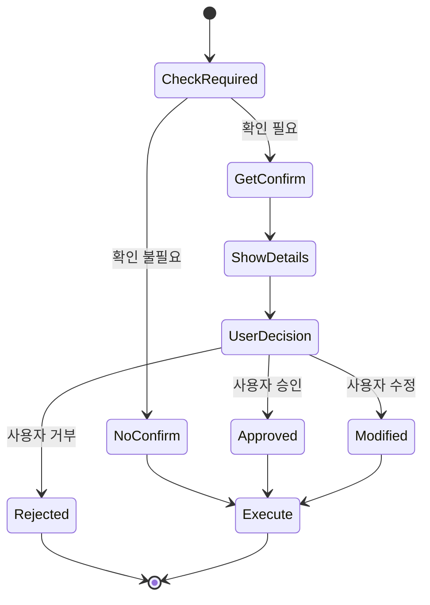
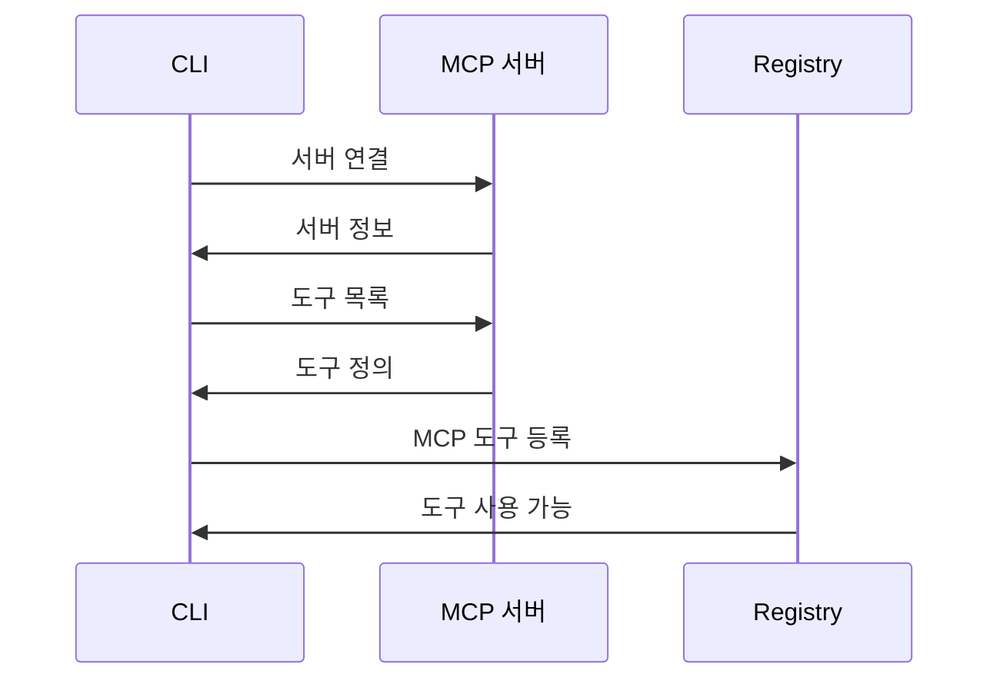
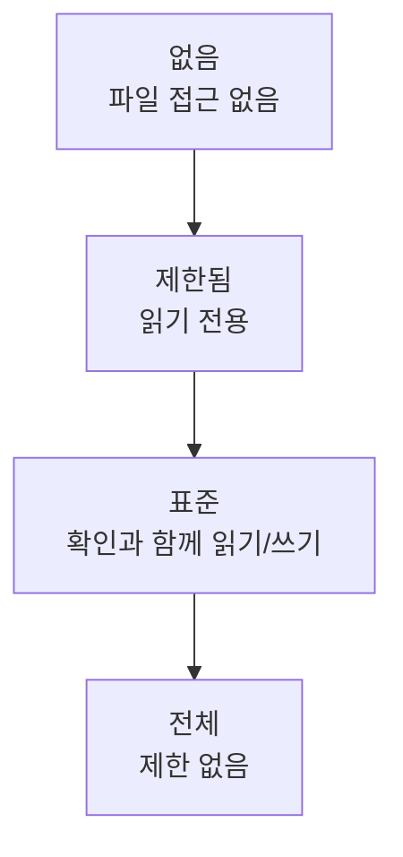
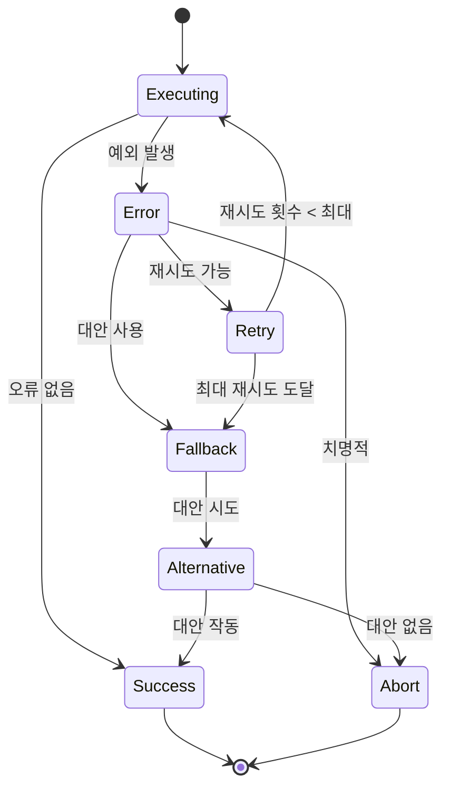

# 도구 오케스트레이션 시스템

## 개요

Gemini CLI의 도구 오케스트레이션 시스템은 내장 및 외부 도구를 통해 AI의 기능을 확장하는 정교한 프레임워크를 제공합니다. 이 시스템은 보안과 사용자 제어를 유지하면서 도구 등록, 실행, 검증, 결과 처리를 관리합니다.

## 아키텍처



## 도구 범주

### 1. 내장 도구



### 2. MCP 도구
Model Context Protocol 서버를 통해 제공되는 외부 도구:
- 데이터베이스 작업
- API 통합
- 사용자 정의 비즈니스 로직
- 서드파티 서비스

### 3. 사용자 정의 도구
ToolBuilder 인터페이스를 통한 사용자 정의 도구

## 도구 등록

### 등록 프로세스



### 도구 정의 스키마

```typescript
interface ToolDefinition {
  name: string
  description: string
  category: ToolCategory
  inputSchema: {
    type: 'object'
    properties: Record<string, JSONSchema>
    required?: string[]
  }
  outputSchema?: JSONSchema
  permissions: ToolPermissions
  confirmation: ConfirmationRequirement
}

interface ToolPermissions {
  fileSystem: 'none' | 'read' | 'write'
  network: boolean
  shell: boolean
  sensitive: boolean
}

enum ConfirmationRequirement {
  Never = 'never',
  Always = 'always',
  Destructive = 'destructive',
  Smart = 'smart'
}
```

## 실행 파이프라인

### 1. 요청 처리



### 2. 검증 계층

```typescript
class ToolValidator {
  async validate(request: ToolRequest): Promise<ValidationResult> {
    // 스키마 검증
    const schemaValid = await this.validateSchema(
      request.params,
      request.tool.inputSchema
    )
    
    // 권한 검증
    const permissionsValid = await this.checkPermissions(
      request.tool.permissions,
      this.currentTrustLevel
    )
    
    // 매개변수 검증
    const paramsValid = await this.validateParameters(
      request.params,
      request.tool.constraints
    )
    
    return {
      valid: schemaValid && permissionsValid && paramsValid,
      errors: [...],
      warnings: [...]
    }
  }
}
```

### 3. 확인 시스템



### 4. 실행 엔진

```typescript
class ToolExecutor {
  async execute(tool: Tool, params: any): Promise<ToolResult> {
    // 실행 전 후크
    await this.runPreExecutionHooks(tool, params)
    
    // 필요시 체크포인트
    if (tool.permissions.fileSystem === 'write') {
      await this.createCheckpoint()
    }
    
    try {
      // 타임아웃과 함께 실행
      const result = await this.executeWithTimeout(
        tool.execute(params),
        tool.timeout || 30000
      )
      
      // 실행 후 처리
      return await this.processResult(result, tool)
      
    } catch (error) {
      // 오류 처리 및 복구
      return this.handleExecutionError(error, tool)
    }
  }
  
  private async executeWithTimeout<T>(
    promise: Promise<T>,
    timeout: number
  ): Promise<T> {
    return Promise.race([
      promise,
      new Promise((_, reject) => 
        setTimeout(() => reject(new Error('타임아웃')), timeout)
      )
    ])
  }
}
```

## 내장 도구 구현

### 파일 시스템 도구

```typescript
class FileSystemTools {
  @Tool({
    name: 'read_file',
    permissions: { fileSystem: 'read' },
    confirmation: ConfirmationRequirement.Never
  })
  async readFile(params: { path: string }): Promise<ToolResult> {
    const content = await fs.readFile(params.path, 'utf-8')
    return {
      success: true,
      output: content,
      metadata: {
        size: content.length,
        lines: content.split('\n').length
      }
    }
  }
  
  @Tool({
    name: 'write_file',
    permissions: { fileSystem: 'write' },
    confirmation: ConfirmationRequirement.Always
  })
  async writeFile(params: { path: string, content: string }): Promise<ToolResult> {
    await fs.writeFile(params.path, params.content)
    return {
      success: true,
      output: `파일 작성됨: ${params.path}`,
      metadata: {
        size: params.content.length,
        created: true
      }
    }
  }
}
```

### 쉘 실행 도구

```typescript
class ShellTools {
  @Tool({
    name: 'bash_command',
    permissions: { shell: true },
    confirmation: ConfirmationRequirement.Always
  })
  async executeBash(params: { command: string }): Promise<ToolResult> {
    const { stdout, stderr, exitCode } = await this.runCommand(params.command)
    
    return {
      success: exitCode === 0,
      output: stdout,
      error: stderr,
      metadata: {
        exitCode,
        command: params.command,
        duration: Date.now() - startTime
      }
    }
  }
  
  private async runCommand(command: string): Promise<CommandResult> {
    // 샌드박스 실행 활성화 시
    if (this.sandboxEnabled) {
      return this.runInSandbox(command)
    }
    
    // 안전 검사와 함께 직접 실행
    return this.runDirect(command)
  }
}
```

## MCP 도구 통합

### MCP 도구 탐지



### MCP 도구 래퍼

```typescript
class MCPToolWrapper implements Tool {
  constructor(
    private server: MCPServer,
    private toolDef: MCPToolDefinition
  ) {}
  
  async execute(params: any): Promise<ToolResult> {
    try {
      // MCP 서버에 도구 호출 전송
      const response = await this.server.callTool({
        name: this.toolDef.name,
        arguments: params
      })
      
      // MCP 응답을 표준 형식으로 변환
      return this.transformResponse(response)
    } catch (error) {
      return this.handleMCPError(error)
    }
  }
  
  private transformResponse(response: MCPResponse): ToolResult {
    return {
      success: !response.isError,
      output: response.content.map(c => c.text).join('\n'),
      metadata: response.metadata
    }
  }
}
```

## 도구 결과 처리

### 결과 파이프라인


### 결과 형식화

```typescript
interface ToolResult {
  success: boolean
  output: string | object
  error?: string
  metadata?: {
    duration?: number
    tokensUsed?: number
    filesAffected?: string[]
    [key: string]: any
  }
  artifacts?: ToolArtifact[]
}

interface ToolArtifact {
  type: 'file' | 'image' | 'data'
  name: string
  content: any
  mimeType?: string
}
```

## 보안 및 샌드박싱

### 신뢰 수준



### 샌드박싱 전략

```typescript
interface SandboxConfig {
  type: 'none' | 'docker' | 'podman' | 'seatbelt'
  restrictions: {
    filesystem: FileSystemRestrictions
    network: NetworkRestrictions
    process: ProcessRestrictions
  }
  mounts?: string[]
  environment?: Record<string, string>
}

class Sandbox {
  async execute(command: string, config: SandboxConfig): Promise<Result> {
    switch (config.type) {
      case 'docker':
        return this.executeInDocker(command, config)
      case 'seatbelt':
        return this.executeWithSeatbelt(command, config)
      default:
        return this.executeUnsandboxed(command)
    }
  }
}
```

## 성능 최적화

### 도구 실행 최적화

```typescript
class ToolOptimizer {
  // 독립적인 도구들의 병렬 실행
  async executeParallel(tools: ToolCall[]): Promise<ToolResult[]> {
    const independent = this.identifyIndependent(tools)
    return Promise.all(independent.map(t => this.execute(t)))
  }
  
  // 유사한 작업의 일괄 처리
  batchOperations(tools: ToolCall[]): ToolCall[] {
    const batched = new Map<string, ToolCall[]>()
    
    tools.forEach(tool => {
      const key = `${tool.name}_${tool.category}`
      if (!batched.has(key)) batched.set(key, [])
      batched.get(key)!.push(tool)
    })
    
    return Array.from(batched.values()).map(this.mergeBatch)
  }
  
  // 반복 작업 캐싱
  private cache = new Map<string, ToolResult>()
  
  async executeWithCache(tool: ToolCall): Promise<ToolResult> {
    const key = this.getCacheKey(tool)
    
    if (this.cache.has(key)) {
      return this.cache.get(key)!
    }
    
    const result = await this.execute(tool)
    this.cache.set(key, result)
    return result
  }
}
```

## 오류 처리

### 오류 복구 전략



### 오류 유형 및 처리

```typescript
enum ToolErrorType {
  ValidationError = 'validation',
  PermissionError = 'permission',
  ExecutionError = 'execution',
  TimeoutError = 'timeout',
  NetworkError = 'network',
  UnknownError = 'unknown'
}

class ToolErrorHandler {
  handle(error: ToolError): ErrorResponse {
    switch (error.type) {
      case ToolErrorType.ValidationError:
        return this.suggestCorrection(error)
      case ToolErrorType.PermissionError:
        return this.requestPermission(error)
      case ToolErrorType.TimeoutError:
        return this.offerRetry(error)
      default:
        return this.genericError(error)
    }
  }
}
```

## 모니터링 및 텔레메트리

### 도구 사용량 메트릭

```typescript
interface ToolMetrics {
  toolName: string
  executionCount: number
  averageDuration: number
  successRate: number
  errorRate: number
  lastExecution: Date
}

class ToolTelemetry {
  trackExecution(tool: string, result: ToolResult): void {
    this.metrics.record({
      tool,
      success: result.success,
      duration: result.metadata?.duration,
      timestamp: Date.now()
    })
  }
  
  getStatistics(): ToolStatistics {
    return {
      mostUsed: this.getMostUsedTools(),
      slowest: this.getSlowestTools(),
      errorProne: this.getErrorProneTools()
    }
  }
}
```

## 모범 사례

### 도구 개발
1. 명확하고 설명적인 도구 이름
2. 포괄적인 매개변수 검증
3. 의미 있는 오류 메시지
4. 실패 시 적절한 정리
5. 가능한 경우 멱등성 작업

### 보안
1. 항상 입력 검증
2. 적절한 샌드박싱 구현
3. 파괴적 작업에 확인 요구
4. 모든 도구 실행 로깅
5. 속도 제한 구현

### 성능
1. 적절한 경우 캐싱
2. 유사한 작업 일괄 처리
3. 타임아웃 구현
4. 비동기 작업 사용
5. 리소스 사용량 모니터링

## 향후 개선사항

### 계획된 기능
- **도구 구성**: 도구를 연결하여 조합
- **조건부 실행**: 조건에 따라 실행되는 도구
- **도구 마켓플레이스**: 커뮤니티 도구 공유 및 탐색
- **비주얼 도구 빌더**: 사용자 정의 도구 생성을 위한 GUI
- **도구 버전 관리**: 도구 버전 및 호환성 관리

### 연구 영역
- 컨텍스트 기반 지능형 도구 선택
- 복잡한 작업을 위한 자동 도구 구성
- 예측적 도구 캐싱
- 크로스 플랫폼 도구 호환성
- ML을 사용한 도구 실행 최적화